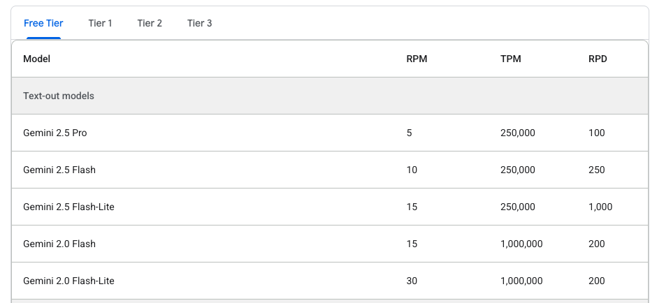

# Mastery LS

**Mastery LS** takes online learning to the next level by boosting maintainable content creation and focusing on learner mastery.

- Markdown for content creation sanity
- Content management using GitHub for version control
- AI powered for content generation, learner feedback, quiz generation
- Video and interactivity powered
- Project based mastery

## Feature details

1. **Content** that leverages the online experience. This will include instruction video with interactive paths, textual instruction, and self paced learning.
   1. Markdown as the primary content format
   1. GitHub for version control and collaboration
   1. AI content generation for rapid content development
   1. Interactive video with branching paths
   1. Textual instruction with interactive elements
   1. Inline quizzes with support for multiple choice, multiple answer, and free text responses
   1. Self-paced learning modules
   1. Progress tracking and analytics
   1. Mobile-friendly design for learning on the go
   1. Offline access to learning materials
   1. AI-driven feedback for personalized learning
   1. Data privacy and security measures
   1. Scalability to accommodate large user bases
   1. Support for various content formats (videos, PDFs, images, etc.)
1. **Human Interaction** between learning peers and mentors from around the globe in curated cohorts. Peers advance to serve as mentors for other learners.
   1. Peer review and feedback
   1. Mentor review and feedback
   1. Collaboration tools for peer projects
1. **Mastery Projects** that demonstrate authentic learning in creative ways that provide a portfolio of the learner
   1. Tools for mastery projects
1. **System Integration** that provides mastery reports, enrollments, analytics, and automated notification
   1. Download reports
   1. Automated notifications
   1. Metrics dashboard
   1. API access for reporting integrations
   1. API access for enrollments
   1. API access for analytics
   1. API access for notifications
   1. TouchSpeed: Keyboard assisted grading automation
   1. TouchSpeed: Keyboard assisted feedback generation

## Functionality

### Configuration

create your `config.js` file in the root of the project.

```js
export default {
  supabase: {
    url: 'https://yyy.supabase.co',
    key: 'xxx',
  },
};
```

### Course

A course definition is read from the `course.json` file found in the root of the repo. If there is not `course.json` file then the content of the `instruction/modules.md` file is analyzed to try and discover the course.

#### Example `course.json`

```json
{
  "title": "QA & DevOps",
  "schedule": "schedule/schedule.md",
  "syllabus": "instruction/syllabus/syllabus.md",
  "links": {
    "canvas": "https://byu.instructure.com/courses/31151",
    "chat": "https://discord.com/channels/748656649287368704"
  },
  "modules": [
    {
      "title": "Course info",
      "topics": [
        { "title": "Home", "path": "README.md" },
        { "title": "Syllabus", "path": "instruction/syllabus/syllabus.md" },
        { "title": "Schedule", "path": "schedule/schedule.md" }
      ]
    }
  ]
}
```

### GitHub repo structure

In order for a GitHub repo to function as the source for a Mastery LS course it must have the following structure.

```txt
.
├── LICENSE
├── README.md
├── instruction
│   ├── modules.md
│   ├── topic1
│   │   └── topic1.md
│   ├── topic2
│   │   ├── topic2.md
│   │   └── topic2.gif
│   ├── topic3
│   │   ├── topic3.md
│   │   └── topic3.png
│   └── template
│       └── template.md
├── syllabus
│   └── syllabus.md
└── schedule
    └── schedule.md
```

#### Modules

The `modules.md` file creates the content structure for the course. It uses the headings levels to generate the interface for the instruction modules. The modules file allows you to reorganize the topic order in any desired structure. When Mastery LS loads a course it first parses `modules.md` to generate the table of contents. If a course author modifies the order of topics, and commits the change, then the `modules.md` file is overwritten.

You should only manually modify the contents of `modules.md` if you understand the structure of the file. Any additions to the file beyond the recognized structure will be lost when the file is altered by Mastery LS.

```md
# Instructional modules

## Module1 title

- [Topic1](topic1/topic1.md)
- [Topic2](topic2/topic2.md)

## Module2 title

- [Topic3](topic3/topic3.md)
- [Topic4](topic4/topic4.md)
```

## Development notes

I want to keep this really simple and so I am going to use:

1. Vite
1. Basic React library
1. Tailwind CSS
1. Supabase for database and authentication

This should make it so that I can host the whole thing as a static website and just host it on GitHub.

### Markdown support

There are lots of markdown libraries out there such as `marked`, `react-markdown`, and `remark`. I went with react markdown and various remark plugins.

### Added Tailwind for style

Followed these basic [instructions](https://tailwindcss.com/docs/installation/using-vite) for using with Vite.

## AI

I chose [Gemini](https://ai.google.dev/gemini-api/docs/rate-limits) API because they have a free tier.



```js
curl "https://generativelanguage.googleapis.com/v1beta/models/gemini-2.0-flash:generateContent" \
  -H 'Content-Type: application/json' \
  -H 'X-goog-api-key: GEMINI_API_KEY' \
  -X POST \
  -d '{
    "contents": [
      {
        "parts": [
          {
            "text": "Explain how AI works in a few words"
          }
        ]
      }
    ]
  }'
```

## Database

### Catalog

Everyone can read the catalog

```postgres
CREATE policy "User read all"
on "public"."catalog"
FOR ALL
TO public
using (
  true
);
```

### User

Let a user manage their own user record so that they can register, login, and update settings

```postgres
CREATE policy "User manage self"
on "public"."user"
FOR ALL
TO public
using (
  (auth.uid() = id)
)
with check (
  (auth.uid() = id)
);
```

### Enrollment

Let a user manage their own enrollment record so that they can join, drop, and update settings

```postgres
CREATE policy "User manage self"
on "public"."enrollment"
FOR ALL
TO public
using (
  (auth.uid() = "learnerId")
)
with check (
  (auth.uid() = "learnerId")
);
```

### Progress

```postgres
CREATE POLICY "Allow users to insert their own progress"
ON "public"."progress"
FOR INSERT TO authenticated
WITH CHECK ((SELECT auth.uid()) = "userId");
```

```postgres
CREATE POLICY "Allow users to read their own progress"
ON "public"."progress"
FOR SELECT TO authenticated
USING ((SELECT auth.uid()) = "userId");
```

### Roles

Allow user to read their own roles

```postgres
CREATE POLICY "User read self"
  ON public.role
  FOR SELECT
  TO public
  USING (
  ("user" = auth.uid())
  );
```

#### Root

Create a function that validates a user is root. You can then call this in RLS policies

```postgres
CREATE OR REPLACE FUNCTION public.auth_is_root(uid uuid)
RETURNS boolean
LANGUAGE sql
STABLE
SECURITY DEFINER
SET search_path = public
AS $$
  SELECT EXISTS (
    SELECT 1
    FROM public.role
    WHERE "user" = uid
      AND "right" = 'root'
  );
$$;

GRANT EXECUTE ON FUNCTION public.auth_is_root(uuid) TO anon, authenticated;
```

Create a policy on each table that allows root to manage everything

```postgres
CREATE POLICY "Root all access"
ON public.catalog
FOR ALL
TO public
USING (public.auth_is_root(auth.uid()))
WITH CHECK (public.auth_is_root(auth.uid()));
```

You can allow update for specific columns by restricting the update with a GRANT

```postgres
DROP POLICY IF EXISTS "update-own-rows" ON public.role;
CREATE POLICY "update-own-rows"
  ON public.role
  FOR UPDATE
  USING (user = auth.uid())
  WITH CHECK (user = auth.uid());

REVOKE ALL PRIVILEGES ON public.role FROM authenticated;

GRANT SELECT ON public.role TO authenticated;
GRANT INSERT ON public.role TO authenticated;
GRANT DELETE ON public.role TO authenticated;
GRANT UPDATE (settings) ON public.role TO authenticated;
```
