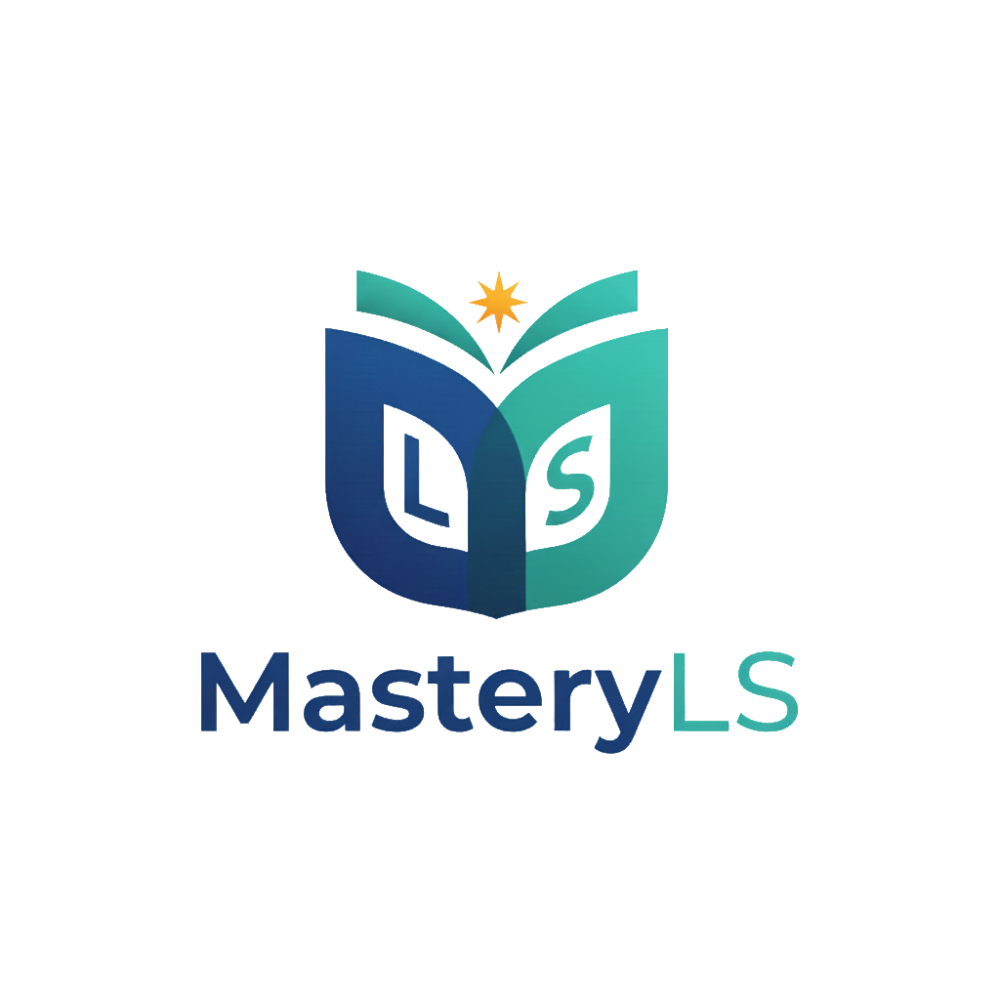
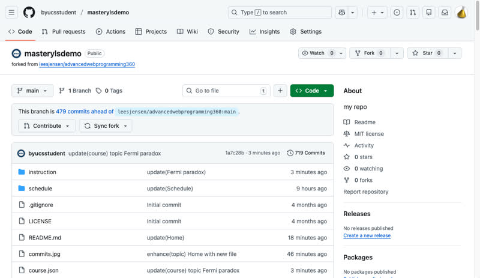
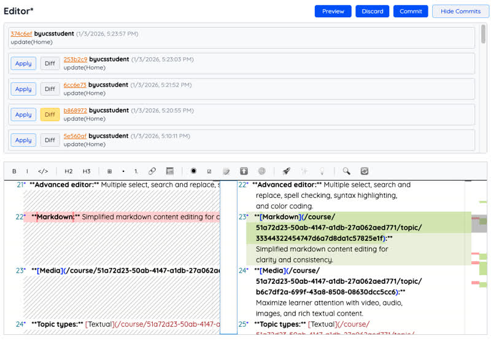
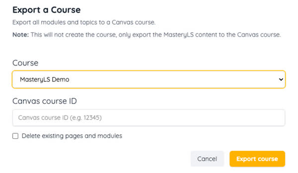
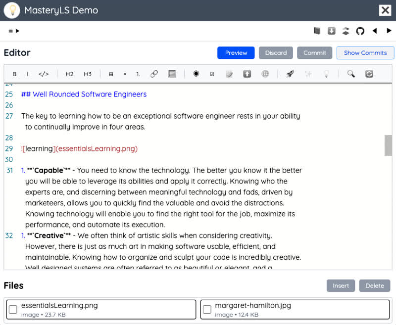
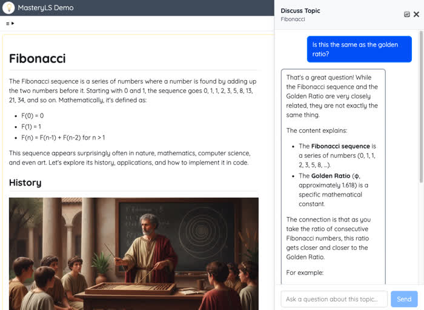
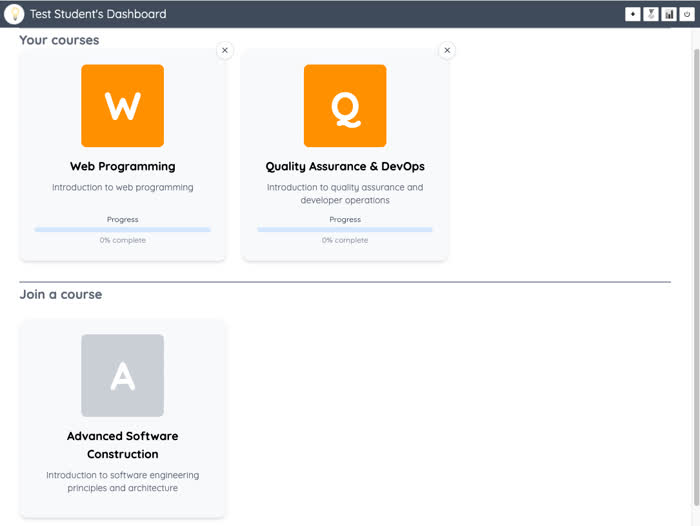
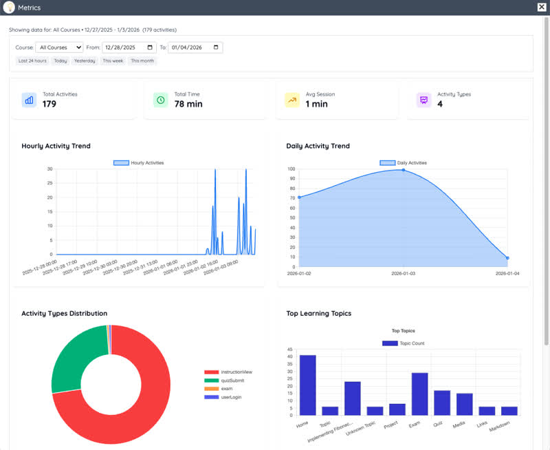
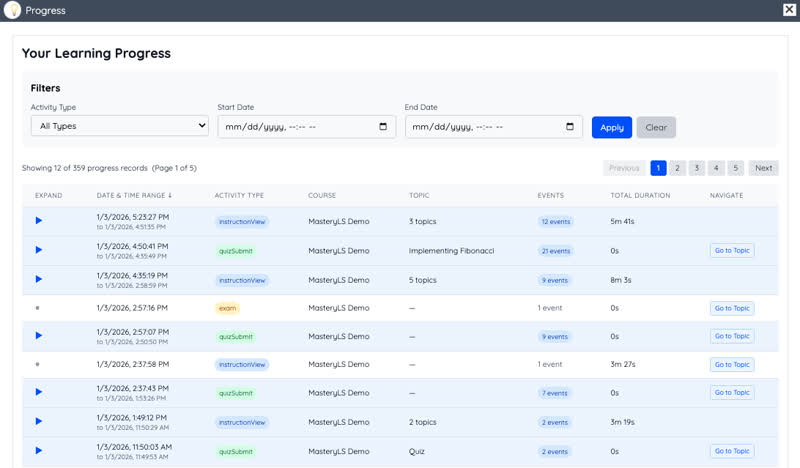
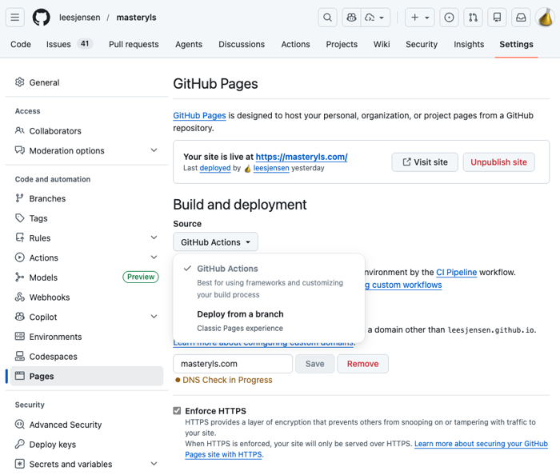

[](https://github.com/leesjensen/masteryls/actions/workflows/ci.yml)

**Mastery LS** takes online learning to the next level by boosting maintainable content creation and focusing on learner mastery.

- Markdown for content creation sanity
- Content management using GitHub for version control
- AI powered for content generation, learner feedback, quiz generation
- Video and interactivity powered
- Project based mastery

[🎥 Introduction Demo](https://youtu.be/HXNx_Gp0jyM)

## Features

### GitHub content management

MasteryLS uses your GitHub repository to store and manage the course content. This means you are using the world's most popular and powerful content management system. You also have complete control of your content and can easily deploy it to multiple delivery channels or remove all access to your content.



All course changes are versioned, comparable, and reversible. This makes it easy to see what your content looked like a year ago, fix a mistake, see who made a change, or revert to a previous version. Because each file is version controlled you can have multiple instructional designers working at the same time.



Course and topics may be published, under development, or unpublished. Make any user an editor, or remove an editor at any time. You can even _delete protect_ so that you don't accidentally lose your content.

### Compatible

Your content is available from your GitHub repository and changes made in MasteryLS are immediately synced. You can even export and sync your MasteryLS course to an Instructure Canvas course.



Once you have connected your course to Canvas you can update all topics, or push a single topic, at any time. Any feature that is not compatible with Canvas, such as AI mentoring and feedback, is automatically removed from the Canvas version of the course.


### Advanced editor

In order to keep up with the educational needs of your learners you must be able to generate and maintain content easily. MasteryLS make that easy by simplifying the content representation with **Markdown** instead of incompatible, complex, and insecure HTML. Use drag and drop to add files and manipulate the course structure. Hotkeys allow you to execute most common editing tasks.

- Multiple select, search and replace, spell checking, syntax highlighting, and color coding.
- Simplified [markdown](/course/51a72d23-50ab-4147-a1db-27a062aed771/topic/33344322454747d6a7d8da1c57825e1f) content editing for clarity and consistency.
- All major [media](/course/51a72d23-50ab-4147-a1db-27a062aed771/topic/b6c7df2a-699f-43a8-8508-08630dcc5cc6) types supported.
- Maximize learner attention with video, audio, images, and rich textual content.



### Topic types

You can support a diverse audience of learners with different instructional topic types.

- **Text**: Free flowing instructional text with embedded media types and quiz questions.
- **Quiz**: A collection of quiz questions that expedite learning outcomes. AI provides automatic feedback and exploration.
- **Exam**: A collection of quiz questions that measures mastery and only provides feedback upon completion. Mentors review and provide feedback to the learner's mastery demonstration.
- **Video**: Full screen video playback as an individual topic.
- **Project**: Mastery demonstration with a project artifact that is mentor graded and reviewed. After submission, a project then becomes part of the learner's mastery portfolio.

### AI integration

MasteryLS was designed from the beginning with AI as an integral part of the experience. This accelerates learning and reduces mentor overhead.

- **Content generation**: Editors use AI to generate a courses, topics, sections, quizzes, and exams. Editors can then easily enhance and modify the generated content in order to produce a production ready result.
- **Learning feedback**: Learners receive immediate feedback to quizzes, exams, and project submissions. Mentors can augment and overwrite AI responses.
- **Topic discussion**: Learner can deepen their understanding and ask clarifying questions with the context aware AI discussion mentor.



### Personalized Dashboard

The individualized dashboard shows available courses, enrollments, and progress. The learner, mentor, and administrator can also easily access metrics and logs to view individual performance.



### Metrics

A learner, mentor, or administrator can access the [visualizations](/metrics) for time spent on each course and activity. This helps determine productivity and focus.



### Progress

A [detailed log](/progress) for everything a learner does is tracked of all course interactions and accomplishments. A learner can use this to demonstrate progress. A mentor or administrator and compare progress across courses, activities, peers, and cohorts.



# Deploying MasteryLS

Do the following to deploy MasteryLS

1. Fork the [MasteryLS Repository](https://github.com/leesjensen/masteryls) to your development environment.
1. Clone your fork to your development environment.
1. Create a [Supabase](https://supabase.com) account. A free Supabase account will work fine to start.
1. Obtain a Supabase Auth Token. In the Supabase account dashboard, access the user profile menu and select **Account preferences**. Select **Access tokens** from the **Account settings** sidebar. Press **Generate new token**.

   

1. Run the MasteryLS CLI to configure your Supabase account.

   ```sh
   npm install
   cd install
   node initproject.js
   ```

1. Save the Supabase configuration that is output by the MasteryLS CLI to a file named `config.js` in the root of the project. Do not commit your configuration file to your repo. The configuration represents your Supabase **project URL** and **publishable key**. This allows the application to make Supabase backend requests.

   ```js
   export default {
     supabase: {
       url: 'https://yyy.supabase.co',
       key: 'xxx',
     },
   };
   ```

1. Enable **GitHub Pages** for your fork of the MasteryLS repository. Make sure you specify `GitHub Actions` as your deployment source, enforce HTTPS, and provide a custom domain.

   **Note**: _The website must be hosted from the root of your domain (not a path on the domain) or the React page routing will not work correctly._

   

1. Commit the `config.js` file that was generated by the MasteryLS CLI to your fork of MasteryLS. This will trigger a GitHub Action workflow that will publish the frontend code to GitHub Pages.

## Architecture

MasteryLS is a web-based Learning System (LS) designed for content mastery and maintainable course creation, leveraging GitHub for content storage, Supabase for backend services, and Gemini AI for content generation and learner feedback.

### High-Level Architecture

The application is a Single Page Application (SPA) built with React and Vite. It interacts with several external services to provide a seamless learning experience:


- **Frontend**: React application served via Vite.
- **Backend**: Supabase (BaaS) for authentication, database, and real-time features.
- **Content Storage**: GitHub repositories store course content (Markdown, code), allowing for version control and community contribution.
- **Integrations**: Canvas LMS for course exporting, Gemini AI for LLM support.

### Technology Stack

#### Frontend

- **Framework**: React 18+ (with React Router v6 for routing).
- **Build Tool**: Vite.
- **Styling**: TailwindCSS.
- **Editor**: Monaco Editor (for code editing).
- **Markdown**: `react-markdown`, `remark-gfm`, `rehype-raw` for rich content rendering.

#### Backend / Services

- **Supabase**:
  - **Auth**: User management and authentication.
  - **Database**: PostgreSQL for storing User profiles, Enrollments, Progress, and Roles.
  - **Edge Functions**: Proxy for calling external APIs (Canvas, Gemini) to keep secrets secure.
- **GitHub API**: Used to fetch course content, templates, and manage user commits for projects.
- **Canvas API**: Course exporting and mastery reporting.

#### Testing

- **E2E/Component**: Playwright.
- **Coverage**: Istanbul / NYC.

### Core Concepts & Data Model

The application revolves around a few key entities (defined in `src/model.ts`):

1.  **User**: A registered learner or instructor. Uses Supabase Auth.
2.  **Course (CatalogEntry)**: Represents a course. Metadata is stored in Supabase (`catalog` table), but the actual content is in a GitHub repository.
3.  **Enrollment**: Links a `User` to a `Course`. Tracks progress and user-specific settings.
4.  **Topic**: A unit of learning within a course (Video, Instruction, Project, Exam).
5.  **Role**: Defines permissions (e.g., `admin`, `editor`) for a user on a specific object (Course) or globally.
6.  **LearningSession**: A runtime state combining the current Course, Topic, and Enrollment.

### Project Structure


- **`src/index.html`**: Browser entry point.
- **`src/app.jsx`**: Main entry point, sets up the Router and global Contexts.
- **`src/service/`**: Contains `service.ts` (singleton), which handles all data fetching and business logic (Supabase, GitHub, etc.).
- **`src/views/`**: Feature-based directory structure (e.g., `dashboard`, `classroom`, `courseCreation`).
- **`src/components/`**: Reusable UI components.
- **`src/hooks/`**: Custom hooks, encompassing complex logic like `useCourseOperations`.

### Key User Flows

1.  **Authentication**: Users sign in via Supabase Auth.
    - Roles for learnes, editors, and root administrators.
1.  **Learning**:
    - User selects a course (Enrollment).
    - Content is fetched from the associated GitHub repository.
    - Progress is tracked in Supabase.
    - Interactions use AI for grading and feedback.
    - Discussions with AI for self directed learning.
1.  **Editors**:
    - Instructors create a new course. The system uses the GitHub API to generate a new repository from a template (`csinstructiontemplate`).
    - Edit markdown content (Monaco) and commit back to GitHub.
    - Generate content with Gemini AI.

## Course repository

This section describes the general structure of a course GitHub repository.

### course.json

A course definition is read from the `course.json` file found in the root of the repo. If there is not `course.json` file then the content of the `instruction/modules.md` file is analyzed to try and discover the course.

```json
{
  "title": "Rocket Science",
  "modules": [
    {
      "title": "Course info",
      "topics": [
        { "title": "Home", "path": "README.md" },
        { "title": "Syllabus", "path": "instruction/syllabus/syllabus.md" },
        { "title": "Schedule", "path": "schedule/schedule.md" }
      ]
    }
  ]
}
```

### GitHub repo structure

In order for a GitHub repo to function as the source for a Mastery LS course it must have the following structure.

```txt
.
├── LICENSE
├── README.md
└── instruction
    ├── topic1
    │   └── topic1.md
    ├── topic2
    │   ├── topic2.md
    │   └── topic2.gif
    ├── topic3
    │   ├── topic3.md
    │   └── topic3.png
    └── syllabus
        └── syllabus.md
```

## Supabase Database

See the [Database Technology](/docs/technologyDb.md) document for a complete description of the database schema and design.
