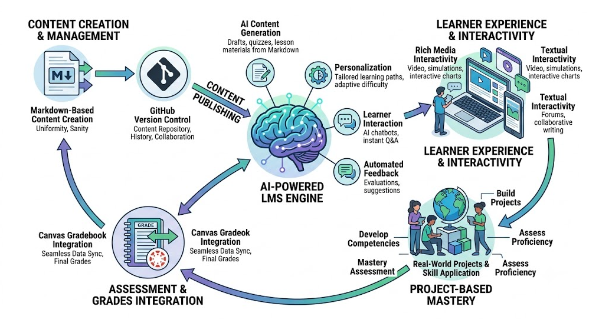

---

Elevate your online learning ecosystem with MasteryLS, where AI-driven interaction, accelerated and maintainable Markdown workflows, and a relentless focus on project-based mastery converge to transform education.

MasteryLS seamlessly bridges advanced content operations with an optimized learner experience. By anchoring your curriculum in Markdown-based creation and managing it through GitHub version control, the system ensures complete formatting sanity and collaboration stability before any content ever reaches the learner. At the core of the MasteryLS ecosystem lies an AI-powered LMS engine that personalizes delivery, generates contextual materials, provides feedback, and handles real-time learner interactions. This engine drives rich media engagement and project-based mastery pathways, ultimately closing the loop by automatically synchronizing comprehensive performance data with the Canvas Gradebook.

## Features

- **Content Creation & Management**: The process begins with Markdown-based content creation for consistency, which is then managed and versioned through GitHub to maintain a complete history of the curriculum.
- **AI-Powered LMS Engine**: This central hub utilizes AI to analyze content, generate new materials (like quizzes and drafts), personalize learning paths, and provide automated interaction and feedback to students.
- **Learner Experience & Interactivity**: Students engage with rich media and textual content through a modern interface, benefiting from customized curriculum delivery and interactive features like chatbots.
- **Project-Based Mastery**: Learners apply their skills to real-world projects to build core competencies. Their progress is evaluated through mastery assessments designed to ensure proficiency before advancement.
- **Assessment & Grades Integration**: Finally, grades are finalized based on mastery results and seamlessly synchronized with the Canvas Gradebook, completing the learning cycle.

## Learning more

Learn more about MasteryLS:

- [MasteryLS.com](https://masteryls.com/)
- [Introductory Video](https://youtu.be/HXNx_Gp0jyM)
- [MasteryLS application features](docs/features/features.md)
- [Demonstration course](https://masteryls.com/course/51a72d23-50ab-4147-a1db-27a062aed771) - _Register to access AI features_
- [Learner tutorial](docs/learnerTutorial.md)
- [Editor tutorial](docs/editorTutorial.md)
- [Deploying your own instance of MasteryLS](docs/deploying.md)
- [MasteryLS software architecture](docs/architecture.md)

---

