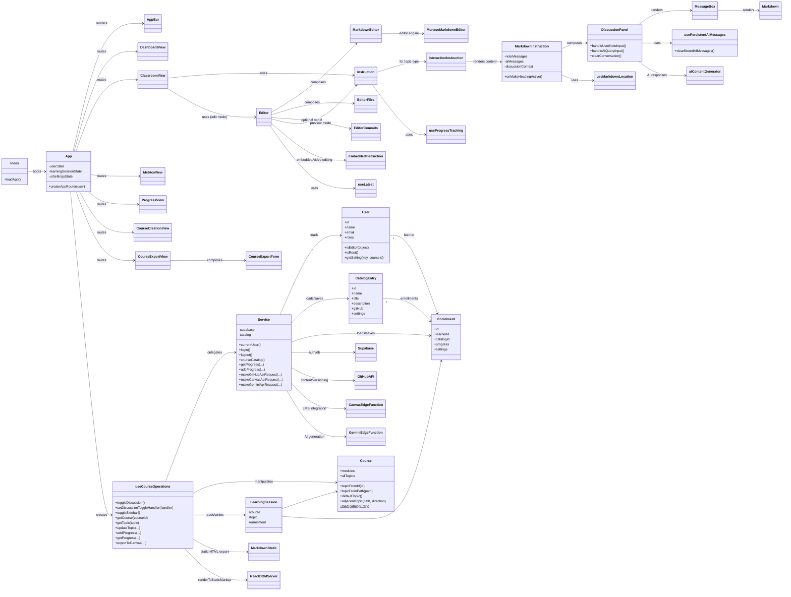

# MasteryLS Application Class Diagram

```mermaid
classDiagram
direction LR

class Index {
  +loadApp()
}

class App {
  +createAppRouter(user)
  -userState
  -learningSessionState
  -uiSettingsState
}

class AppBar
class DashboardView
class ClassroomView
class MetricsView
class ProgressView
class CourseCreationView
class CourseExportView
class CourseExportForm
class Instruction
class InteractionInstruction

class MarkdownInstruction {
  -noteMessages
  -aiMessages
  -discussionContext
  +onMakeHeadingActive()
}

class DiscussionPanel {
  +handleUserNoteInput()
  +handleAIQueryInput()
  +clearConversation()
}

class MessageBox
class Markdown
class MarkdownStatic
class Editor
class MarkdownEditor
class MonacoMarkdownEditor
class EditorFiles
class EditorCommits
class EmbeddedInstruction

class useCourseOperations {
  +toggleDiscussion()
  +setDiscussionToggleHandler(handler)
  +toggleSidebar()
  +getCourse(courseId)
  +getTopic(topic)
  +updateTopic(...)
  +addProgress(...)
  +getProgress(...)
  +exportToCanvas(...)
}

class useMarkdownLocation
class usePersistentAIMessages {
  +clearStoredAIMessages()
}
class useProgressTracking
class useLatest

class Service {
  -supabase
  -catalog
  +currentUser()
  +login()
  +logout()
  +courseCatalog()
  +getProgress(...)
  +addProgress(...)
  +makeGitHubApiRequest(...)
  +makeCanvasApiRequest(...)
  +makeGeminiApiRequest(...)
}

class Course {
  +modules
  +allTopics
  +topicFromId(id)
  +topicFromPath(path)
  +defaultTopic()
  +adjacentTopic(path, direction)
  +load(catalogEntry)$
}

class User {
  +id
  +name
  +email
  +roles
  +isEditor(object)
  +isRoot()
  +getSetting(key, courseId)
}

class CatalogEntry {
  +id
  +name
  +title
  +description
  +gitHub
  +settings
}

class Enrollment {
  +id
  +learnerId
  +catalogId
  +progress
  +settings
}

class LearningSession {
  +course
  +topic
  +enrollment
}

class Supabase
class GitHubAPI
class CanvasEdgeFunction
class GeminiEdgeFunction
class aiContentGenerator
class ReactDOMServer

Index --> App : boots
App --> AppBar : renders
App --> DashboardView : routes
App --> ClassroomView : routes
App --> MetricsView : routes
App --> ProgressView : routes
App --> CourseCreationView : routes
App --> CourseExportView : routes

ClassroomView --> Instruction : uses
ClassroomView --> Editor : uses (edit mode)
Instruction --> InteractionInstruction : for topic type
InteractionInstruction --> MarkdownInstruction : renders content
Editor --> MarkdownEditor : composes
Editor --> EditorFiles : composes
Editor --> EditorCommits : optional panel
Editor --> Instruction : preview mode
Editor --> EmbeddedInstruction : embedded/video editing
MarkdownEditor --> MonacoMarkdownEditor : editor engine
MarkdownInstruction --> DiscussionPanel : composes
DiscussionPanel --> MessageBox : renders
MessageBox --> Markdown : renders
MarkdownInstruction --> useMarkdownLocation : uses
DiscussionPanel --> usePersistentAIMessages : uses

App --> useCourseOperations : creates
Instruction --> useProgressTracking : uses
Editor --> useLatest : uses
CourseExportView --> CourseExportForm : composes

useCourseOperations --> Service : delegates
useCourseOperations --> Course : manipulates
useCourseOperations --> LearningSession : reads/writes
useCourseOperations --> MarkdownStatic : static HTML export
useCourseOperations --> ReactDOMServer : renderToStaticMarkup
Service --> User : loads
Service --> CatalogEntry : loads/saves
Service --> Enrollment : loads/saves

LearningSession --> Course
LearningSession --> Enrollment
CatalogEntry "1" --> "*" Enrollment : enrollments
User "1" --> "*" Enrollment : learner

Service --> Supabase : auth/db
Service --> GitHubAPI : content/versioning
Service --> CanvasEdgeFunction : LMS integration
Service --> GeminiEdgeFunction : AI generation
DiscussionPanel --> aiContentGenerator : AI responses
```
