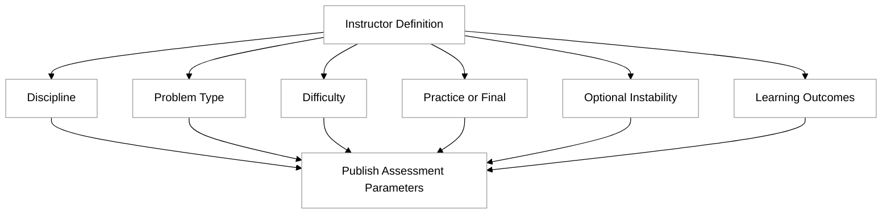
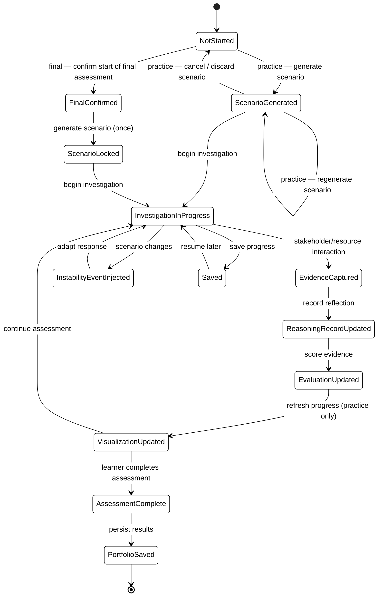
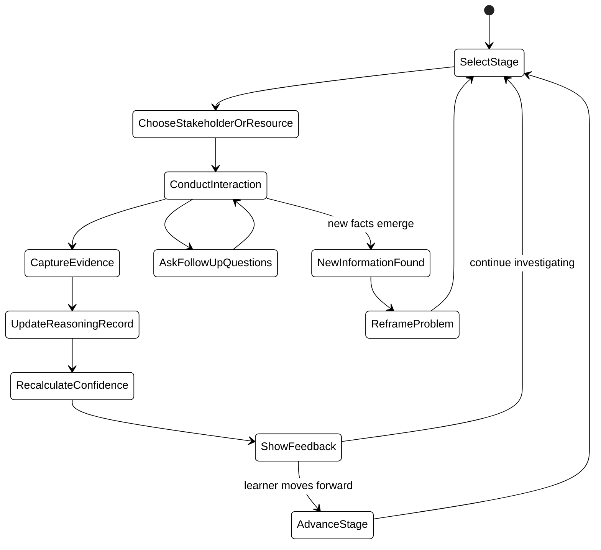

# Disciplinary Reasoning Assessment

To demonstrate mastery of a disciplinary topic, the learner engages with a tool that simulates a real-world scenario. The learner works through different stages of addressing the scenario while interacting with relevant stakeholders and resources. These interactions become the basis for feedback and evaluation. At the conclusion of the assessment, the collected evidence is summarized and an overall evaluation is generated.

The goal is to develop a universal framework that can be used across disciplines and problem domains.

The assessment provides:

1. A structured workflow
1. AI coaching
1. Feedback and evaluation
1. Progress visualization
1. Portfolio creation

The assessment supports two modes:

- **Practice** – Feedback and evaluation are displayed continuously throughout the assessment. The learner may generate a scenario, cancel the assessment, and generate a new scenario as many times as they wish before committing to work through one.
- **Final** – Feedback is withheld until the assessment is complete. The learner explicitly agrees to begin a final assessment; once initiated the scenario is fixed and cannot be regenerated. That scenario must be continued until it is completed.

In both modes the scenario is generated at runtime when the learner begins (not by the author), and the learner may save the current state of the scenario interaction to a progress record and resume it later — the same way an exam interaction is saved and resumed.

## General Framework

```text
Scenario Generation (AI-generated at learner runtime from the author's parameters)
        │
        ▼
Resource Identification (People, Artifacts, Systems)
        │
        ▼
Learner Investigations (Iterative movement through stages using AI interactions)
        │
        ▼
Reasoning Record (Understanding, Identification, Assumptions, Evidence, Decisions)
        │
        ▼
AI Observation Engine (Continuously evaluates each learner interaction)
        │
        ├── Process
        ├── Competencies
        └── Professional Dispositions
        │
        ▼
Feedback (Five-star rating with supporting evidence and justification)
        │
        ▼
Portfolio (Exportable PDF artifact)
```

## Definition

The assessment author does **not** author a specific scenario. The author specifies only the parameters that constrain generation:

1. The target discipline
2. The type of problem to present to the learner
3. The difficulty
4. The mode (Practice or Final)
5. Whether instability events are enabled
6. The intended learning outcomes

These parameters are what is stored with the topic and published. No scenario, stakeholders, or resources are generated or reviewed at authoring time.

When a learner begins the assessment, the framework uses the author's parameters to generate, at runtime:

1. A scenario
2. Expected:
   1. Inflection points (beta testing, customer trials, production release, IPO, ...)
   2. Standards of evidence (annual earnings report, network latency, ...)
   3. Stakeholders (patient, salesperson, government official, ...)
   4. Resources (cleanroom, data center, microscope, ...)

The learner's goal is to develop, justify, and iteratively refine a response to an authentic disciplinary scenario.

The learner demonstrates the ability to:

- Develop an understanding of the problem
- Identify:
  - Stakeholders
  - Resources
  - Inflection points

- Propose a direction
- Establish supporting evidence to justify decisions

## Scenario

When the learner begins the assessment, the AI generates a discipline-specific scenario from the author's parameters. The scenario identifies the major stakeholders who will participate in the investigation. Generation happens at learner runtime, not at authoring time.

In **Practice** mode the learner may discard the generated scenario and generate a new one as often as they like before settling on one to work through. In **Final** mode the learner first confirms that they are starting a final assessment; the scenario is then generated once and locked — it cannot be regenerated and must be completed.

At any point the learner may save the in-progress scenario interaction to their progress record and resume it later, mirroring how an exam interaction is persisted and resumed (see [Assessment Progress](#assessment-progress)).

### Example Scenario

```text
The State Department of Revenue wants to replace its aging tax processing system.

Current system

- 14 million records
- COBOL backend
- Downtime costs $150k/hour
- Multiple government agencies depend on it

Your team has been hired.

Goal

Design an architecture and implementation strategy.
```

### Optional: Instability

The assessment may optionally introduce unexpected changes into the scenario at random points. These events intentionally measure the learner's ability to adapt as new information and constraints emerge.

## Evaluation

The goal of the evaluation is **not** to assess an artifact, but rather to evaluate reasoning and competency. Each dimension is measured and supported with evidence collected throughout the assessment.

### Evaluation Metrics

#### Process

- Framing
- Research
- Modeling
- Action
- Validation
- Reflection

#### Competency

- Systems thinking
- Communication
- Design reasoning
- Evidence-based reasoning
- Decision-making

#### Disposition

- Curiosity
- Ownership
- Integrity
- Persistence
- Empathy
- Accountability

### Evaluation Tracking

For each dimension (as a summation, and also individual attributes) the following is tracked:

- A short textual summary based on the interaction.
- Calculated confidence level.
- Supporting evidence is collected from investigation interactions.

Confidence levels:

- Beginning
- Emerging
- Developing
- Proficient
- Exemplary

### Evaluation Visualization

A radar chart displays the learner's progress on the primary evaluation dimensions (Process, Competency, and Disposition).

A table for each Evaluation metric is displayed with the ability to drill into the supporting metrics.

When in Practice mode the visualization is always displayed. In Final mode it is only displayed when the final artifact is presented.

## Investigation

The investigation is the core interactive experience of the assessment. It involves the process of the learner exploring the scenario through the process of chat conversations with AI, the recording of reasoning, and the tracking of evaluation metrics.

### Investigative Pattern

At any point during the investigation, the learner may identify a stakeholder or resource.

Each stakeholder is automatically assigned a role within the scenario based on the situation they represent. Once identified, the stakeholder becomes available for interaction.

Each investigation follows this pattern:

1. The learner selects one or more stakeholders or resources.
2. The learner conducts conversations or gathers evidence.
3. After each interaction, the learner records reflections.
4. Evidence of performance is collected.
5. Feedback and assessment are generated.
6. In **Practice Mode**, evidence, feedback, and assessment are displayed continuously throughout the assessment.

### Stages

The investigation is organized around six universal disciplinary stages:

1. Frame
2. Research
3. Model
4. Act
5. Validate
6. Reflect

The AI generates discipline-specific interpretations of each stage.

| Universal Move | Software Engineering                 | Biology                        | History                       | Accounting                            |
| -------------- | ------------------------------------ | ------------------------------ | ----------------------------- | ------------------------------------- |
| **Frame**      | Clarify stakeholders and constraints | Define the biological question | Define the historical problem | Clarify the financial issue           |
| **Research**   | Gather requirements                  | Collect observations           | Examine primary sources       | Collect financial records             |
| **Model**      | Design architecture                  | Develop hypotheses and models  | Construct interpretations     | Build financial models                |
| **Act**        | Implement software                   | Conduct experiments            | Write a historical argument   | Prepare statements or recommendations |
| **Validate**   | Test behavior                        | Analyze results                | Evaluate evidence             | Audit and reconcile                   |
| **Reflect**    | Evaluate tradeoffs                   | Consider limitations           | Reconsider interpretations    | Assess risks and implications         |

Throughout the investigation, learners may engage with any of the disciplinary stages. Although the framework encourages a natural progression, learners may revisit earlier stages as new information emerges.

## Reasoning Record

The framework provides a workspace where learners record their thinking throughout the investigation. The learner can easily create a link (with a single button push) to the investigation conversation into the reasoning record content.

The reasoning record includes:

- Current understanding
- Assumptions
- Unknowns
- Hypotheses
- Decisions
- Evidence
- Confidence

## Completion

There is an affordance that completes the assessment.

- The assessment is persisted and available through the portfolio.
- When in Final mode the feedback and evaluation metrics are displayed

Separate from completion, the learner may save an in-progress assessment at any time and resume it later. Saving does not complete the assessment; it preserves the current scenario and interaction state in the progress record so the learner can leave and return.

# Portfolio

As learners complete multiple scenarios, their results are stored and may be published externally.

The framework automatically generates a cumulative summary of progress, presenting a trajectory of learning rather than isolated grades.

| Scenario              | Confidence | Summary        |
| --------------------- | ---------- | -------------- |
| Website creation      | Strong     | Lorem ipsum... |
| Tax management system | Developing | Lorem ipsum... |
| Distributed database  | Emerging   | Lorem ipsum... |

Any portfolio scenario is exportable to PDF format.

# Application Design

## Integration with MasteryLS

The Disciplinary Reasoning Assessment in actualized in MasteryLS as a new instruction type parallel to Exam, Project, and Instruction.

Similar to the schedule editing interface it has its own editor that graphically defines the backing Markdown file without directly editing it.

The topic is stored in GitHub in the same way that other instruction topics are currently. This allows for the same creation, modification, and deletion affordance.

## User stories

As an instructor

- I define a discipline
- I define a problem type
- I set the difficulty, mode, instability, and learning outcomes
- I publish the assessment parameters (the scenario itself is generated later, for each learner)

As a learner

- I generate a scenario from the published parameters when I begin
- In practice mode I can cancel and regenerate the scenario; in final mode I confirm the start and the scenario is locked
- I interview stakeholders and interact with resources
- I record reflections
- I receive coaching
- I save my progress and resume the assessment later

As an evaluator

- I review evidence
- I inspect competency growth
- I export reports

## Evidence Definition

Evidence consists of observable learner behaviors, including:

- Questions asked
- Conversation tone and depth
- Observations made
- Stakeholders identified
- Resources consulted
- Assumptions documented
- Decisions justified
- Revisions made
- Reflections recorded
- Adaptations after instability events

## Assessment loop

```
repeat
    learner selects action
    AI responds
    observation engine extracts evidence
    reasoning record updated
    confidence recalculated
    visualization updated
until assessment complete
```

## Domain Model

Assessment

- id
- title
- discipline
- mode
- scenario
- investigations[]
- reasoningRecord
- evaluation
- portfolioEntry

Scenario

- description
- stakeholders[]
- resources[]
- inflectionPoints[]
- standardsOfEvidence[]

Stakeholder

- name
- role
- personality
- objectives
- availableKnowledge

Resource

- name
- type
- contents

Investigation

- stage
- target
- conversation
- evidenceCollected[]

ReasoningRecord

- understanding
- assumptions
- unknowns
- hypotheses
- decisions
- evidence
- confidence

Evaluation

- process
- competency
- disposition
- evidence[]

## AI Responsibilities

Scenario Generator

- Creates scenarios
- Creates stakeholders
- Creates resources
- Creates inflection points

Stakeholder Agent

- Plays stakeholder roles
- Maintains personality
- Reveals information appropriately

Observation Agent

- Monitors interactions
- Extracts evidence
- Scores competencies

Coach

- Provides hints
- Provides feedback
- Suggests investigations

Assessment Agent

- Iteratively summarizes observations for visualization
- Produces final report

## State diagrams

### Assessment authoring flow

The instructor defines and publishes only the generation parameters. There is no scenario generation or review at authoring time — that happens later, per learner, in the assessment flow.



### General learner assessment flow



The learner state (mode, whether a final assessment has been confirmed, the generated/locked scenario, investigations, reasoning record, and evaluation) is persisted to the learner's progress record so that a saved assessment can be resumed exactly where it was left — the same persistence model used by exams.

### Interview flow



## Layouts

### Assessment editor

```
┌──────────────────────────────────────────────────────────────────────────────┐
│ Assessment Generator                                                         │
├──────────────────────────────────────────────────────────────────────────────┤
│ Step 1: Define Assessment                                                    │
│                                                                              │
│ Discipline        [____________________]                                     │
│ Problem Type      [____________________]                                     │
│ Difficulty        [easy (1) to hard (5)]                                     │
│ Mode              ( Practice ) ( Final )                                     │
│ Instability       [ ] Enabled                                                │
│                                                                              │
│ Step 2: Learning Intent                                                      │
│ Learning Outcomes  [_text area____________________________________]          │
│                                                                              │
│ [Generate]  [Cancel]                                                         │
└──────────────────────────────────────────────────────────────────────────────┘
```

```
┌──────────────────────────────────────────────────────────────────────────────┐
│ Assessment                                                                   │
├──────────────────────────────────────────────────────────────────────────────┤
│ Left Panel                           │ Main Panel                            │
│                                      │                                       │
│ Scenario                             │ Generated Scenario                    │
│ - Title                              │ ------------------------------------  │
│ - Goal                               │ ------------------------------------  │
│ - Stakeholders                       │                                       │
│ - Resources                          │ Stakeholders                          │
│ - Inflection Points                  │ ------------------------------------  │
│ - Evidence Standards                 │                                       │
│ - Evaluation Dimensions              │ Resources                             │
│                                      │ ------------------------------------  │
│ Right Panel                          │                                       │
│                                      │ Inflection Points                     │
│ AI Suggestions                       │ ------------------------------------  │
│ - Add stakeholder                    │                                       │
│ - Adjust difficulty                  │ Evidence Standards                    │
│ - Expand instability                 │ ------------------------------------  │
│ - Refine rubric                      │                                       │
│                                      │ Evaluation Rubric                     │
│ [Commit]                             │ ------------------------------------  │
└──────────────────────────────────────────────────────────────────────────────┘
```

## Assessment Definition File format

Disciplinary Reasoning Assessments are stored in markdown format and committed to a GitHub repository.

## Assessment Progress

Progress is stored in the learner's progress record in Supabase, following the same persistence model exams use. A single progress record per learner per assessment captures the full resumable state:

- `mode` — Practice or Final
- `state` — e.g. `notStarted`, `inProgress`, `completed` (and, for Final, whether the start has been confirmed and the scenario locked)
- `scenario` — the generated (and, in Final mode, locked) scenario, stakeholders, and resources
- `investigations` — the learner's interactions and captured evidence
- `reasoningRecord` — the learner's recorded reasoning
- `evaluation` — accumulated process, competency, and disposition results

Because the complete state lives in the progress record, the learner can save and resume an assessment exactly where they left off. The author's published parameters (discipline, problem type, difficulty, mode, instability, learning outcomes) remain in the backing Markdown topic file; only learner-specific runtime state lives in the progress record.
