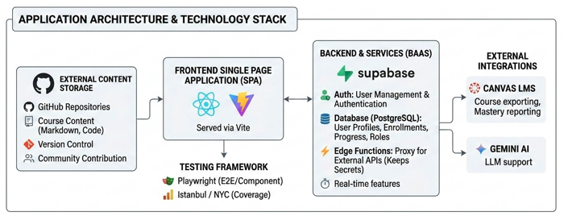
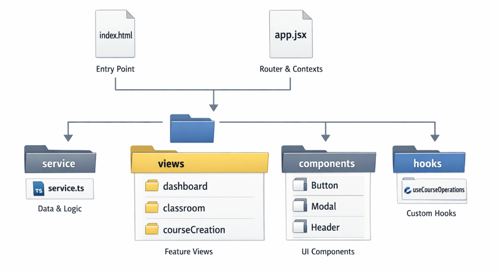

# Architecture

MasteryLS is a web-based Learning System (LS) designed for content mastery and maintainable course creation, leveraging GitHub for content storage, Supabase for backend services, and Gemini AI for content generation and learner feedback.

## High-Level Architecture

The application is a Single Page Application (SPA) built with React and Supabase. It interacts with several external services to provide a seamless learning experience.



- **Frontend**: React application served via Vite.
- **Backend**: Supabase (BaaS) for authentication, database, and real-time features.
- **Content Storage**: GitHub repositories store course content (Markdown, code), allowing for version control and community contribution.
- **Integrations**: Canvas LMS for course exporting, Gemini AI for LLM support.

## Technology Stack

### Frontend

- **Framework**: React 18+ (with React Router v6 for routing)
- **Build Tool**: Vite
- **Styling**: TailwindCSS
- **Internal Editor**: Monaco
- **Markdown**: `react-markdown`, `remark-gfm`, `rehype-raw` for rich content rendering

### Backend

- **Supabase**:
  - **Auth**: User management and authentication.
  - **Database**: PostgreSQL for storing User profiles, Enrollments, Progress, and Roles.
  - **Edge Functions**: Proxy for calling external APIs (Canvas, Gemini) to keep secrets secure.
- **GitHub API**: Used to fetch course content, templates, and manage user commits for projects.
- **Canvas API**: Course exporting and mastery reporting.

### Testing

- **E2E/Component**: Playwright.
- **Coverage**: Istanbul / NYC.

## Core Concepts & Data Model

The application revolves around a few key entities (defined in `src/model.ts`):

1.  **User**: A registered learner or instructor. Uses Supabase Auth.
2.  **Course (CatalogEntry)**: Represents a course. Metadata is stored in Supabase (`catalog` table), but the actual content is in a GitHub repository.
3.  **Enrollment**: Links a `User` to a `Course`. Tracks progress and user-specific settings.
4.  **Topic**: A unit of learning within a course (Video, Instruction, Project, Exam).
5.  **Role**: Defines permissions (e.g., `admin`, `editor`) for a user on a specific object (Course) or globally.
6.  **LearningSession**: A runtime state combining the current Course, Topic, and Enrollment.

## Project Structure



- **`src/index.html`**: Browser entry point.
- **`src/app.jsx`**: Main entry point, sets up the Router and global Contexts.
- **`src/service/`**: Contains `service.ts` (singleton), which handles all data fetching and business logic (Supabase, GitHub, etc.).
- **`src/views/`**: Feature-based directory structure (e.g., `dashboard`, `classroom`, `courseCreation`).
- **`src/components/`**: Reusable UI components.
- **`src/hooks/`**: Custom hooks, encompassing complex logic like `useCourseOperations`.

## Key User Flows

1.  **Authentication**: Users sign in via Supabase Auth one-time passwords.
    - Roles for learners, editors, and root administrators.
1.  **Learning**:
    - User selects a course (Enrollment).
    - Content is fetched from the associated GitHub repository.
    - Progress is tracked in Supabase.
    - Interactions use AI for grading and feedback.
    - Discussions with AI for self directed learning.
1.  **Editors**:
    - Instructors create a new course. The system uses the GitHub API to generate a new repository from a template (`csinstructiontemplate`).
    - Edit markdown content (Monaco) and commit back to GitHub.
    - Generate content with Gemini AI.

## Course repository

This section describes the general structure of a course GitHub repository.

### course.json

A course definition is read from the `course.json` file found in the root of the repo. If there is not `course.json` file then the content of the `instruction/modules.md` file is analyzed to try and discover the course.

```json
{
  "title": "Rocket Science",
  "modules": [
    {
      "title": "Course info",
      "topics": [
        { "title": "Home", "path": "README.md" },
        { "title": "Syllabus", "path": "instruction/syllabus/syllabus.md" },
        { "title": "Schedule", "path": "schedule/schedule.md" }
      ]
    }
  ]
}
```

### GitHub repo structure

In order for a GitHub repo to function as the source for a Mastery LS course it must have the following structure.

```txt
.
├── LICENSE
├── README.md
└── instruction
    ├── topic1
    │   └── topic1.md
    ├── topic2
    │   ├── topic2.md
    │   └── topic2.gif
    ├── topic3
    │   ├── topic3.md
    │   └── topic3.png
    └── syllabus
        └── syllabus.md
```

## Supabase Database

See the [Database Technology](technologyDb.md) document for a complete description of the database schema and design.
