# Editor Tutorial

This tutorial explains the full authoring and course-operations workflow in MasteryLS, from course creation to editing, interactions, settings, analytics, gradebook, and observe mode.

## Quick Start Checklist

If you are new to MasteryLS editing, use this checklist as a first-run path through the core workflow. It is intentionally hands-on: you will create/edit content, validate rendering, confirm settings, and verify operational views (metrics, activity, gradebook, observe mode) in one pass.

- [ ] Create a course (`New course`) or open an existing editor-assigned course.
- [ ] Open a topic and switch `View -> Edit` in the classroom toolbar.
- [ ] Make a small markdown change (heading or paragraph) and verify changed-line markers.
- [ ] Insert one interaction template from the editor toolbar (for example, multiple-choice).
- [ ] Switch back to View mode and confirm the interaction renders/behaves correctly.
- [ ] If needed, add a file or paste an image and verify the markdown reference.
- [ ] Open course `Settings`, confirm metadata, and save changes.
- [ ] If using Canvas, run `Link course` and verify external references.
- [ ] Open `Metrics` and `Activity` once to verify progress/analytics visibility.
- [ ] Open `MasteryView`, expand a learner row, and test `Observe` / `Exit observe`.

## 1) Course Creation and Getting to Edit Mode

> [!NOTE]
>
> You must be a MasteryLS editor in order to create courses

### Create a course

Use the user menu (`New course`) to create a course. You can:

- Generate starter structure with AI, or
- Create from a template repository.

After creation, the course is added to catalog and you are set as an editor for that course.

Once you have MasteryLS fully deployed you can now log into your installation of MasteryLS using the **root email** you provided to the MasterLS CLI for installation. This user has full root access to your installation.

After logging in, you will see the root user's dashboard. Click on the user menu and select **New Course**.

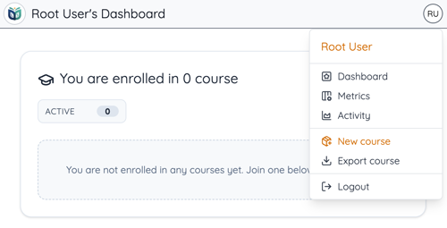

Enter the information about the course. Don't generate the course from your description on your first course. You can experiment with that later.

You need to provide your GitHub account name, repo, and personal access token (PAT) for the location where you want to create the course repository. Make sure that the PAT you provide has **Administration** and **Contents** read/write rights.

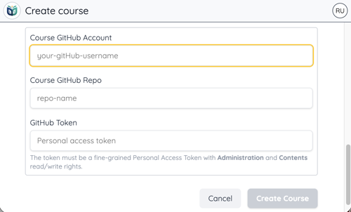

Congratulations! You have successfully installed MasteryLS and created your first course.

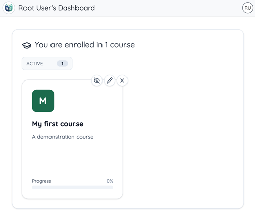

### AI course generation

When you choose AI generation during course creation, MasteryLS asks the model to produce a starter course structure (modules + topics + topic descriptions). This is designed to accelerate initial planning, not replace instructional review.

Recommended workflow:

1. Provide a specific course title and description.
2. Review module sequence for a clear learning progression.
3. Refine generated topic titles/descriptions before drafting content.

Best practices:

- Be explicit about audience level and scope in the description.
- Keep capstone/project expectations clear in the prompt.
- Treat generated structure as a **draft blueprint**. You will need to enhance, add, remove, and curate the list of generated topics.

### Link an existing course to Canvas

If you want to use Canvas as the gradebook for the course then use `Link course` from the user menu to connect MasteryLS content to a Canvas course. This supports:

- Linking pages/quizzes/assignments
- Selecting schedule file for due-date syncing
- Restricting topic subset to link
- Repair/re-link/unlink workflows

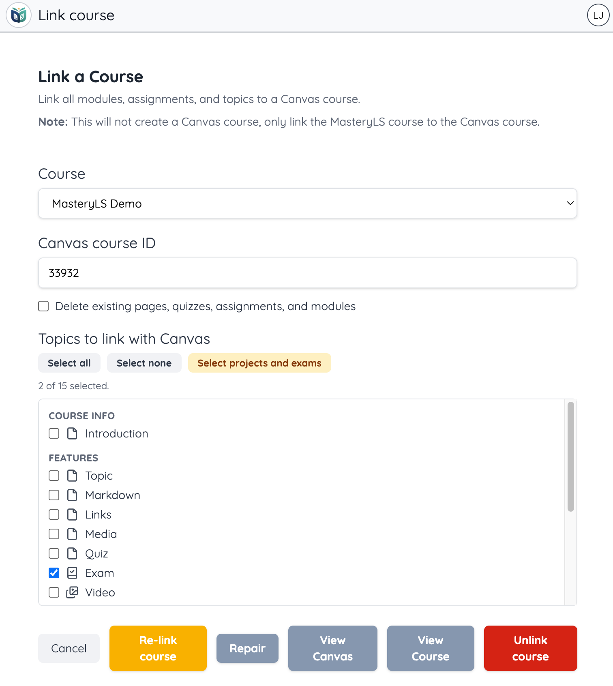

### Enable editing mode

1. Open a course topic.
2. In classroom toolbar, use the `Edit/View` slider to switch to edit.
3. The center pane switches to markdown editor.

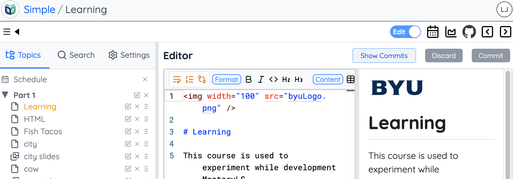

Notes:

- Edit controls are shown only for course editors/root.
- In observe mode, editing and submission actions are read-only.

## 2) Managing Topics and Modules

In `Topics` sidebar (edit mode):

- Add, rename, and delete modules.
- Add, rename, and delete topics.
- Drag-and-drop topics to reorder.
- Generate all stubbed topics with AI (`state: stub` + description).
- Create/delete schedule topic and schedule files.

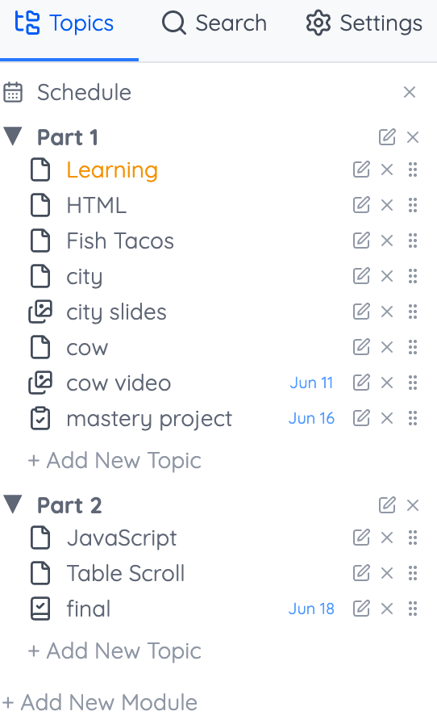

### AI topic generation

AI topic generation turns stub topics into first-draft lesson markdown. It uses topic descriptions (and module/course context) to generate prose and structure quickly.

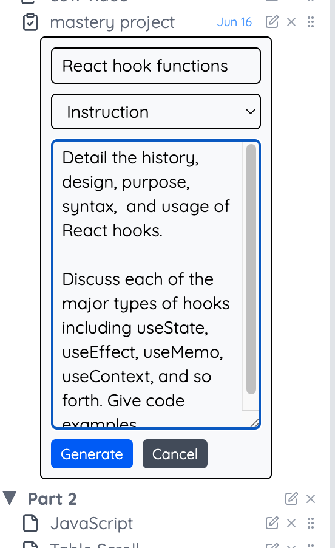

Recommended workflow:

1. Write high-quality topic descriptions first (objective + constraints + expected depth).
2. Generate one topic, inspect quality, then tune descriptions.
3. Generate remaining topics in batches.
4. Perform an editorial pass for correctness, style, and consistency.

Pre-publish checks:

- Validate technical correctness of examples.
- Remove duplicate/redundant sections.
- Confirm links, code blocks, and interactions behave correctly in View mode.
- Ensure generated interactions have valid UUID IDs and intended settings.

Published learner behavior:

- Unpublished topics are filtered from learner-facing TOC.
- Due date labels can appear on topics when schedule due-items map to topic links/titles.

## 3) Using the Editor and Toolbar

The editor supports standard behaviors: selection editing, multi-cursor, undo/redo, search/replace, keyboard shortcuts, and line-level precision editing.

- Draft section headings first (`##`, `###`), then fill content.
- Insert interactions from templates, then tune JSON options.
- Frequently switch to View mode to validate rendering and UX.
- Use changed-line markers before commit.
- **Do not copy interactions**. The generated ID must be unique for each interaction. Use the toolbar button to first create the masteryls code fence and then copy the body of the interaction if desired.

### Tool categories

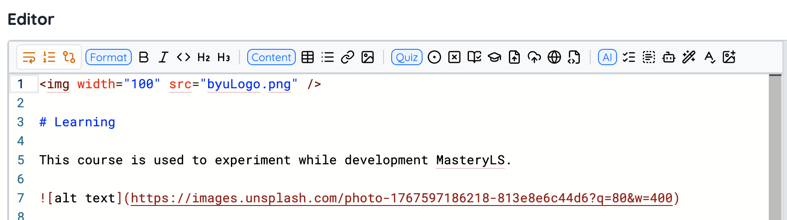

#### Editor toggle group

- `Word Wrap`: Toggle long-line wrapping.
- `Line Numbers`: Toggle gutter numbers.
- `Changed Lines`: Toggle changed-line markers against committed content.

#### Format group

- **Bold**: wrap selection in `**...**`
- **Italic**: wrap selection in `*...*`
- **Inline Code**: wrap selection in `` `...` ``
- **Heading 2**: prefix line with `## `
- **Heading 3**: prefix line with `### `

#### Content group

- **Table**: inserts markdown table template.
- **Bullet List**: prefixes list item with `- `.
- **Link**: opens topic-link selector and inserts internal topic link markdown.
- **Image**: inserts image markdown placeholder.

#### Quiz/Interaction template group

- **Multiple Choice**: inserts a single-answer graded question (`multiple-choice`) where one option is correct.
- **Multiple Select**: inserts a multi-answer graded question (`multiple-select`) where multiple options can be correct.
- **Essay**: inserts a free-response graded prompt (`essay`) for longer written learner answers.
- **Teaching**: inserts an AI teaching/conversation interaction (`teaching`) where learner responses are evaluated from the teaching dialogue.
- **File Submission**: inserts a file upload submission interaction (`file-submission`) for deliverables like documents, code archives, or media.
- **URL Submission**: inserts a URL-based submission interaction (`url-submission`) that can validate links and optionally grade via criteria.
- **Web Page**: inserts an embeddable HTML interaction (`web-page`) using inline HTML or an external topic file.
- **AI Web Page**: inserts a generation/edit/submit web-page workflow (`ai-web-page`) with optional AI prompting and rubric grading.

Each template inserts a `masteryls` interaction fence with starter JSON/body.

#### AI group

- **AI generated quiz**: creates a quiz fence and normalizes interaction IDs.
- **AI generated section**: adds topic section markdown.
- **AI prompt response**: inserts AI-generated prose/content.
- **AI modify selected markdown**: rewrites only selected range.
- **AI topic review**: spelling/grammar/content review.
- **AI generated image**: generates image asset and inserts markdown.

## 4) Managing Files and Pasting Images

### Files

- Add topic files and remove files from editor file tools.
- Insert file links/media references into markdown.

### Pasted images

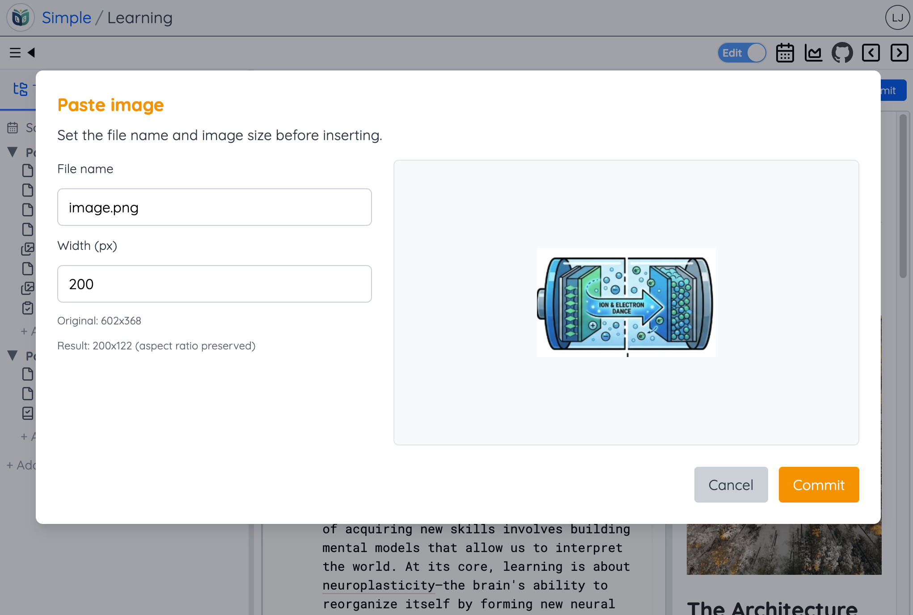

- Paste image directly into editor.
- MasteryLS creates topic asset files and inserts markdown references.
- Duplicate names get unique suffixes automatically.
- Image resize flow can be used before insertion.

## 5) View Commits and Apply History

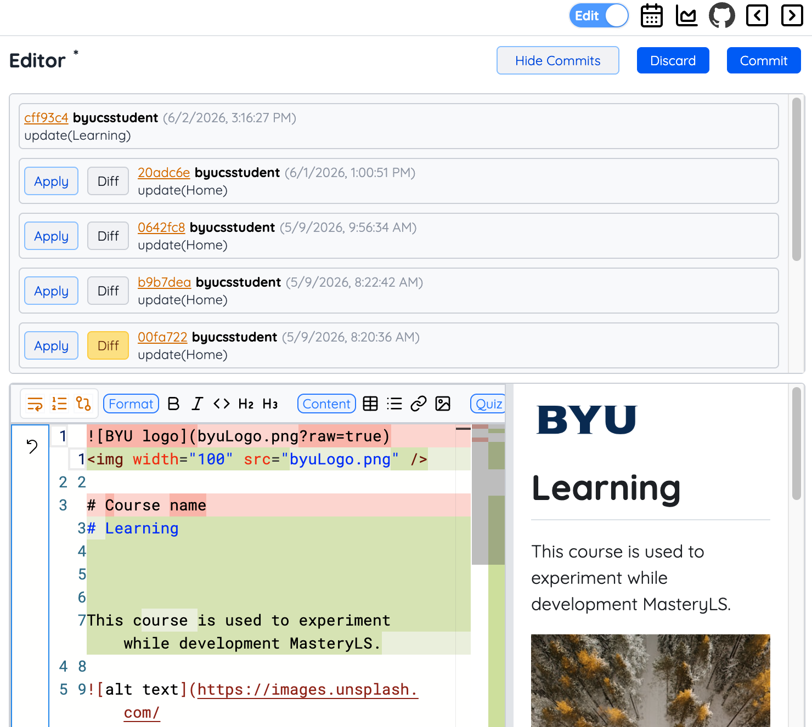

In edit mode commit/history tools:

- View topic commit history.
- Open diffs for prior commits.
- Apply selected revision/diff back into current editor.

Use this to recover from mistakes, compare revisions, and audit changes.

## 6) Create and Manage Schedules

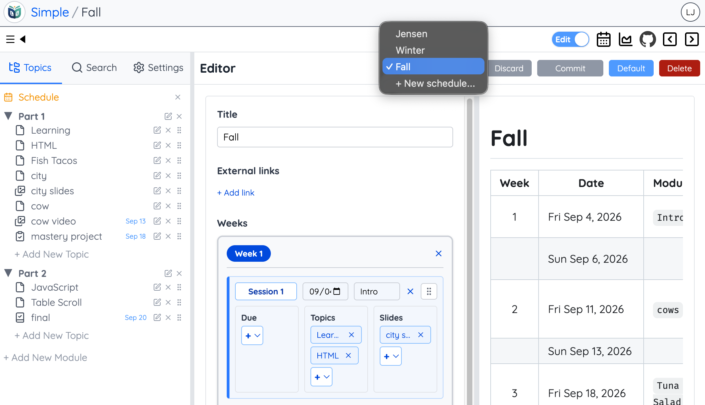

Schedule operations support:

- Create schedule topic.
- Create additional schedule files.
- Set default schedule file.
- Copy schedule files and remap first session date.
- Rename/delete non-default schedule files.
- Delete entire schedule.

Schedule data drives due-date context in TOC and can be used during Canvas linking.

## 7) Interactions: Format, Parameters, and Examples

All interactions use a fenced `masteryls` block:

````
```masteryls
{"id":"<uuid>", "title":"Interaction title", "type":"multiple-choice"}
Body/instructions...
```
````

Additional examples:

- Full interaction examples: [example-topic.md](example-topic.md)
- AI web page authoring examples: [example-topic.md#ai-web-page-authoring-notes](example-topic.md#ai-web-page-authoring-notes)

### Core JSON parameters (common)

- `id` (string): unique interaction identifier. Use UUID format.
- `title` (string): label shown above interaction.
- `type` (string): interaction type selector.

### 7.1 Multiple choice

What it does: Presents a single-answer objective question and awards score based on the selected option versus the defined correct option.

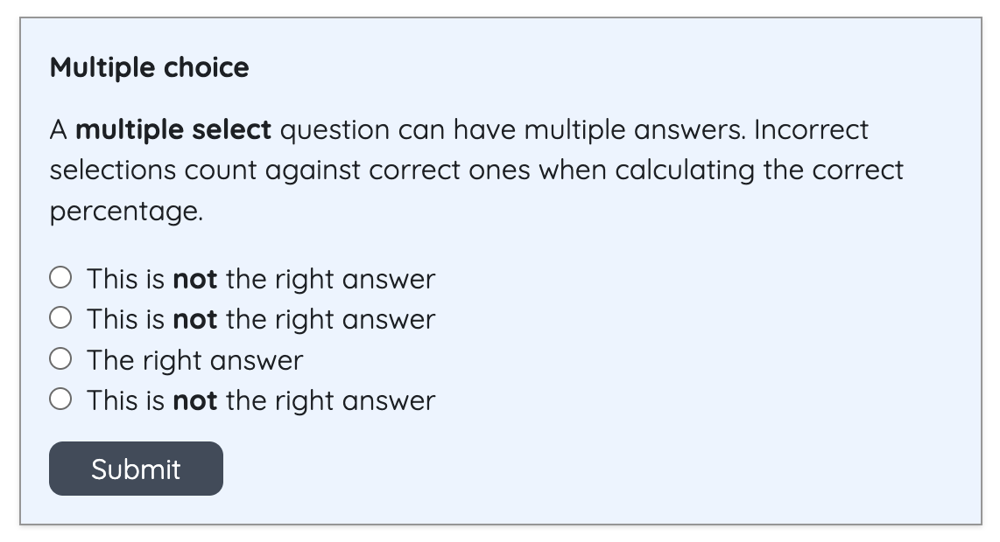

````
```masteryls
{"id":"39280", "title":"Multiple choice", "type":"multiple-choice", "syncGrade":true, "autoGrade":false }
Simple **multiple choice** question

- [ ] This is **not** the right answer
- [x] This is _the_ right answer
- [ ] This one has a [link](https://cow.com)
```
````

Parameters:

- `type: "multiple-choice"`
- Exactly one intended correct choice marked with `[x]`.
- `syncGrade` (bool): enables manual "Submit to Gradebook" button after submission feedback.
- `autoGrade` (bool): controls posted-grade vs comment-only behavior in linked gradebook.

### 7.2 Multiple select


What it does: Presents a multi-answer objective question where learners can choose multiple options; scoring accounts for both correct and incorrect selections.

````
```masteryls
{"id":"39281", "title":"Multiple select", "type":"multiple-select", "syncGrade":true, "autoGrade":false }
A **multiple select** question can have multiple answers.

- [ ] Wrong
- [x] Correct
- [x] Also correct
```
````

Parameters:

- `type: "multiple-select"`
- Multiple `[x]` answers allowed.
- `syncGrade` (bool): enables manual "Submit to Gradebook" button after submission feedback.
- `autoGrade` (bool): controls posted-grade vs comment-only behavior in linked gradebook.

### 7.3 Essay

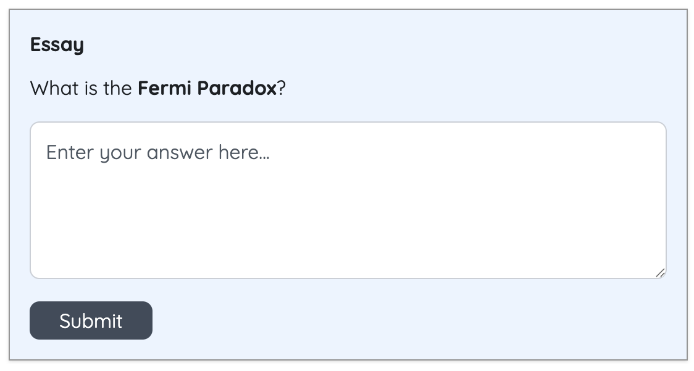

What it does: Collects a free-form written response for qualitative evaluation and feedback.

````
```masteryls
{"id":"b1de730b-9331-4e2f-8c7b-b8ff66a51a03", "title":"Your thoughts?", "type":"essay", "gradingCriteria":"- Answers both parts of the prompt\n- Uses evidence from the lesson\n- Explains reasoning clearly" }
Simple **essay** question
```
````

Parameters:

- `type: "essay"`
- `gradingCriteria` (string, optional): Additional grading criteria used by AI when scoring and generating feedback. The additional grading criteria is applied together with the essay prompt and surrounding content. This gives you the opportunity to add criteria that is not specifically displayed to the learner.
- Body is prompt/context.

### 7.4 Survey

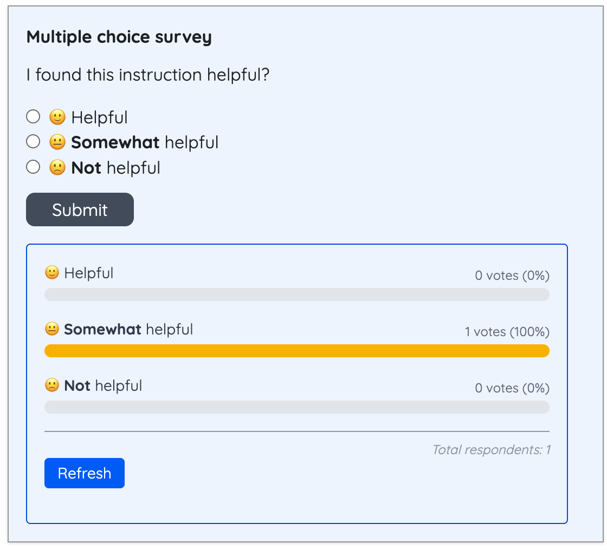

What it does: Collects non-graded learner preference/feedback responses as either single-select or multi-select choices.

````
```masteryls
{"id":"40824056-92f3-48e6-8f68-f0f63d67071f", "title":"Multiple select survey", "type":"survey",  "multipleSelect": "true" }
What would you have as a pet?

- [ ] Cat
- [ ] Dog
```
````

Parameters:

- `type: "survey"`
- `multipleSelect`: `"true"` for multi-select behavior; omitted/false behaves as single-select survey.

### 7.5 Likert

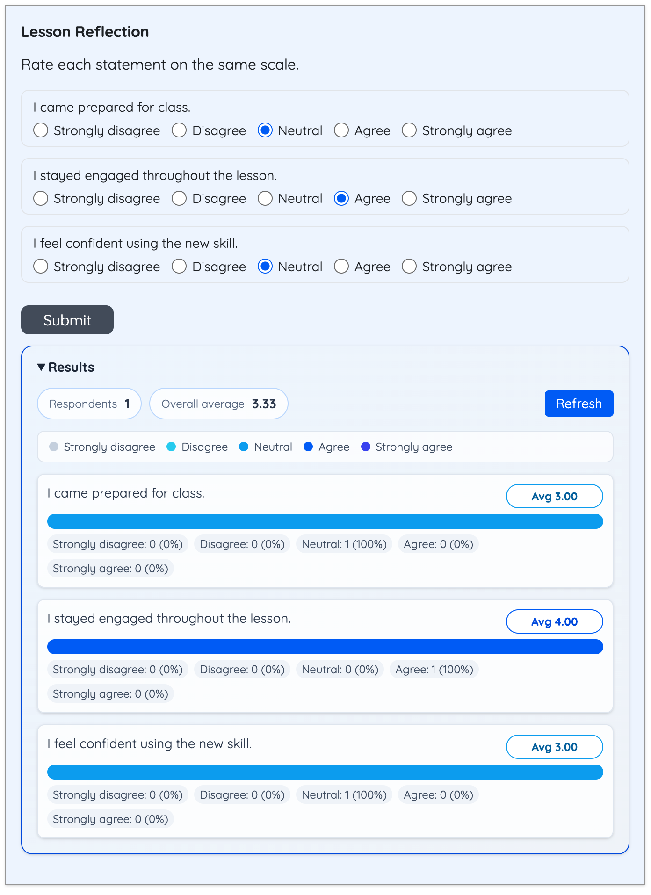

What it does: Collects scaled sentiment across multiple statements and supports aggregated results reporting.

````
```masteryls
{"id":"9f6b1470-6384-45f8-a13a-045b9278f6a2", "title":"Lesson Reflection", "type":"likert", "showResults":"always"}
Rate each statement on the same scale.

Scale: Strongly disagree | Disagree | Neutral | Agree | Strongly agree

| qid | item |
|-----|------|
| prep | I came prepared for class. |
| engage | I stayed engaged throughout the lesson. |
```
````

Parameters:

- `type: "likert"`
- `showResults`: `always` or `editor`
- `required`: optional (`false` allows partial responses)
- `Scale:` line defines ordered labels
- table columns: question id + question text (`qid/id` and `item/statement/question` aliases supported)

### 7.6 File submission

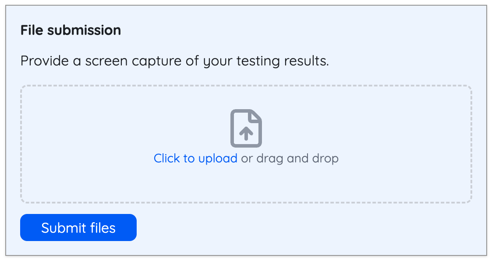

What it does: Collects one or more uploaded files as learner deliverables for project evidence and optional gradebook workflows.

````
```masteryls
{"id":"39283", "title":"File submission", "type":"file-submission", "syncGrade":true, "autoGrade":false }
Simple **submission** by file
```
````

Parameters:

- `type: "file-submission"`
- `syncGrade` (bool): enables manual “Submit to Gradebook” after grading feedback.
- `autoGrade` (bool): controls posted-grade vs comment-only behavior in linked gradebook.

### 7.7 URL submission

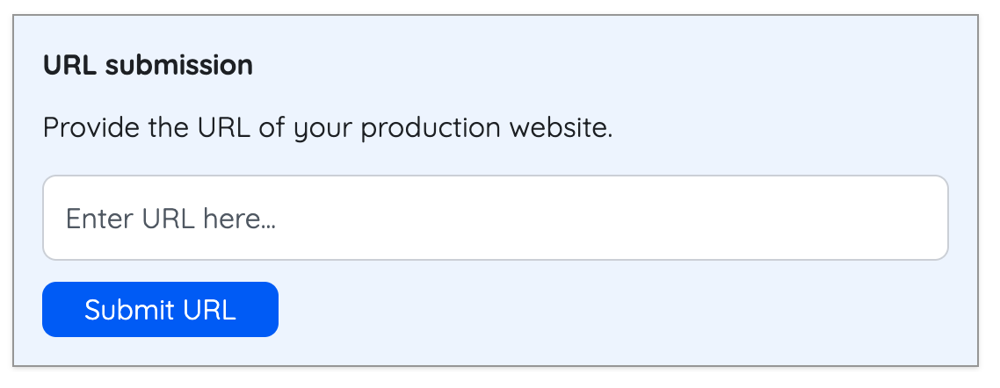

What it does: Collects a learner URL submission, optionally validates/rewrites the URL, optionally grades with criteria, and can sync results to gradebook.

````
```masteryls
{"id":"39287", "title":"URL submission (AI criteria + URL transform)", "type":"url-submission", "validateUrl":true, "syncGrade":true, "autoGrade":false, "gradingCriteria":"- Include a section named HTML Deliverable\n- At least two completed checklist items are explained clearly", "urlPrompt":"Convert the user provided URL to create a URL that is the path to the raw GitHub content for the README.md file." }
Submit your repository URL.
```
````

Parameters:

- `type: "url-submission"`
- `validateUrl` (bool): validates URL format/reachability.
- `gradingCriteria` (string): rubric for AI grading.
- `urlPrompt` (string): transformation prompt for target URL extraction.
- `syncGrade` (bool): enable manual gradebook submission.
- `autoGrade` (bool): include posted score when syncing.

### 7.8 Teaching

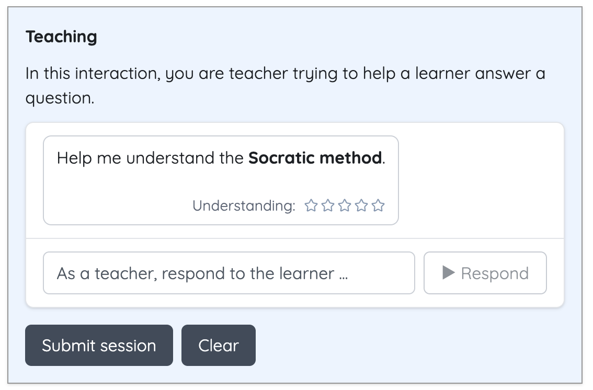

What it does: Runs an AI-assisted teaching dialogue where learner messages are evaluated and submitted as an instructional interaction outcome.

````
```masteryls
{"id":"b1de730b-9331-4e2f-8c7b-b8ff66a51a03", "title":"Teaching", "type":"teaching" }
Help me understand the **Socratic method**.
```
````

Parameters:

- `type: "teaching"`
- Body is teaching objective/context.

### 7.9 Prompt

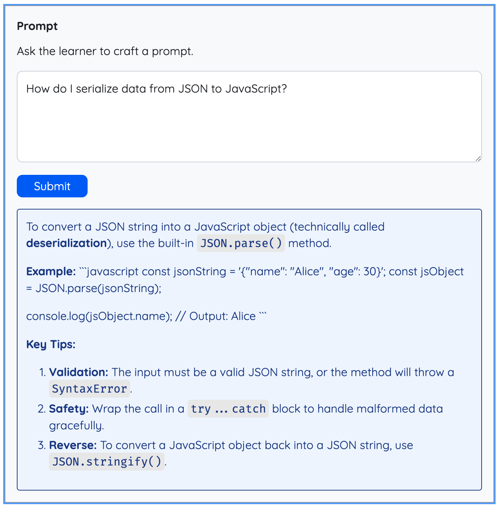

What it does: Captures and evaluates learner-authored prompts as a prompt-engineering style interaction.

````
```masteryls
{"id":"b1de730b-9331-4e2f-8c7b-b8ff66a51a03", "title":"Prompt", "type":"prompt" }
Ask the learner to craft a prompt.
```
````

Parameters:

- `type: "prompt"`
- Body defines task/prompt constraints.

### 7.10 Web page

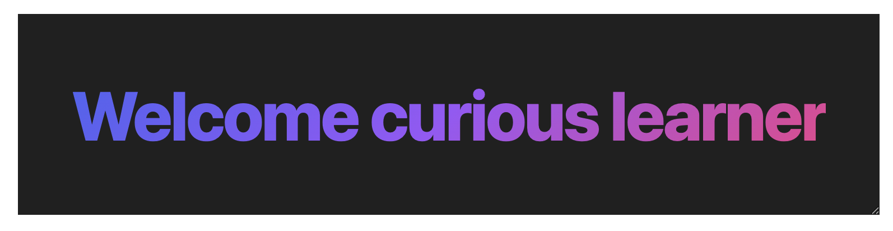

What it does: Renders embedded HTML content (inline or file-based) inside the lesson so learners can view or interact with a page artifact.

````
```masteryls
{"id":"b1de730b-9331-4e2f-8c7b-b8ff66a51a03", "title":"Web Page", "type":"web-page", "file":"instruction/topic1/starter-page.html", "height":"100px"}
This body text is optional when using `file`.
```
````

Parameters:

- `type: "web-page"`
- `file`: HTML path resolved from topic path.
- `height`: initial frame height (number px or CSS unit string).
- Inline HTML body may be used; if both inline HTML and `file` exist, inline HTML takes precedence.

You can use the Web Page interaction to create interactive demos in your content. The following shows an interaction that demonstrates Hick's Law.

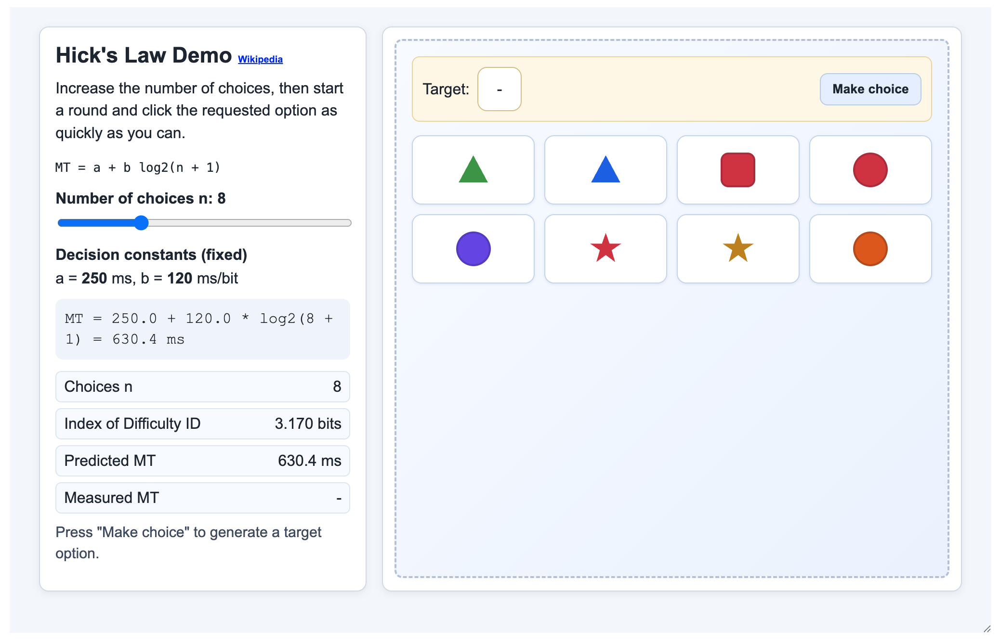

### 7.11 AI web page

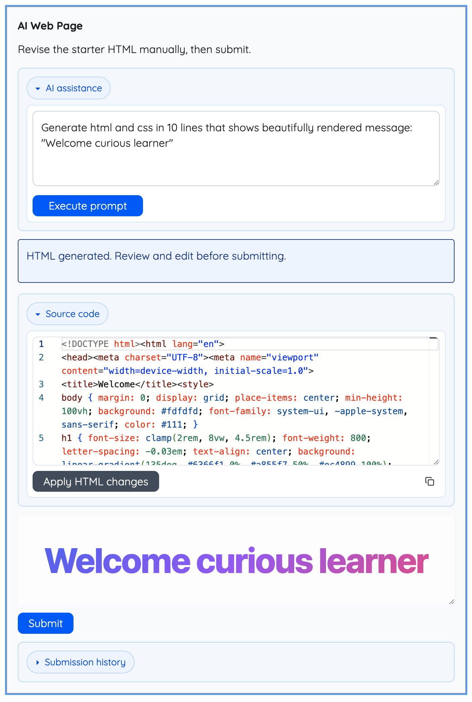

What it does: Provides an AI-assisted workflow to generate/edit HTML, then submit for rubric-based evaluation.

#### Reference to topic file

````
```masteryls
{"id":"b1de730b-9331-4e2f-8c7b-b8ff66a51a03", "title":"AI Web Page", "type":"ai-web-page", "allowAiPrompt":false, "file":"instruction/topic1/starter-page.html"}
Revise the starter HTML manually, then submit.
```
````

#### Reference to embedded HTML

````
```masteryls
{"id":"b1de730b-9331-4e2f-8c7b-b8ff66a51a03", "title":"AI Web Page", "type":"ai-web-page", "allowAiPrompt":false}
Revise the starter HTML manually, then submit.

~~~html
<h1>hello</h1>
~~~
```
````

Parameters:

- `type: "ai-web-page"`
- `allowAiPrompt` (bool): show/hide prompt generation UI.
- `gradingCriteria` (string): rubric for submit-time grading.
- `file`: optional starter HTML file.
- `height`: optional frame height.

## 8) Course Settings (Detailed, including Repair tools)

Open: sidebar `Settings`.

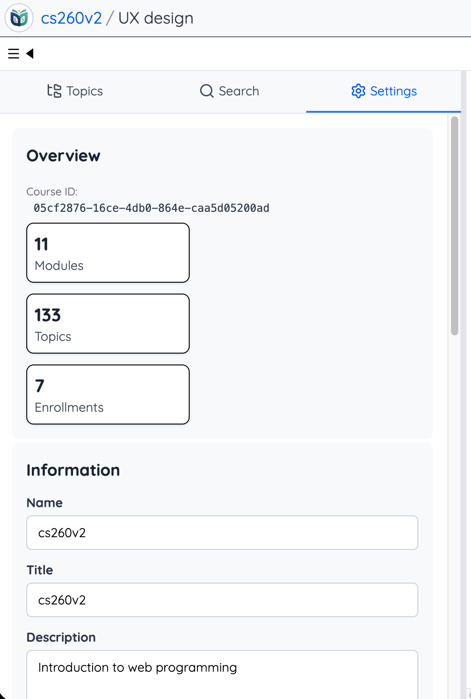

### Information section

- **Name**: short course handle.
- **Title**: display title in UI.
- **Description**: course summary.
- **State**: `published` or `unpublished`.
- **Delete Protected**: blocks destructive deletion.
- **GitHub account/repository**: source-of-truth repo location.
- **GitHub token** (editor): used for repository operations.
- **External references**: current linked external IDs (e.g., Canvas).

### Repair tools

1. **Reindex search**
   - Rebuilds topic search index from current course markdown.
   - Use after large content edits if search appears stale/incomplete.

2. **Unpin content**
   - Clears pinned/forced UI content state across topics.
   - Use if pinned items are stuck or inconsistent.

### People management

- **Manage editors**:
  - Add/remove course editors.
  - At least one editor must remain.
- **Manage learners**:
  - Enroll/remove learners from course enrollment.
  - Changes affect learner course access and related reporting.

### Save and delete behavior

- `Save changes` persists all modified settings and people assignments.
- `Delete course` is restricted (root+editor) and disabled when delete-protected.
- Deletion is destructive (course, repo linkage context, and related records).

## 9) Metrics

Open from user menu `Metrics`.

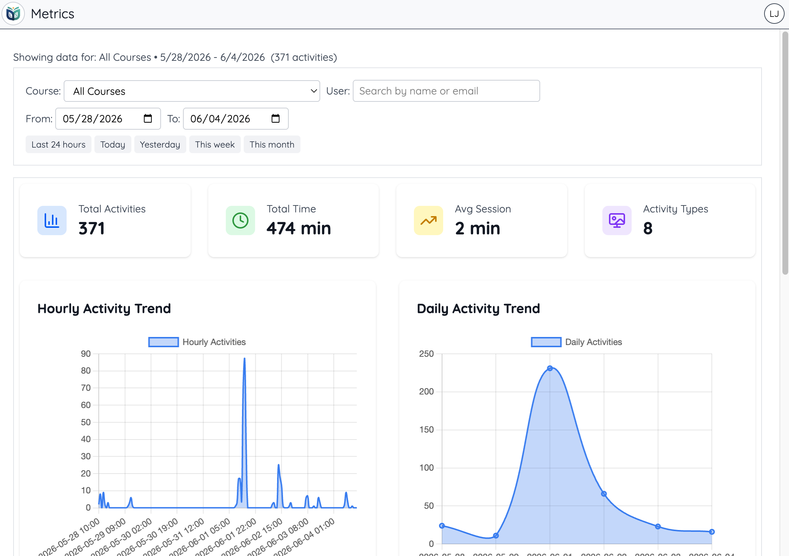

Metrics supports:

- Course filter (`All Courses` or specific course)
- Date range filters + quick presets
- Editor user filter (search by name/email)
- Aggregate activity counters and trend visualizations
- Session/time/activity-type analytics for operational insight

Use it to identify engagement drop-offs, outlier activity, and timing patterns.

## 10) Activity (Progress View)

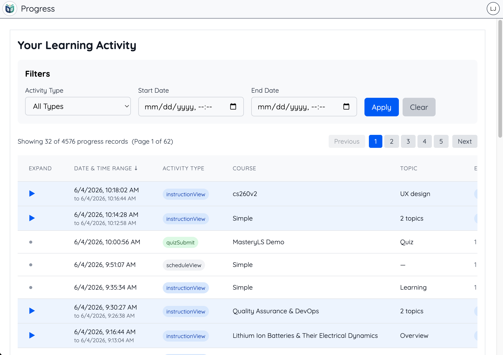

Open from user menu `Activity`.

Features:

- Filter by event type, course, date window.
- Paginated server-side progress records.
- Grouped consecutive events for readability.
- Duration summaries and timestamp sorting.
- Direct navigation back to related course/topic.

Use it for user-level audit trails and behavior debugging.

## 11) Mastery View

Open from user menu or classroom toolbar.

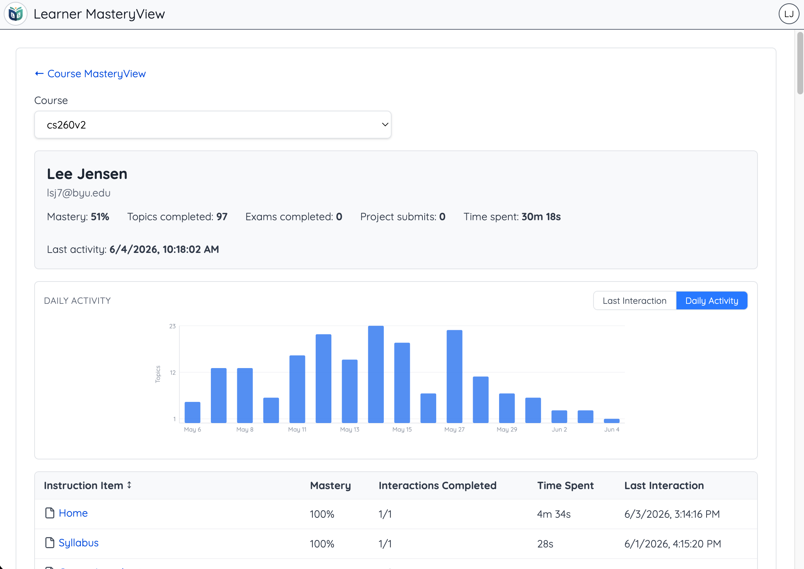

Features:

- Course-level learner summary table.
- Search/pagination.
- Expand learner rows for detailed topic interaction coverage.
- Sort detail columns.
- For sync-enabled submissions:
  - manual `Submit to Gradebook`
  - `autoGrade` behavior respected.

## 12) Observe Mode (Root/Editor as Learner)

Start from Mastery View:

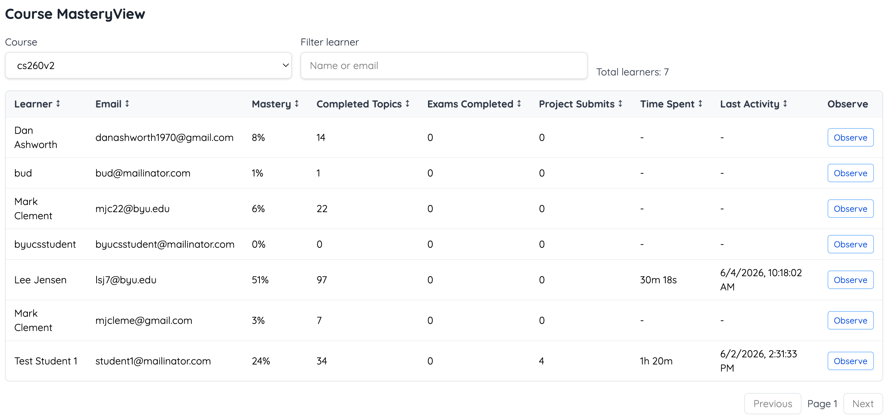

1. Click `Observe` on learner row.
2. App routes to course as that learner.
3. Banner shows observed learner and read-only state.
4. Use `Exit observe` in banner to leave mode.

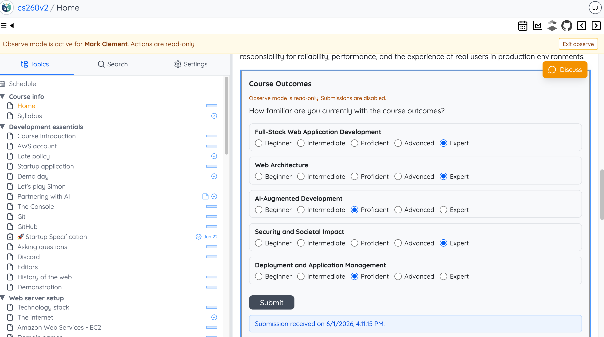

Behavior:

- Read-only course interactions/submissions.
- Grade sync disabled while observing.
- Notes are visible as read-only in discussion.
- Observe session persists across refresh until exited.

## 13) How Content Is Stored in GitHub

MasteryLS course content is GitHub-backed:

- Course structure and metadata are stored in course files (including topic paths and schedule files).
- Topic markdown is the primary authored content.
- Interaction definitions live directly inside topic markdown as `masteryls` fences.
- Added assets (images/files) are stored in repo and referenced by relative markdown paths.
- Editor commits update files in GitHub and commit history is visible from the editor.

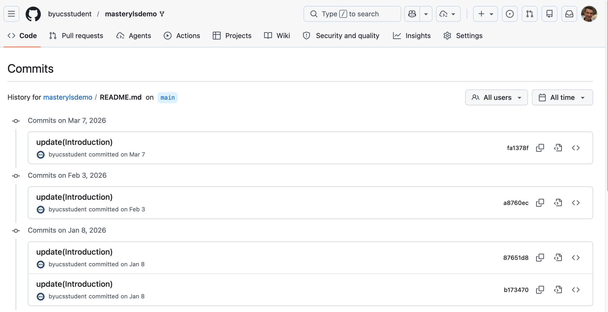

Practical implications:

- Git history is your long-term content audit.
- File paths in topic metadata matter for rendering and linking.
- Keep interaction IDs stable once learners start submitting against them.

## 14) How Data Is Stored in Supabase

Supabase stores operational data and app state, including:

- **catalog**: course catalog entries and settings.
- **user/role**: users, permissions, editor/root rights.
- **enrollment**: learner-course enrollment and progress summary.
- **progress**: event/activity records (`instructionView`, `quizSubmit`, `note`, `exam`, etc.).
- **topic search index**: searchable topic content index data.
- **edge function workflows**: secure Canvas sync, URL validation, gradebook overview aggregation.

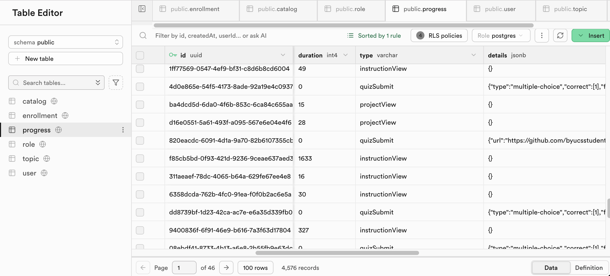

Storage split model:

- **GitHub** = canonical course content/files.
- **Supabase** = users, permissions, enrollments, analytics, submissions, sync metadata.
