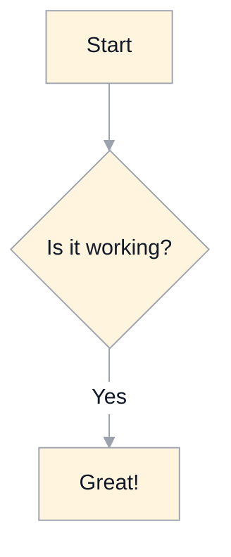

# Instruction Title

This is the content of the instruction. It can include **bold text**, _italic text_, <sub>sub</sub>, <sup>super</sup>, and even [links](https://example.com).

## Quiz

Quizzes in Mastery LS format

```masteryls
{"id":"39280", "title":"Multiple choice", "type":"multiple-choice" }
Simple **multiple choice** question

- [ ] This is **not** the right answer
- [x] This is _the_ right answer
- [ ] This one has a [link](https://cow.com)
- [ ] This one has an image 
```

```masteryls
{"id":"39281", "title":"Multiple select", "type":"multiple-select" }
A **multiple select** question can have multiple answers. Incorrect selections count against correct ones when calculating the correct percentage.

- [ ] This is **not** the right answer
- [x] This is _the_ right answer
- [ ] This is **not** the right answer
- [x] Another right answer
- [ ] This is **not** the right answer
```

```masteryls
{"id":"39282", "title":"Essay", "type":"essay" }
Simple **essay** question
```

```masteryls
{"id":"39283", "title":"File submission", "type":"file-submission" "allowComment":true  }
Simple **submission** by file
```

```masteryls
{"id":"39284", "title":"URL submission", "type":"url-submission" "allowComment":true }
Simple **submission** by url
```

```masteryls
{"id":"39285", "title":"AI Web Page (Prompt + Starter HTML)", "type":"ai-web-page", "height":420, "gradingCriteria":"Create a responsive page with semantic HTML, accessible labels, and a clear call-to-action. Score based on structure, accessibility, and prompt alignment."}
Build a landing page for a student coding club.
Use the prompt box to generate a first version, then edit and submit.

~~~html
<!doctype html>
<html>
  <head>
    <meta charset="UTF-8" />
    <meta name="viewport" content="width=device-width, initial-scale=1.0" />
    <title>Coding Club</title>
    <style>
      body { font-family: sans-serif; margin: 0; padding: 24px; }
      main { max-width: 720px; margin: 0 auto; }
      .cta { display: inline-block; padding: 10px 14px; background: #0b60d0; color: #fff; text-decoration: none; border-radius: 8px; }
    </style>
  </head>
  <body>
    <main>
      <h1>Join Coding Club</h1>
      <p>Build projects, prepare for hackathons, and level up your skills.</p>
      <a class="cta" href="#join">Join now</a>
    </main>
  </body>
</html>
~~~
```

```masteryls
{"id":"39286", "title":"AI Web Page (Manual Only)", "type":"ai-web-page", "allowAiPrompt":false, "file":"instruction/topic1/starter-page.html"}
Revise the starter HTML manually, then submit.
This interaction hides AI prompt generation and starts from the configured file.
```

### ai-web-page authoring notes

- `title`: Displayed above the interaction.
- Directions: Use regular markdown body text (outside code fences).
- Starter HTML from body: Provide an optional `html` code fence in the interaction body (prefer `~~~html` inside a `masteryls` fence).
- Starter HTML from file: Provide optional `file` metadata with a path resolvable from the topic.
- `allowAiPrompt`: Optional boolean (`true` by default). If `false`, prompt generation UI is hidden.
- `gradingCriteria`: Optional text criteria used for AI grading on submit.
  - If omitted, submission receives full credit (100%).
- Submission history: Learners can load a previous submission, edit it, and submit again as a new record.

## Lists

- Item 1
- Item 2

* Item 1
* Item 2

- nested
  1. cow
  1. rat
  1. dog
- more
  1. apple
  1. pie

## Color circles

`#0969DA`

## Section links

[Link to mentions](#mentions)

## Code Block

```javascript
function example() {
  console.log('This is a code block');
}
```

## Mermaid Diagram



## Blockquote and Important Note

> This is a blockquote.

> [!IMPORTANT]
>
> This is an important note that should be highlighted.

## Tables

| Syntax    | Description |
| --------- | ----------- |
| Header    | Title       |
| Paragraph | Text        |

## Task Lists

- [x] Feature 1
- [ ] Feature 2
- [ ] Feature 3

## Strikethrough

~~This was mistaken text~~

## Emoji

:smile: :rocket: :tada: :+1:

## Images


## Mentions

@leesjensen - you are needed

## Issue/PR References

#1 - relative

leesjensen/masteryls#1 - absolute

softwareconstruction240/softwareconstruction#297 - absolute

## Autolinked URLs

https://github.com

## Inline HTML

<span style="color: red;">This is red text</span>
cow</br>rat

## Footnotes

Here is a footnote reference.[^1]

[^1]: This is the footnote.

## Collapsed summary

<details>
<summary>My top languages</summary>

| Rank | Languages  |
| ---: | ---------- |
|    1 | JavaScript |
|    2 | Python     |
|    3 | SQL        |

</details>

## Horizontal lines

---
