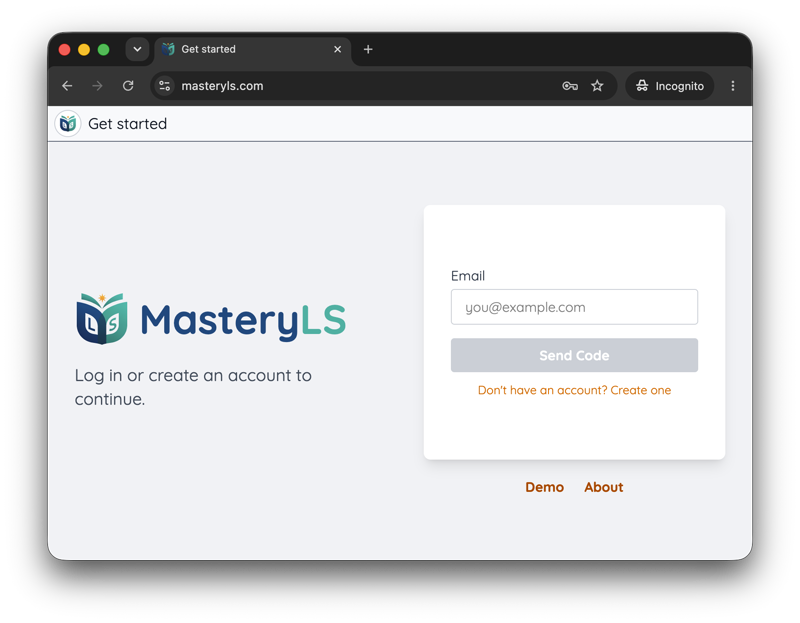
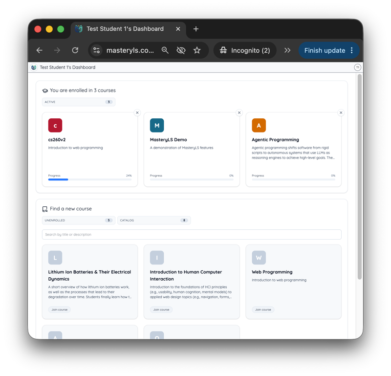
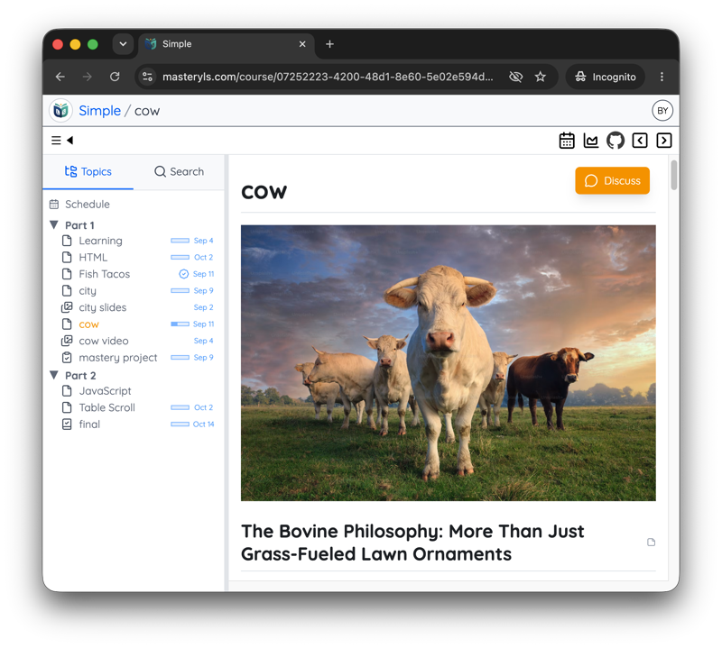
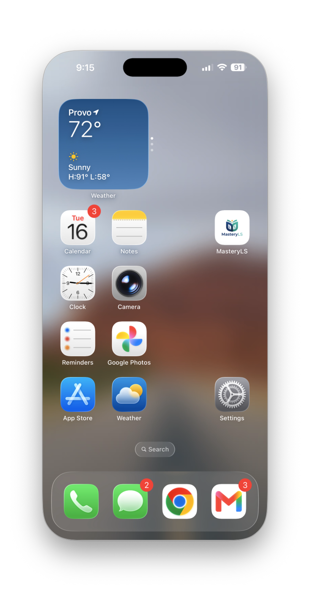
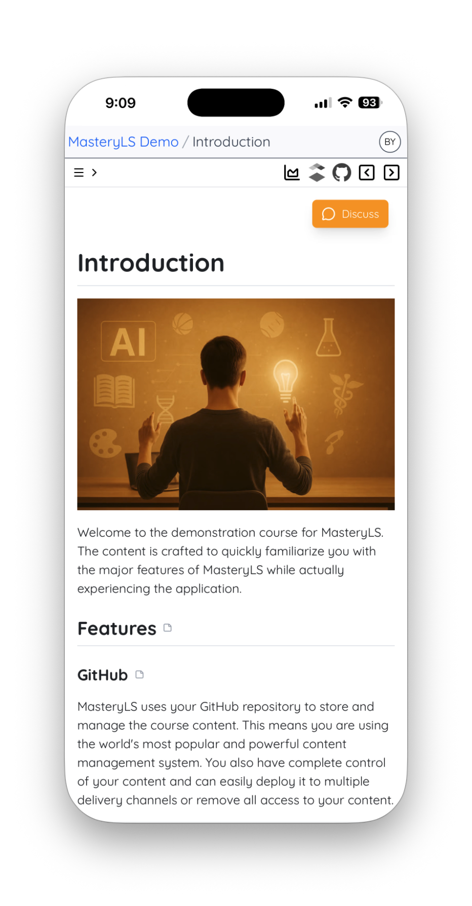
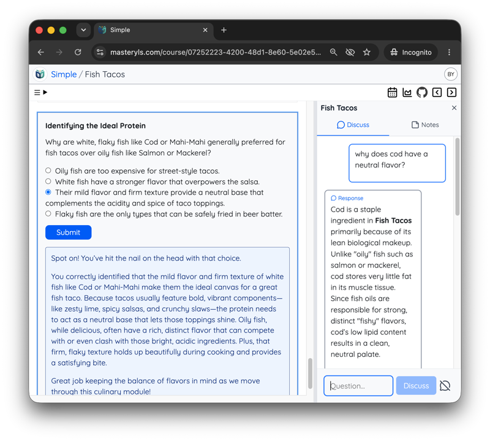
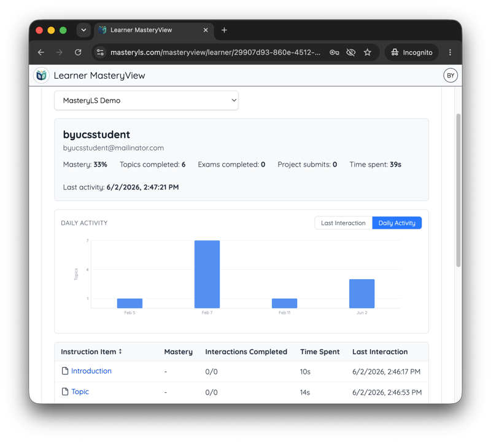

# Features

## Easy to join

You can view courses without even logging in, but to get the full impact of the AI features and tracking your project you simply request a One Time Password though your email. It is that simple.

## Personalized Dashboard

The individualized dashboard shows available courses, enrollments, and progress. The learner, mentor, and administrator can also easily access metrics and logs to view individual performance.

## Content

Beautiful, consistent, content layout containing rich images, video, audio, slides, interactions, quizzes, projects, and exams.

## Use anywhere

MasteryLS uses installable web application technology (PWA) to create an outstanding experience no matter what device you use. You can skip the app store and install the MasteryLS on your phone by simply opening the website and adding it to your home screen. From then on it works like any other native device application.

| Install                                  | Learn                                |
| ---------------------------------------- | ------------------------------------ |
|  |  |

## AI interaction

Automatic AI feedback for all interactions. Content tailored AI chat functionality for any course topic.

## Tracking mastery progress

The Mastery View shows the top level progress that a learner is making. You can see how much time has been spend, what mastery activities have been completed, and what topics have been viewed.

A detailed log tracks progress for everything a learner does in all course interactions and accomplishments. A learner can use this to demonstrate progress. A mentor or administrator and compare progress across courses, activities, peers, and cohorts.

## Metrics

A learner, mentor, or administrator can access the [visualizations](/metrics) for time spent on each course and activity. This helps determine productivity and focus.

## Advanced editor

In order to keep up with the educational needs of your learners you must be able to generate and maintain content easily. MasteryLS make that easy by simplifying the content representation with **Markdown** instead of incompatible, complex, and insecure HTML. Use drag and drop to add files and manipulate the course structure. Hotkeys allow you to execute most common editing tasks.

- Multiple select, search and replace, spell checking, syntax highlighting, and color coding.
- Simplified [markdown](/course/51a72d23-50ab-4147-a1db-27a062aed771/topic/33344322454747d6a7d8da1c57825e1f) content editing for clarity and consistency.
- All major [media](/course/51a72d23-50ab-4147-a1db-27a062aed771/topic/b6c7df2a-699f-43a8-8508-08630dcc5cc6) types supported.
- Maximize learner attention with video, audio, images, and rich textual content.

## Topic types

You can support a diverse audience of learners with different instructional topic types.

- **Text**: Free flowing instructional text with embedded media types and quiz questions.
- **Quiz**: A collection of quiz questions that expedite learning outcomes. AI provides automatic feedback and exploration.
- **Exam**: A collection of quiz questions that measures mastery and only provides feedback upon completion. Mentors review and provide feedback to the learner's mastery demonstration.
- **Video**: Full screen video playback as an individual topic.
- **Project**: Mastery demonstration with a project artifact that is mentor graded and reviewed. After submission, a project then becomes part of the learner's mastery portfolio.

## AI integration

MasteryLS was designed from the beginning with AI as an integral part of the experience. This accelerates learning and reduces mentor overhead.

- **Content generation**: Editors use AI to generate a courses, topics, sections, quizzes, and exams. Editors can then easily enhance and modify the generated content in order to produce a production ready result.
- **Learning feedback**: Learners receive immediate feedback to quizzes, exams, and project submissions. Mentors can augment and overwrite AI responses.
- **Topic discussion**: Learner can deepen their understanding and ask clarifying questions with the context aware AI discussion mentor.

## Advanced interactions

| Group        | Types                                                            | Grading                                                         | AI                                              |
| ------------ | ---------------------------------------------------------------- | --------------------------------------------------------------- | ----------------------------------------------- |
| Choice-based | **multiple-choice**, **multiple-select**, **survey**, **likert** | Auto-scored by choices; survey and likert are unscored          | Feedback on multiple-choice and multiple-select |
| Text-based   | **essay**, **prompt**                                            | essay AI graded; prompt unscored                                | Yes - grading and response generation           |
| AI-chat      | **teaching**                                                     | AI scores understanding %                                       | Yes - conversational feedback                   |
| Submission   | **file-submission**, **url-submission**                          | Auto 100% on submit                                             | None                                            |
| Web content  | **web-page**, **ai-web-page**                                    | web-page display only; ai-web-page criteria-graded or auto 100% | ai-web-page generation optional (configurable)  |

## GitHub content management

MasteryLS uses your GitHub repository to store and manage the course content. This means you are using the world's most popular and powerful content management system. You also have complete control of your content and can easily deploy it to multiple delivery channels or remove all access to your content.

All course changes are versioned, comparable, and reversible. This makes it easy to see what your content looked like a year ago, fix a mistake, see who made a change, or revert to a previous version. Because each file is version controlled you can have multiple instructional designers working at the same time.

Course and topics may be published, under development, or unpublished. Make any user an editor, or remove an editor at any time. You can even _delete protect_ so that you don't accidentally lose your content.

## Canvas Compatible

Your content is available from your GitHub repository and changes made in MasteryLS are immediately synced. You can even export and sync your MasteryLS course to an Instructure Canvas course.

Once you have connected your course to Canvas you can update all topics, or push a single topic, at any time. Any feature that is not compatible with Canvas, such as AI mentoring and feedback, is automatically removed from the Canvas version of the course.

