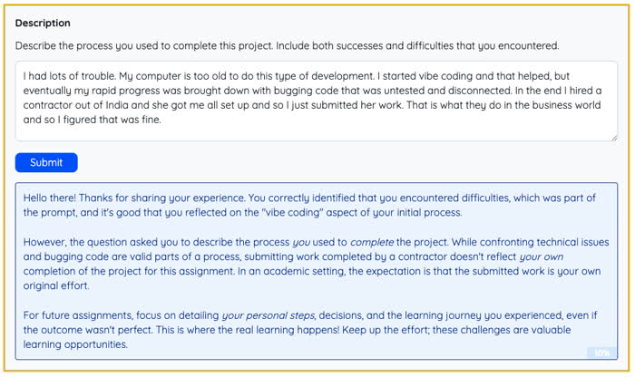
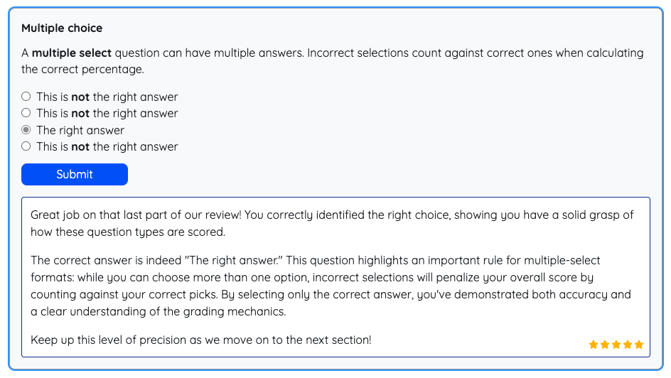
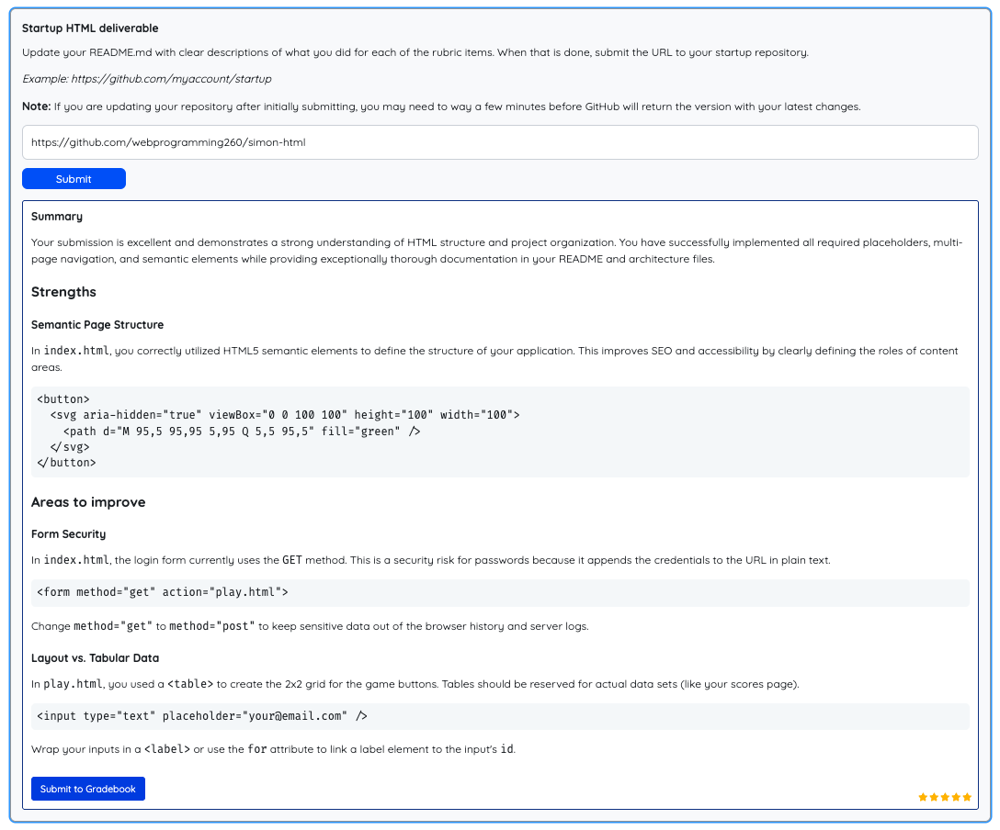

# Learner Tutorial

This tutorial explains how to use MasteryLS successfully as a learner. It covers the major learner-facing screens, how to move through a course, how to complete activities, and how to track your progress.

> [!NOTE]
>
> Not every course uses every feature described here. Your course may include only some of them.

## Quick Start Checklist

- Log in from the start page.
- Open your dashboard and join a course if you are not already enrolled.
- Open a course card to enter the classroom.
- Use the `Topics` tab in the sidebar to move between topics.
- Open the `Search` tab if you need to find a concept quickly.
- Complete any interactions in the topic content and submit your work.
- Use `Discuss` or `Notes` while reading if you want help or want to save your thinking.
- Open the course `Schedule` when you need due dates or pacing guidance.
- Review `MasteryView` or `Progress` to see how your work is being tracked.

## 1. Logging In and Getting Started

When you first open MasteryLS, you land on the start page.

- Enter your email to log in or create your account.
- Use the emailed one-time password if your installation is configured that way.
- If you are just exploring, your instance may also offer demo courses.

After signing in, you will usually be taken to your dashboard.

## 2. Your Dashboard

The dashboard is your home base for courses.

### What you can do there

- View every course you are currently enrolled in.
- See your overall progress percentage on each enrolled course card.
- Search the course catalog by title or description.
- Join a published course you are not yet enrolled in.
- Hide or show completed courses.
- Remove an enrollment if you no longer want the course on your dashboard.

### Best practice

If you are actively working on several courses, use the progress bar on each card to decide where to pick up next.

## 3. Entering a Course

Click a course card to open the classroom.

The classroom has three main areas:

- The top toolbar.
- The left sidebar.
- The main content area.

## 4. Using the Top Toolbar

The classroom toolbar gives you quick navigation and course tools.

### Common learner tools

- `Sidebar toggle`: expand or collapse the left sidebar.
- `Schedule`: open the course schedule if the course has one.
- `MasteryView`: open your course mastery summary.
- `Canvas course site`: open the connected Canvas item or course, if your course uses Canvas.
- `GitHub repository`: open the source repository for the current topic, if you need direct access to course files.
- `Previous topic` and `Next topic`: move sequentially through the course.
- `Course chat server`: open the course chat link if one is configured.

### Keyboard shortcuts

- `Cmd/Ctrl + b`: toggle the sidebar.
- `Cmd + Left Arrow`: previous topic.
- `Cmd + Right Arrow`: next topic.
- `Cmd/Ctrl + i`: toggle the discussion panel.

## 5. Using the Sidebar

The sidebar is where you navigate and search inside the course.

### Topics tab

Use the `Topics` tab to browse the course outline.

- Topics are grouped into modules.
- Click a module title to expand or collapse it.
- Click a topic to open it.
- The current topic is highlighted.
- Some topics may show due-date labels if the course schedule maps dates to them.
- A check icon or progress bar may appear beside topics you have already worked on.
- A note icon appears when you have notes saved for that topic.

### Search tab

Use the `Search` tab to find matching content inside the current course.

- Enter a search term.
- Review matching topics and highlighted excerpts.
- Click a result to jump directly to that topic.

This is useful when you remember a concept but not where it was taught.

## 6. Reading Topic Content

Most topics are displayed as formatted markdown content in the main panel.

Content may include:

- Text explanations
- Headings and callouts
- Images
- Code blocks
- Embedded media
- Interactions and submissions

Some topics are standard reading topics, while others are special topic types such as schedules, embedded content, projects, or exams.

## 7. Using the Discussion and Notes Panel

Most non-schedule learning topics support a side discussion panel.

### Opening it

- Click the `Discuss` button that appears in the topic view, or
- Use `Cmd/Ctrl + i`.

### Two modes

- `Discuss`: ask AI questions about the current topic.
- `Notes`: save your own notes for later review.

### What makes it useful

- The AI discussion is topic-aware.
- You can ask clarifying questions without leaving the lesson.
- You can save useful AI responses as notes.
- Clicking some headings can open discussion filtered to that section.

### Best practice

Use `Discuss` when you are stuck, and use `Notes` when you want to capture your own summary in your own words.

## 8. Working With the Schedule

If the course includes a schedule, you can open it from the toolbar.

### What you can do

- View the course pacing plan.
- Switch between schedule files if the course provides more than one schedule.
- Follow due dates and recommended sequence.

If due dates are connected to topics, you may also see abbreviated due-date markers in the topic list.

## 9. Completing Interactions

Many topics contain embedded interactions. These are how you practice, submit work, and receive feedback.

When you submit an interaction, MasteryLS may:

- Mark it complete
- Record a score
- Show feedback immediately
- Update your mastery and progress views

While AI grading is running, you may see an evaluation indicator and status message near the submission area. Wait for it to finish before leaving the page if you want to review the feedback immediately.

### Multiple choice and multiple select

Use these for objective questions.

- Select the answer or answers.
- Click `Submit`.
- Review the feedback and score.

### Essay

Use this for longer written responses.

- Type your answer in the text area.
- Submit when ready.
- Review AI-generated score and written feedback if the course has grading enabled.

### Likert

Likert interactions collect ratings across a shared scale.

- Answer each item on the scale shown.
- Submit when complete.

### File submission

Use this when you need to upload a deliverable.

- Choose the required file or files.
- Click `Submit files`.
- Wait for the upload to finish.
- Review any returned status or feedback.

### URL submission

Use this when your work lives at a link, such as a deployed site, video, or document.

- Paste the URL.
- Submit it.
- If the course validates URLs, correct any validation errors and resubmit.

### GitHub submission

Some technical courses may ask you to submit a GitHub repository or GitHub URL. Follow the instructions in the interaction and submit the requested GitHub link.

### Teaching interaction

Teaching interactions are conversational.

- Respond to the prompts as if you are teaching the concept back.
- Continue the exchange until you are ready.
- Click `Submit session` when finished.

### Web page and AI web page interactions

These interactions may ask you to inspect, build, or revise HTML content directly in the lesson.

- `web-page`: usually displays a page or embedded HTML.
- `ai-web-page`: may let you generate, revise, and submit a page based on prompts or criteria.

## 10. Understanding Feedback and Scores

After a submission, you may see:

- Written feedback
- A numeric score or percent
- Star-based visual scoring
- A completion marker

Use the feedback first, and the score second.

The score tells you how you did. The feedback tells you how to improve.

## 11. Exams and Projects

Some topics are more formal than standard practice interactions.

### Exams

Exams are designed to measure mastery more formally.

- Read directions carefully before you start.
- Complete all required parts before leaving the topic.
- Some exams delay or limit feedback until completion.

### Projects

Projects may ask you to submit a file, URL, GitHub repository, or another artifact that demonstrates mastery.

- Follow the submission instructions exactly.
- Double-check that you submitted the correct artifact.
- If the course uses Canvas gradebook integration, some project workflows may also support gradebook submission.

## 12. Tracking Your Progress

MasteryLS gives you two main learner-facing tracking views: `MasteryView` and `Progress`.

### MasteryView

Open `MasteryView` from the classroom toolbar.

Use it to see your course-level mastery summary, including:

- how much of the course you have completed
- how much time you have spent
- how many interactions you have finished
- how your progress is distributed across topics

This is the quickest high-level view of how you are doing in a course.

### Progress

The `Progress` page is a more detailed activity log.

Use it to:

- review recent work
- filter by activity type, course, or date
- inspect your submission history
- see how your time and actions are being recorded

This is useful when you need a detailed record of what you have done.

## 13. Metrics

Some installations make a `Metrics` view available.

Use it to visualize:

- time spent by course
- activity trends
- where your effort is going

This is especially helpful for self-management across multiple courses.

## 14. Tips for Succeeding in MasteryLS

- Use the sidebar topic list to stay oriented in the course structure.
- Check the schedule regularly instead of waiting until a due date is close.
- Complete interactions as you go instead of reading straight through and planning to return later.
- Use discussion for clarification, but write your own notes so your understanding becomes durable.
- Review feedback after each submission and revise your approach before moving on.
- Use MasteryView weekly to monitor whether your progress matches the course pace.
- Use Progress if you need a record of exactly what you completed.

## 15. Troubleshooting

### I submitted something and nothing seems to happen

- Wait a few seconds, especially for AI-graded interactions.
- Watch for the evaluation message near the submit button.
- Do not click submit repeatedly while evaluation is in progress.

### My topic changed but I cannot see the content

- Collapse the sidebar with the toolbar button.
- On small screens, selecting a topic should usually bring the content into view automatically.

### I cannot find something I already studied

- Use the `Search` tab in the sidebar.
- Check your notes for that topic.
- Use `Previous topic` and `Next topic` in the toolbar if you are moving through content sequentially.
