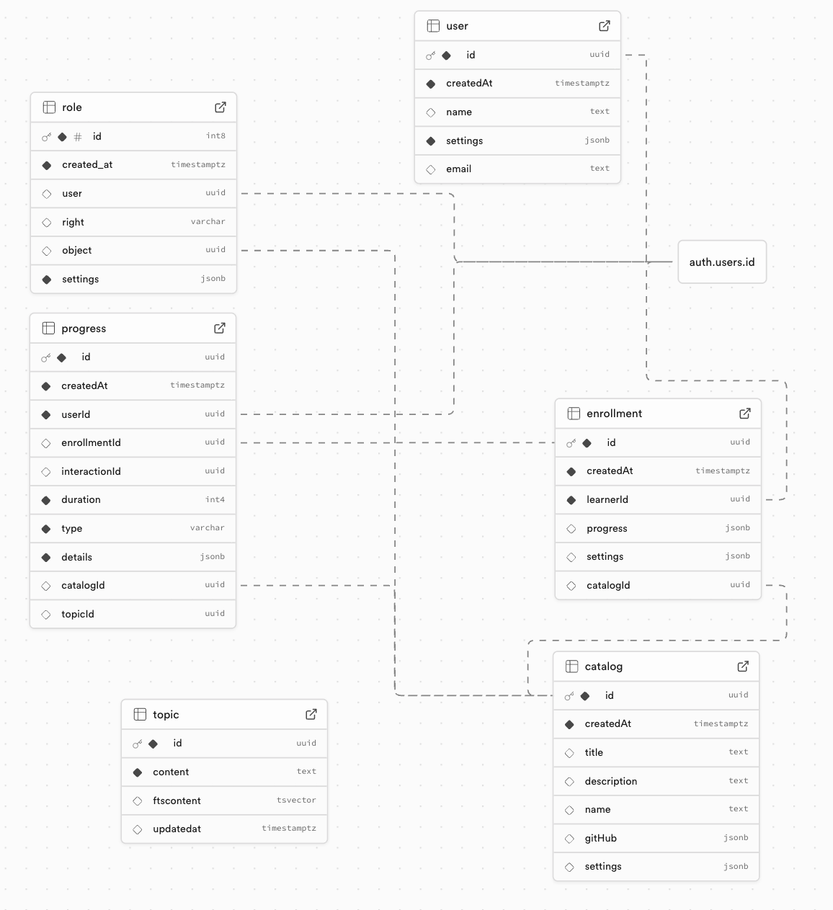

# MasteryLS Database Technology

The database configuration is found in the [Creation SQL Script](supabase/schema.sql) that is used to initialize Supabase for a new installation. This includes the Postgres table schemas, grants, RLS, triggers, and policies.

The primary objects include:

- **User** - A user of MasteryLS. This can be a learner, editor, or root user as defined by the entries in the **role** table.
- **Role** - The roles that users have. By default all users have the **learner** role.
- **Catalog** - The available courses. Courses have state such as `published` and may not be available for all users.
- **Enrollment** - Indicates a learner is participating in a course.
- **Progress** - All of the actions a user has taken. This includes authentication events as well as enrollment and learning actions.
- **Topic** - Search index for course content.
