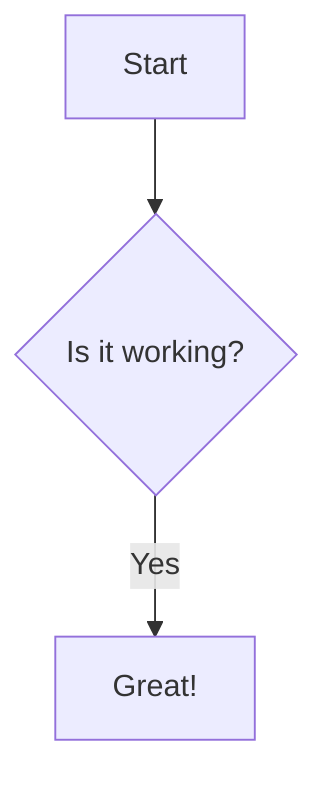

# Instruction Title

This is the content of the instruction. It can include **bold text**, _italic text_, and even [links](https://example.com).

- Item 1
- Item 2

## Code Block

```javascript
function example() {
  console.log('This is a code block');
}
```

## Mermaid Diagram



## Blockquote and Important Note

> This is a blockquote.

> [!IMPORTANT]
>
> This is an important note that should be highlighted.

## Tables

| Syntax    | Description |
| --------- | ----------- |
| Header    | Title       |
| Paragraph | Text        |

## Task Lists

- [x] Feature 1
- [ ] Feature 2
- [ ] Feature 3

## Strikethrough

~~This was mistaken text~~

## Emoji

:smile: :rocket: :tada:

## Images


## Mentions

@leesjensen

## Issue/PR References

#2
leesjensen/masteryls#2

## Autolinked URLs

https://github.com

## Inline HTML

<span style="color: red;">This is red text</span>

## Footnotes

Here is a footnote reference.[^1]

[^1]: This is the footnote.
