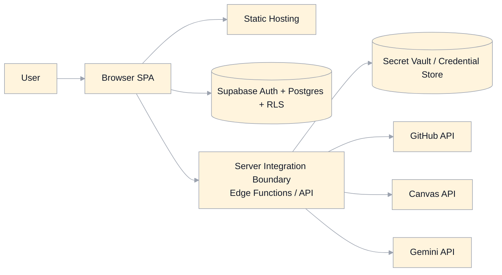
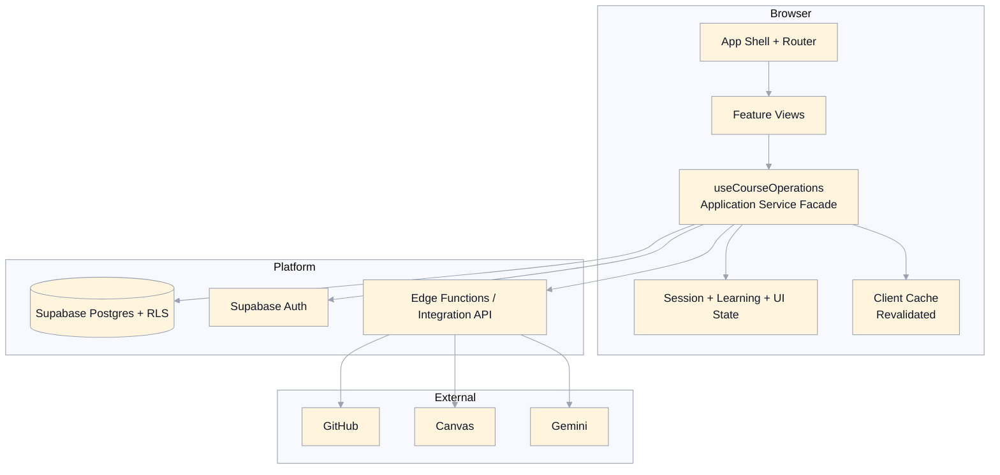
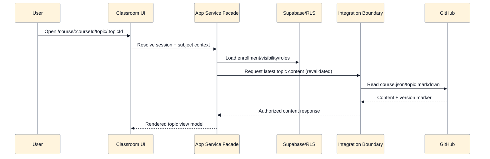
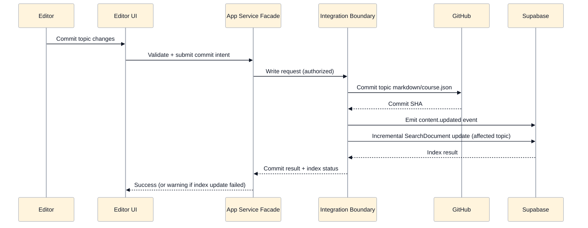
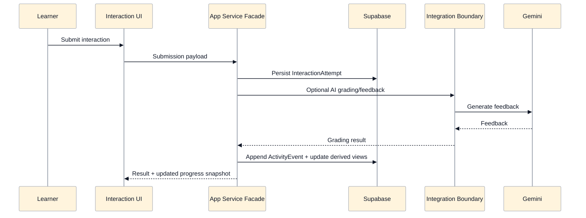

# System Architecture Specification

## Scope
This document defines the target system architecture for MasteryLS:
- runtime component boundaries
- integration boundaries
- data ownership and consistency rules
- cross-cutting security and observability behavior

It is aligned to:
- `app.md`
- `domain-model.md`
- `auth-authorization.md`
- `routing-state.md`
- `editor-github-authoring.md`
- `search-progress-metrics.md`

## Design Goals
- Keep architecture simple to operate and clear to reason about.
- Enforce server-side authorization and secret custody for all sensitive operations.
- Separate canonical content storage (GitHub) from operational application data (Supabase).
- Support read-only observer mode via explicit actor/subject context.
- Make writes auditable and read models reproducible.

## Architecture Style
- Client: React SPA with route-driven feature views.
- Backend platform: Supabase Auth + Postgres + RLS + Edge Functions.
- External systems: GitHub (content), Canvas (LMS export), Gemini (AI).
- Integration pattern: browser never owns long-lived external secrets; external write/read operations requiring credentials execute through server-side integration boundary.

## System Context

## Container View (Runtime)

## Logical Layering
- Presentation Layer:
  - route views, panes, editor, interactions, metrics/progress dashboards.
  - governed by UI contract artifacts in `specification/ui/*` and screen manifests in `specification/ui/manifests/*`.
- Application Layer:
  - orchestration/service facades (`useCourseOperations`) coordinating workflows.
- Domain Layer:
  - explicit domain entities from `domain-model.md` and policy decisions from `auth-authorization.md`.
- Infrastructure Layer:
  - Supabase adapters, integration adapters for GitHub/Canvas/Gemini, storage and cache adapters.

Rules:
- UI layer does not implement authoritative permission logic.
- Application layer resolves actor/subject context and calls server-authorized operations.
- Infrastructure layer is replaceable without changing domain contracts.

UI rendering boundary:
- application services return view models.
- UI components render from view models + screen manifests (slot/state/component allowlists).
- orchestration hooks coordinate data/actions; they are not the source of visual contract truth.

## Application Service Decomposition (Phased Migration Plan)
Current state:
- `useCourseOperations` is a broad compatibility facade spanning learning runtime, authoring, admin, export, AI, and analytics operations.

Target state:
- split into focused application services with explicit contracts:
  - `LearningRuntimeService`
  - `AuthoringService`
  - `AdminService`
  - `ExportService`
  - `AnalyticsService`
  - shared `AuthorizationContextService` (actor/subject resolution, including observer mode)
- React hooks become thin adapters over services:
  - `useLearningRuntime`, `useAuthoringActions`, `useAdminActions`, `useExportActions`, `useAnalyticsQueries`.

Migration phases:
1. Phase 0 - Stabilize Facade
- keep `useCourseOperations` public shape stable for existing views/tests.
- enforce centralized permission checks inside facade paths.
- add telemetry tags per operation family to baseline usage and failure patterns.

2. Phase 1 - Extract Pure Services
- move domain/application logic into framework-agnostic modules.
- keep hooks as orchestration adapters only.
- isolate external I/O adapters (Supabase, GitHub, Canvas, Gemini) behind interfaces.

3. Phase 2 - Introduce Capability Hooks
- add focused hooks for new/updated features; avoid adding new behavior to monolithic facade.
- route each capability hook to its corresponding service.
- retain facade as compatibility wrapper delegating to new services.

4. Phase 3 - Cutover And Deprecate
- migrate remaining call sites from `useCourseOperations` to capability hooks.
- mark facade APIs deprecated and remove once no call sites remain.
- enforce architectural lint/check rules preventing new cross-capability coupling.

Guardrails during migration:
- no behavior regression on authz boundaries, observer read-only enforcement, or audit emission.
- no client secret expansion; all sensitive integrations remain server-bound.
- preserve existing route contracts and UI behavior unless explicitly specified.
- require parity tests for each migrated capability before cutover.

Definition of done:
- `useCourseOperations` removed or reduced to a minimal compatibility shim with no business logic.
- all capability services have explicit input/output contracts and test coverage.
- actor/subject authorization context is shared and consistently applied across all services.

## Data Ownership Boundaries
- GitHub (canonical instructional content):
  - `course.json`
  - topic markdown/media assets
  - commit history/diffs
- Supabase DB (canonical operational data):
  - users, roles, observer delegations/sessions
  - enrollments, attempts, exam sessions, notes, activity events
  - search projection (`SearchDocument`) and derived read models
- Client local storage (non-authoritative preferences only):
  - pane layout
  - view preferences
  - per-user scoped transient discussion cache

## Core Runtime Flows

### Topic Read Flow

### Topic Edit Commit + Search Index Update

### Interaction Submission + Activity Pipeline

## Security Architecture
- Identity and session:
  - Supabase OTP auth, server-validated session and scope checks.
- Authorization:
  - RLS + policy checks enforce read/write constraints.
  - observer mode switches subject context and hard-denies writes.
- Secrets:
  - GitHub/Canvas/AI credentials are server-custodied (`CredentialReference`); never exposed to client.
- Content safety:
  - markdown sanitization and protocol allowlists at render/export boundaries.
- Integration boundary:
  - external API calls requiring secrets run server-side.
  - deny-by-default endpoint authorization with auditable outcomes.

## Consistency And Freshness Model
- Canonical event timestamp: `createdAt`.
- Write operations are auditable and idempotency-aware where needed (export/index/repair flows).
- Optimistic concurrency required for authoring writes (base SHA/version checks).
- Content reads target latest default branch with explicit revalidation.
- Search index:
  - incremental update on successful topic create/edit commit.
  - full reindex is available as recovery.

## State Model Responsibilities
- Canonical server state:
  - identity, permissions, enrollments, attempts, notes, activity events, search docs.
- Canonical external content state:
  - GitHub course definition and topic assets.
- Client transient state:
  - currently loaded course/topic view model
  - UI-only preferences and pending editor drafts

## Observability
- Required audit event families:
  - auth, role/delegation, observer session, content updates, exports, reindex, privileged analytics reads.
- Correlation:
  - every privileged operation includes actor and (if applicable) subject user IDs.
- Operational telemetry:
  - integration latency/error categories (GitHub, Canvas, Gemini)
  - cache revalidation outcomes
  - index freshness lag metrics

## Deployment Topology (Target)
- Frontend SPA hosted as static assets.
- Supabase project provides Auth, Postgres, RLS, and Edge Functions.
- Edge Functions act as the integration/API boundary for secret-bound external operations.
- Environment-specific config contains only non-secret public values in frontend runtime config.

## Legacy Gaps Addressed
- Removes client-side external secret custody and token-in-role-settings behavior.
- Replaces mixed direct external calls with a consistent server integration boundary for sensitive operations.
- Formalizes actor/subject context for observer-mode and cross-user reporting reads.
- Makes post-commit search indexing behavior explicit and recoverable.
- Enforces consistent auditability across content, admin, and analytics workflows.
