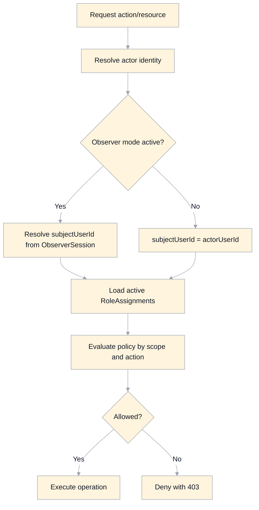

# Authentication And Authorization Specification

## Scope
This document defines the target authentication and authorization model for MasteryLS.

It replaces insecure or ambiguous legacy behavior with explicit, server-enforced rules.

## Security Objectives
- Verify user identity with low-friction, phishing-resistant flows.
- Enforce least privilege with explicit scoped roles.
- Prevent client-side secret exposure.
- Ensure all sensitive access is enforced server-side (not just in UI).
- Provide complete auditability of access and privilege changes.

## Identity Model
- Identity provider: Supabase Auth.
- Primary login factor: email one-time passcode (OTP).
- Canonical user key: auth subject UUID.
- Application user profile is mapped 1:1 with auth subject.

User lifecycle:
1. OTP verified by auth provider.
2. User record is created or updated in app `User` table.
3. Default role assignment is provisioned (`learner`, global scope) if missing.

## Authentication Flows

### Login / Signup (OTP)
- Inputs: `email`, optional `displayName` during signup.
- A single OTP flow supports both create and login.
- Server rate-limits OTP requests per email + IP + device.
- OTP attempts are capped and temporarily locked on repeated failure.

Required behavior:
- Do not reveal whether an email already exists.
- Expired/invalid token errors are generic and non-enumerating.
- Session is established only after successful OTP verification.

### Session Management
- Session tokens are managed by Supabase client SDK.
- Access control decisions must be validated by backend policies (RLS/API), not trust client state.
- Logout must clear only app-scoped local keys; never call global `localStorage.clear()`.
- Session expiry and refresh failures force re-authentication.

## Authorization Model

## RoleAssignment
Authorization uses `RoleAssignment` (see `domain-model.md`) with:
- `scopeType`: `global` or `course`
- `scopeId`: null for global, course ID for course scope
- `role`: `root`, `editor`, `mentor`, `learner`, `observer`
- active when `revokedAt == null`

Special rule:
- `observer` role is user-level and must be assigned in global scope.

## Effective Permissions
Permission evaluation is deny-by-default:
1. Resolve active role assignments for current user.
2. Resolve most specific scope first (`course` before `global`).
3. Apply policy table for requested action/resource.
4. If no allow rule exists, deny.

Notes:
- UI checks are advisory only.
- Every write/read of protected data must pass server policy checks.

## Observer Mode (Read-Only Proxy)
Observer mode allows an actor to view the system as a specific learner in strict read-only mode.

Rules:
1. Actor initiates observer mode with `observedUserId` (and optional current `courseId` context).
2. Authorization for observer-mode start:
   - `observer`: requires active `ObserverDelegation(actorUserId, observedUserId)`.
   - `mentor`, `editor`, `root`: allowed for any `observedUserId`.
3. While active:
   - reads are evaluated against observed user context (`subjectUserId = observedUserId`).
   - writes remain denied regardless of actor role (read-only guarantee).
4. Auditing records both actor and observed subject for every observer-mode access.
5. Observer mode is explicit, short-lived, and revocable.

## Permission Matrix (Target)
- `guest`
  - read published public courses/topics
  - cannot enroll, submit interactions, add notes, view private analytics
- `learner` (self)
  - create/delete own enrollments where course visibility permits
  - read enrolled published topics
  - create own attempts, exam actions, and notes
  - read own progress/activity
- `observer` (user scope)
  - can enter read-only proxy mode for delegated user(s)
  - read user-visible content/progress as observed user context
  - no content authoring, grading, enrollment mutation, submission, or role-management writes
- `mentor` (course scope)
  - read scoped course metadata/content and learner submissions for mentoring workflows
  - add mentor feedback/assessment where policy allows
  - read scoped progress/reporting views
  - can assume read-only observer mode for any user
  - no course structure authoring or role-management writes by default
- `editor` (course scope)
  - manage course metadata, modules, topics, interactions for scoped course
  - manage publish state transitions for scoped course
  - run indexing/export/repair operations for scoped course
  - manage course-scoped editor/mentor assignments (if policy allows)
  - can assume read-only observer mode for any user
- `root` (global)
  - full administrative access across scopes
  - role grant/revoke, policy override, protected lifecycle actions
  - can assume read-only observer mode for any user

## Resource-Level Policies

### Course Catalog
- Published + public: readable by anyone.
- Draft/archived/private: readable only by scoped mentor/editor/root, or via observer-mode subject context.
- Create/update/delete: editor (scope) or root.

### Course Content Structure
- Read:
  - learners/guests only published topics they are allowed to see.
  - scoped mentor/editor/root can read draft + archived per policy.
  - observer-mode reads follow observed user visibility context.
- Write:
  - editor/root only.
- Publish transitions:
  - explicit operation; audited.

### Enrollment
- Create/delete: self or admin per policy.
- Read:
  - learner reads own.
  - scoped mentor/editor/root reads by course scope per privacy policy.
  - in observer mode, reads are constrained to observed user enrollment context.

### InteractionAttempt / ExamSession / Note
- Create:
  - learner for own enrollment only.
- Read:
  - learner reads own records.
  - scoped mentor/editor/root reads scoped records per privacy policy.
  - in observer mode, reads are constrained to observed user records only.
- Update:
  - attempts are immutable.
  - notes editable by owner; mentor/editor/root moderation allowed by policy.
  - in observer mode, all writes are denied.

### ActivityEvent / Reporting
- Append-only writes from server workflows.
- Learner reads own events.
- Scoped mentor/editor/root can read scoped events.
- Observer-mode reads are constrained to observed user context.

### RoleAssignment
- Grant/revoke:
  - root globally.
  - scoped role admin policy for course roles (if enabled).
- Constraint: each active course must have at least one active `editor`.

### ObserverDelegation
- Grant/revoke:
  - root globally.
  - user-admin policy can optionally allow delegated administration.
- Constraint:
  - delegation applies only to `observer` role users.
  - delegation grants read-only proxy access only.

## Integration Credential Security
- PATs/API keys are never stored in client-visible user/role settings.
- Credentials are represented by `CredentialReference` only.
- Secret material is stored in server vault/secret manager and referenced by `vaultKeyRef`.
- Clients may read only credential status metadata (`valid`, `invalid`, etc.).
- All GitHub/Canvas/AI calls requiring secrets are executed server-side.

## Row-Level Security Requirements (Supabase)
- RLS enabled on all app tables containing non-public data.
- Policies enforced on:
  - ownership (`userId = auth.uid()`)
  - scope membership (course-scoped role checks for mentor/editor/root)
  - observer subject-context checks for read-only proxy sessions
  - role-based admin actions (root-only where required)
- Service role bypass is allowed only in trusted backend execution contexts.

## Auditing Requirements
The following must emit `ActivityEvent` records:
- `auth.account_created`, `auth.login`, `auth.logout`
- role grants/revocations
- observer delegation grants/revocations
- observer mode start/stop
- permission-denied attempts on privileged operations
- publish/unpublish/archive transitions
- enrollment create/withdraw/delete
- credential validation failures and revocations

Audit event requirements:
- include actor `userId` (or `system`)
- include `observedUserId` when in observer mode
- include resource identifiers (`courseId`, etc.)
- include outcome (`success`/`denied`) in `details`

## Threat Mitigations
- Brute force OTP: per-email/IP rate limits, temporary lockouts.
- Privilege escalation: server-side policy checks and immutable role audit trail.
- Token leakage: no plaintext secrets in UI/local storage/domain tables.
- Insecure direct object reference: all scoped reads/writes validated against role scope.
- Proxy abuse: observer mode is read-only, audited, and explicitly scoped to target user context.
- Client tampering: backend is source of truth for permissions and state transitions.

## Consistency Rules
- Canonical timestamps: `createdAt` only.
- All authz decisions are deterministic and policy-driven.
- No hidden role checks (e.g., truthy function reference checks); all checks evaluate explicit boolean results.

## Migration From Legacy Behavior
- Replace role `settings.gitHubToken` usage with `CredentialReference`.
- Replace client-only visibility checks with backend-enforced RLS/API checks.
- Remove broad storage wipe on logout; switch to app-key namespace purge.
- Normalize authorization helper APIs to explicit signatures:
  - `hasRole(role, scopeType, scopeId?)`
  - `can(action, resource, context)`

## Non-Goals
- This document does not define UI copy or exact screen designs for auth pages.
- This document does not define provider-specific secret manager implementation details.
