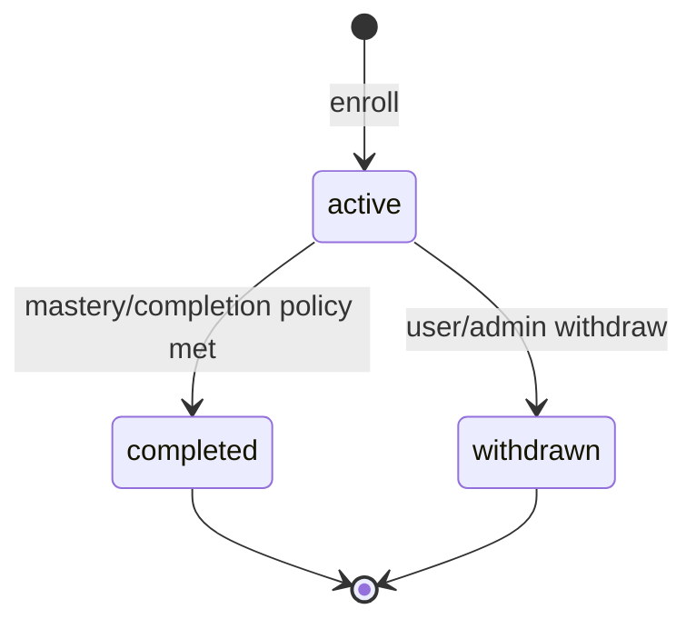
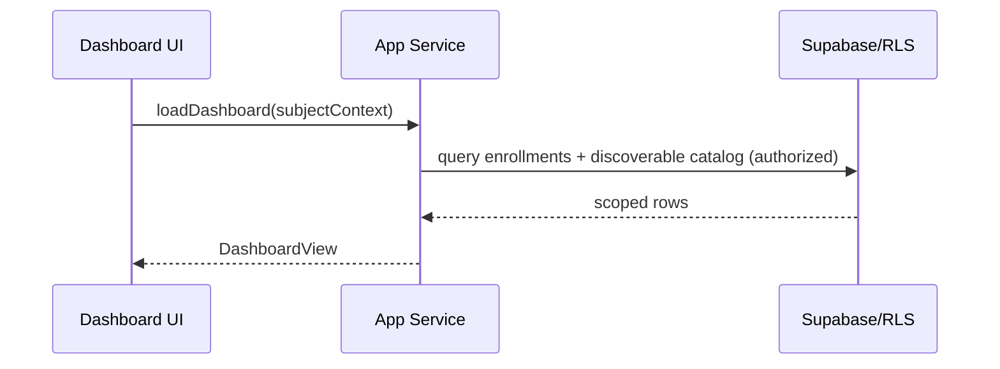

# Dashboard And Enrollment Specification

## Scope
This document defines target behavior for:
- authenticated dashboard experience
- course discovery and enrollment management
- enrollment lifecycle and dashboard read models

It is aligned to:
- `domain-model.md`
- `auth-authorization.md`
- `routing-state.md`
- `classroom-learning.md`
- `search-progress-metrics.md`

## Design Goals
- Give each user a clear “what should I do next?” starting point.
- Keep enrollment actions simple, safe, and auditable.
- Ensure dashboard data is permission-correct and server-authoritative.
- Support observer-mode read-only behavior without hidden write paths.

## Dashboard Surface
Primary sections:
- `Enrolled courses`:
  - active enrollments (default view)
  - optional completed-enrollments toggle
  - per-course progress/mastery summary
- `Find a new course`:
  - discoverable courses user can enroll in
  - search by title/description

Card-level data:
- course title/description
- role/status badges as applicable
- mastery/progress indicator for enrolled cards
- enrollment action:
  - `Open` for enrolled
  - `Join` for discoverable
  - `Leave` (guarded confirmation) for enrolled

## Access And Role Behavior
- Guest:
  - no dashboard route access (redirect to `/`).
- Learner:
  - view own enrollments and discoverable catalog.
  - create/withdraw own enrollment where policy allows.
- Observer:
  - read-only dashboard for observed user context.
  - no join/leave actions.
- Mentor/Editor:
  - same as learner for own enrollments unless policy grants additional capabilities.
  - observer-mode assumption remains read-only.
- Root:
  - own dashboard plus policy-governed administrative visibility where enabled.

## Data Model And Read Contracts

### Enrollment Source Of Truth
- Canonical entity: `Enrollment`.
- Key fields:
  - `id`, `userId`, `courseId`, `status`, `masteryPercent`, `lastTopicId`, `startedAt`, `completedAt`.

Rules:
- at most one active enrollment per `(userId, courseId)`.
- `masteryPercent` is derived, not free-form user edited.

### DashboardView (Derived Read Model)
Input context:
- `actorUserId`
- `subjectUserId` (observer-aware)

Output:
- `summary`:
  - `activeEnrollmentCount`
  - `completedEnrollmentCount`
  - `discoverableCourseCount`
- `enrolledCourses[]`:
  - course metadata
  - enrollment status/mastery/last activity hint
  - effective role hints (non-authoritative UI metadata)
- `discoverableCourses[]`:
  - course metadata
  - join eligibility flag and reason when ineligible

## Enrollment Lifecycle

## Enrollment Workflows

### Dashboard Load

### Join Course
1. Validate auth and subject context (`subjectUserId` must be writable by actor).
2. Validate course visibility/state eligibility.
3. Create enrollment (`status=active`, `startedAt` set, mastery defaults).
4. Emit `enrollment.created` event.
5. Return updated dashboard read model (or incremental card payload).

### Leave/Withdraw Enrollment
1. Require explicit user confirmation.
2. Validate caller can mutate this enrollment.
3. Transition to `withdrawn` (preferred) or apply retention policy if hard-delete is configured.
4. Emit `enrollment.deleted` or `enrollment.withdrawn` event per policy.
5. Refresh enrolled/discoverable sections.

## Discovery And Visibility Rules
- Discoverable courses are filtered by:
  - course state (`published` unless privileged policy says otherwise)
  - visibility (`public`, `authenticated`, `private`)
  - user scope/permissions
  - not already actively enrolled
- Search semantics:
  - case-insensitive
  - whitespace-normalized token search over title + description
  - deterministic ordering (policy default: relevance, then title)

## Observer-Mode Rules
- Dashboard renders using observed user subject context.
- All enrollment mutations are denied.
- UI must clearly indicate read-only proxy state.
- mutation controls (`Join`, `Leave`) are hidden or disabled with reason.

## Routing Integration
- `/dashboard` is the authenticated landing route.
- If a resumable last-course context exists, app may route directly into classroom per `routing-state.md`.
- Entering dashboard should clear stale “current course” navigation hints without deleting unrelated preferences.

## UX And State Requirements
- Empty enrolled state:
  - actionable message and visible discovery list.
- Empty discovery state:
  - explicit “no eligible courses” or “no search matches” messaging.
- Completed toggle:
  - default shows active enrollments.
  - completed list is explicit and stable across refresh.
- Optimistic UI:
  - allowed for join/leave, but must rollback on server failure.
- Pagination:
  - required when enrolled/discoverable lists exceed policy thresholds.

## Security Requirements
- All enrollment create/withdraw operations enforced server-side.
- Prevent duplicate active enrollments with database uniqueness/policy constraints.
- Do not infer admin capability from client-only role helpers.
- Observer mode must hard-deny writes even if actor has baseline write role.

## Audit And Telemetry
Must emit:
- `enrollment.created`
- `enrollment.deleted` or `enrollment.withdrawn` (policy dependent)
- `dashboard.viewed` (optional analytics event)

Event payload includes:
- actor user ID
- subject user ID (if observer mode)
- enrollment/course IDs
- outcome (`success`, `denied`, `failed`)

## Error Handling
- `401`: unauthenticated -> redirect/login recovery.
- `403`: forbidden mutation/read scope.
- `404`: course or enrollment not found.
- `409`: duplicate enrollment or stale mutation conflict.
- `422`: invalid mutation state.

User-facing behavior:
- non-destructive errors show retry guidance.
- destructive confirmations require explicit action and clear impact wording.

## Legacy Gaps Addressed
- Replaces client-biased filtering with server-authoritative scoped dashboard reads.
- Prevents race-condition duplicate enrollments via explicit uniqueness constraints.
- Clarifies read-only observer dashboard semantics for enrollment actions.
- Avoids role-check ambiguity by requiring explicit boolean permission evaluation.
- Moves completion semantics from ad hoc `%==100` UI assumptions to enrollment lifecycle policy.
