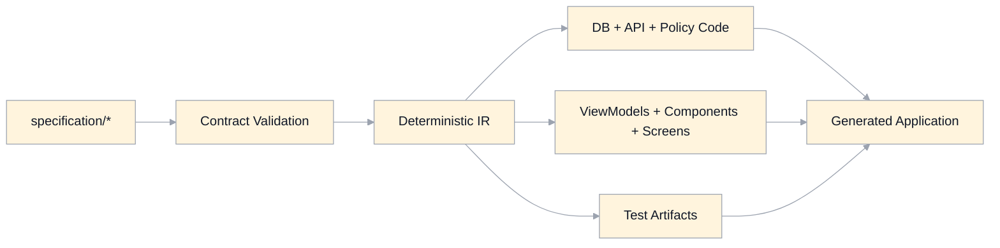

# Generation Blueprint Specification

## Scope
This document defines how to regenerate a functionally similar MasteryLS application from `specification/` only.

It is aligned to:
- `app.md`
- `domain-model.md`
- `api-contracts.md`
- `database-schema-migrations.md`
- `course-json-schema.md`
- `policy-defaults.md`
- `view-model-schemas.md`
- `component-contract-schemas.md`
- `ui/ui-screens.md`
- `test-strategy.md`
- `generation-run-checklist.md`

## Core Rule
Generation must not read existing runtime source code.

The generator is allowed to read only:
- files under `specification/`
- generator templates/tooling explicitly declared by the generation system itself

## Target Runtime Profile (Default)
- Frontend: React SPA
- Language: TypeScript
- Build tool: Vite
- Auth: Supabase Auth client SDK (OTP/session)
- App data/integrations: server API/edge boundary
- Database: Supabase Postgres + RLS
- Styling: token-driven CSS variables from `ui/ui-tokens.md` (no framework lock-in)

This profile is the default for reproducibility. Alternate profiles are allowed only if they satisfy all contracts and acceptance checks below.

## Generation Inputs
- Domain contracts: `domain-model.md`
- Authz policy: `auth-authorization.md`
- API contracts: `api-contracts.md`
- DB schema/migrations: `database-schema-migrations.md`
- Resilience/security: `error-resilience.md`, `security-threat-model.md`
- UI contracts: `ui/manifests/*.ui-manifest.json`, `ui/schemas/*.json`, `ui/schemas/components/*.json`
- Policy defaults: `policy-defaults.json`
- Course definition schema: `schemas/course-json.schema.json`
- Routes/state: `routing-state.md`
- Test obligations: `test-strategy.md`, `ui/ui-conformance-baseline.md`

## Intermediate Representation (IR)
Generator must compile specs into a deterministic IR before codegen.

IR minimum sections:
- `domain`
- `authz`
- `api`
- `database`
- `uiScreens`
- `uiComponents`
- `tests`

IR requirements:
- stable ordering for deterministic output
- normalized IDs/enums across docs
- explicit validation errors for unresolved references

## Generation Order
1. Validate all schema artifacts and cross-references.
2. Build IR from specification inputs.
3. Generate domain types and policy model.
4. Generate DB migrations and RLS policy skeletons.
5. Generate API contracts/handlers from `api-contracts.md` and policy model.
6. Generate view-model mappers from `view-model-schemas.md` + route contracts.
7. Generate component interfaces from `component-contract-schemas.md`.
8. Generate route screens from manifests + view-model schemas.
9. Generate integration adapters (Supabase/GitHub/Gemini/Canvas boundaries).
10. Generate tests and conformance fixtures from `test-strategy.md` + UI baseline artifacts.

## Determinism And Cost Controls
- Hash spec inputs and skip unchanged generation stages.
- Use stage-level caching (`domain`, `api`, `ui`, `tests`) for incremental regeneration.
- Avoid full regeneration when only one contract layer changes.
- Emit a machine-readable generation report with:
  - input hash
  - changed stages
  - output artifact list

## Acceptance Checks
A generation run is accepted only if all checks pass.

Execution sequencing and expected artifacts are additionally defined in:
- `generation-run-checklist.md`

### Contract Checks
- all JSON schemas parse and validate
- `schemas/course-json.schema.json` validates canonical `course.json` fixtures
- `policy-defaults.json` parses and is referenced by policy-driven specs
- manifest state sets match view-model schema enums
- manifest allowed components are covered by component contract registry
- API error shape matches `error-resilience.md`

### Build/Runtime Checks
- frontend builds successfully
- API handlers compile successfully
- DB migration set applies on clean database
- route map includes all canonical routes from `routing-state.md`

### Behavior Checks
- role/observer read-write constraints match `auth-authorization.md`
- topic commit triggers incremental search index update behavior
- observer mode denies all write endpoints
- UI state variants render for every required manifest state

### Quality Checks
- required accessibility checks from `test-strategy.md`
- visual baseline/conformance checks where scenarios are marked required
- no secrets in client bundle/output artifacts

## Failure Policy
If any acceptance check fails:
- generation output is rejected
- report must identify failing contract/check and source spec file
- no partial promotion to "generated baseline"

## Governance
- Contract-first rule: spec change must land before generator/output change.
- Generation versioning:
  - `generation-contract` version is derived from the set of spec artifacts.
- Any breaking change to contracts requires explicit changelog entry in relevant spec docs.

## Legacy Gaps Addressed
- Makes regeneration sequence explicit and reproducible.
- Prevents source-code-dependent regeneration shortcuts.
- Establishes objective acceptance gates for "spec sufficient to regenerate".
