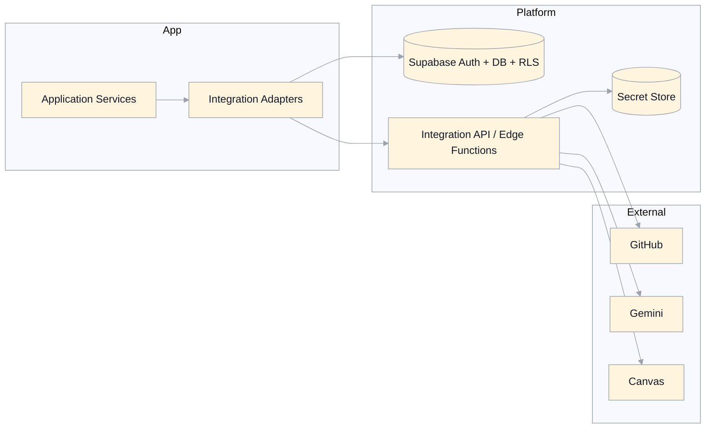

# Integrations Specification (Supabase, GitHub, Gemini, Canvas)

## Scope
This document defines target integration contracts and boundaries for:
- Supabase (Auth, Postgres, RLS, Functions)
- GitHub (course content source of truth + versioning)
- Gemini (AI generation and feedback)
- Canvas (LMS export/sync)

It is aligned to:
- `architecture-system.md`
- `domain-model.md`
- `auth-authorization.md`
- `editor-github-authoring.md`
- `discussion-notes.md`
- `canvas-export.md`
- `search-progress-metrics.md`

## Design Goals
- Keep sensitive integrations server-mediated and auditable.
- Ensure latest course content is served reliably from GitHub.
- Keep integration contracts explicit, typed, and resilient to failures.
- Avoid provider lock-in by using adapter contracts at the application boundary.

## Integration Topology

## Cross-Integration Principles
- Authorization:
  - all privileged integration calls are authorized server-side.
  - observer mode is read-only and denies all writes regardless of actor base role.
- Secret custody:
  - credentials are represented as `CredentialReference`.
  - raw secrets are never returned to browser clients.
- Auditing:
  - privileged integration operations emit `ActivityEvent` with actor/subject and outcome.
- Error normalization:
  - integration errors map to consistent app categories (`auth`, `permission`, `validation`, `rate_limit`, `upstream`, `timeout`, `conflict`).
- Idempotency:
  - retry-safe semantics required for exports, indexing, and reconciliation operations.

## Application Adapter Contracts (Target)
Application services consume integration adapters rather than provider-specific SDK calls.

Required adapter interfaces:
- `IdentityStore` (Supabase auth/session/profile reads)
- `AppDataStore` (domain entities + reporting reads/writes)
- `ContentRepositoryGateway` (GitHub read/write/history)
- `AiGateway` (Gemini requests for discussion/generation/feedback)
- `LmsGateway` (Canvas export/repair operations)

Migration rule:
- `useCourseOperations` remains temporary facade while capabilities move to service-specific adapters (`architecture-system.md` phased plan).

## Supabase Integration

### Responsibilities
- OTP authentication and session lifecycle.
- canonical operational data persistence.
- RLS policy enforcement.
- function hosting for secret-bound integrations.

### Auth Contract
- OTP request and verify are the only supported interactive auth flows.
- after successful verification:
  - upsert app-level `User` profile.
  - ensure default learner role if missing.
- logout clears app-scoped local keys only.

### Data Contract
- Source of truth for:
  - users, roles, delegations, observer sessions
  - enrollments, attempts, exam sessions, notes, activity events
  - search projection (`SearchDocument`) and read models
- Canonical event timestamp is `createdAt`.

### Security Contract
- RLS enabled on all non-public tables.
- server-side role/scope checks for privileged reads and writes.
- no client-trusted authorization decisions.

## GitHub Integration

### Responsibilities
- canonical course definition and topic content storage.
- content commit/version history and file operations.
- template-based repository provisioning support.

### Read Plane (Latest Content Policy)
- Runtime/course reads must target latest default branch content.
- Commit pinning is not part of target runtime behavior.
- Reads must be freshness-safe even under caching.

Required read strategy:
- prefer raw content endpoints with revalidation (`ETag`/`If-None-Match` or equivalent).
- permit cache-busting query strategy for critical freshness paths.
- keep short-lived local cache only with mandatory revalidation before critical reads.

Constraint:
- do not rely on throttled GitHub API read endpoints for runtime topic/course content delivery.

### Write Plane
- content mutations (commit, delete, move, structure updates) are server-mediated.
- write requests include expected base version/SHA for optimistic concurrency.
- write success returns:
  - commit SHA
  - updated version marker(s)
  - optional downstream effects status (e.g., index update warning).

### Post-Commit Indexing Coupling
- successful topic create/edit commit must trigger incremental search document update.
- indexing failure is non-blocking to commit success, but must:
  - emit audit/ops event
  - return warning to caller
  - leave full reindex available as recovery.

### Commit History/Diff Support
- history and diff retrieval are part of content repository gateway capabilities.
- restore/revert operations must create new commits; no history rewriting.

## Gemini Integration

### Responsibilities
- AI discussion responses.
- interaction feedback/grading assistance.
- authoring generation (course/topic/section/quiz/exam).
- optional commit message suggestion.

### Request Safety Contract
- all requests are server-mediated through `AiGateway`.
- never include credentials/secrets in prompt payloads.
- include only minimal required learner/context data.
- discussion context assembly follows `discussion-notes.md` contract.

### Response Contract
- normalized response shape:
  - `text`
  - optional `structured` payload when requested
  - `modelInfo` metadata (provider/model/version where available)
- malformed upstream responses are mapped to normalized integration errors.

### Latency Policy
- operation-specific budgets:
  - interactive discussion/feedback: low-latency budget
  - bulk generation: higher budget with progress UX
  - commit-message suggestion: short budget with immediate manual fallback

## Canvas Integration

### Responsibilities
- full export, incremental update, and reference repair.
- mapping between MasteryLS entities and Canvas objects.
- optional cleanup before rebuild export.

### Contract
- all Canvas operations are server-mediated through `LmsGateway`.
- mappings persisted to non-secret `externalRefs`.
- rerunnable/idempotent behavior for full export and repair.
- partial failure reporting includes counts and failed entities.

### Security
- observer mode hard-deny on all Canvas write operations.
- no raw Canvas token exposure to client.

## Reliability And Failure Policy
- Timeouts:
  - explicit per integration operation type.
- Retries:
  - bounded retry with jitter for transient upstream failures.
  - no blind retries for non-idempotent operations without idempotency keys.
- Rate limits:
  - detect and classify provider throttling.
  - provide user-facing retry guidance and backoff hints.
- Degradation:
  - failures in optional subsystems (e.g., incremental index update) return warnings, not silent success.

## Observability And Audit
- Each integration call records:
  - operation name
  - actor user ID
  - subject user ID when relevant
  - scope (`courseId`, `topicId`, external target IDs)
  - duration
  - outcome (`success`, `denied`, `failed`)
  - normalized error category (if failed)

Required event families:
- auth/session events (Supabase)
- content update/history events (GitHub)
- AI request events (Gemini, redacted payload logging)
- export/repair events (Canvas)
- indexing/reindex events

## Data Privacy And Retention
- Do not log full sensitive prompt/user note content unless policy explicitly permits redacted capture.
- Store only minimum metadata required for troubleshooting and compliance.
- Respect retention policy boundaries for AI transcripts vs canonical notes/events.

## Legacy Gaps Addressed
- Removes browser-side PAT/token handling from integration workflows.
- Replaces mixed direct provider calls with explicit server-side gateways for sensitive operations.
- Defines latest-content strategy that does not depend on throttled GitHub API reads.
- Standardizes normalized error handling and audit semantics across all integrations.
