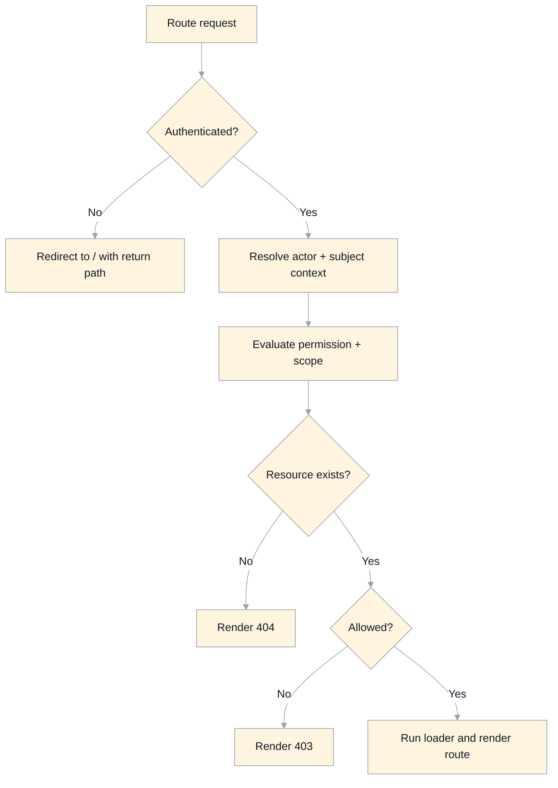

# Routing And State Specification

## Scope
This document defines target routing, navigation guards, and application state boundaries.

It is aligned to:
- `domain-model.md`
- `auth-authorization.md`

## Design Goals
- Deterministic route behavior with explicit access rules.
- Server-authorized data access for all protected routes.
- Clear separation of canonical domain state vs UI/transient state.
- Stable deep-linking for course/topic navigation.
- Safe support for observer-mode read-only proxy sessions.

## Route Map (Target)
- `/`
  - Public start/marketing/catalog landing.
- `/dashboard`
  - Authenticated home for enrollments and course discovery.
- `/course/:courseId`
  - Course entry; resolves to default topic.
- `/course/:courseId/topic/:topicId`
  - Primary classroom route.
- `/metrics`
  - Scoped analytics (auth required).
- `/progress`
  - Scoped activity timeline (auth required).
- `/courseCreation`
  - Course creation (editor/root required).
- `/courseExport`
  - Canvas export workflows (editor/root required).
- `/error/:code?`
  - Structured error rendering.

Future-compatible routes:
- `/admin/*` (root-only if introduced later).

## Access Control By Route

### Public Routes
- `/`
  - Available to all users.
- `/course/:courseId[/topic/:topicId]`
  - Guest: published/public content only.
  - Authenticated: access based on role + course visibility.

### Authenticated Routes
- `/dashboard`, `/metrics`, `/progress`
  - Require authenticated session.
  - Data visibility is policy-scoped.

### Privileged Routes
- `/courseCreation`, `/courseExport`
  - Require effective permission checks (editor scope or root).
  - Guard failure returns `403` route with actionable message.

## Guard Strategy
- Route guards run before protected data fetch.
- Client checks are UX hints only; backend/RLS is authoritative.
- Guard outcomes:
  - `unauthenticated` -> redirect to `/` with return path.
  - `forbidden` -> `403` error route.
  - `not_found` -> `404` error route.
  - `allowed` -> proceed with loader.

## Observer Mode Routing
Observer mode does not change route shape; it changes read context.

Rules:
- Observer mode can only be activated by authenticated users with authorization from `auth-authorization.md`.
- Activation is explicit (UI action + backend validation), producing an `ObserverSession`.
- Routes remain `/course/:courseId/topic/:topicId`; observer context is session-backed, not URL-trusted.
- Optional URL decoration for UX (`?observe=<userId>`) is non-authoritative and must be validated server-side.
- In observer mode:
  - all classroom/dashboard/progress reads use `observedUserId` subject context.
  - all writes are blocked.
  - UI displays a persistent "Viewing as <user> (read-only)" banner.

## Canonical App State Model

## 1. Session State (Canonical)
Server-derived:
- `authUserId`
- `sessionStatus` (`anonymous`, `authenticated`, `expired`)
- `effectiveRoles` (resolved active role assignments)
- `observerSession` (nullable, read-only proxy context)

Ownership:
- Auth provider + backend policy layer.

## 2. Learning State (Canonical)
Server/domain-derived:
- `activeCourseId`
- `activeTopicId`
- `activeEnrollmentId` (nullable for guest)
- `courseDefinitionVersion`

Ownership:
- Domain services/loaders.

## 3. UI Preference State (Local, Namespaced)
Client-local only:
- sidebar visibility/width
- expanded module indices
- last viewed topic hint
- editor view preferences (word wrap, line numbers)

Rules:
- Namespaced keys only (`masteryls.ui.*`).
- Never store secrets.
- Never use `localStorage.clear()`.

## 4. Transient View State (Ephemeral)
Page/session-only:
- search query/results
- loading flags
- modal state
- optimistic UI markers

Rules:
- Must not be source-of-truth for authorization or persisted domain state.

## Route Data Contracts (Read Models)

### `/dashboard`
Needs:
- current user summary
- enrollments (scoped)
- discoverable courses (scoped visibility)

### `/course/:courseId/topic/:topicId`
Needs:
- course metadata + definition
- topic content descriptor
- enrollment summary (if authenticated)
- observer context indicator (if active)

### `/metrics`
Needs:
- normalized `ActivityEnvelopeView`
- scoped filters by course/user/date

### `/progress`
Needs:
- timeline-ready activity stream
- topic/course display joins

## Navigation Rules
- `/course/:courseId` resolves to:
  - `defaultTopicId` if available and visible.
  - otherwise first visible topic.
  - else course-level empty state (`no_visible_topics`).
- Topic navigation (`prev`/`next`) skips non-visible topics for current subject context.
- Hash anchors remain local to rendered topic content.

## URL And Identity Rules
- Route params use canonical IDs or slugs; no raw GitHub URLs in route params.
- Topic identity is stable by `topicId`; content URL is derived internally.
- Query parameters are non-authoritative hints unless validated.

## Error Handling Model
Typed errors mapped to route-level rendering:
- `401` unauthenticated
- `403` forbidden
- `404` not found
- `409` stale version/conflict
- `422` validation error
- `500` unexpected

Error pages must preserve safe recovery actions:
- return home
- return dashboard
- retry load

## State Consistency Requirements
- Single canonical timestamp field (`createdAt`) in timeline views.
- Route transitions must not silently drop unsaved editor state.
- Protected writes require fresh permission check at execution time.
- Observer mode state must be explicitly ended; auto-expire on logout/session expiry.

## Legacy Issues Addressed
- Removes implicit global mutable stores as authoritative state.
- Removes route behavior that depends on unvalidated client role checks.
- Removes ambiguous "current course" behavior by defining deterministic entry resolution.
- Prevents observer/proxy behavior from being URL-only or client-trusted.

## Implementation Guidance
- Prefer router loaders/actions with centralized guard helpers.
- Centralize permission checks via `can(action, resource, context)`.
- Keep route metadata declarative (required auth, required capability, read model dependencies).
- Use typed state containers for canonical session/learning context and avoid ad-hoc globals.
