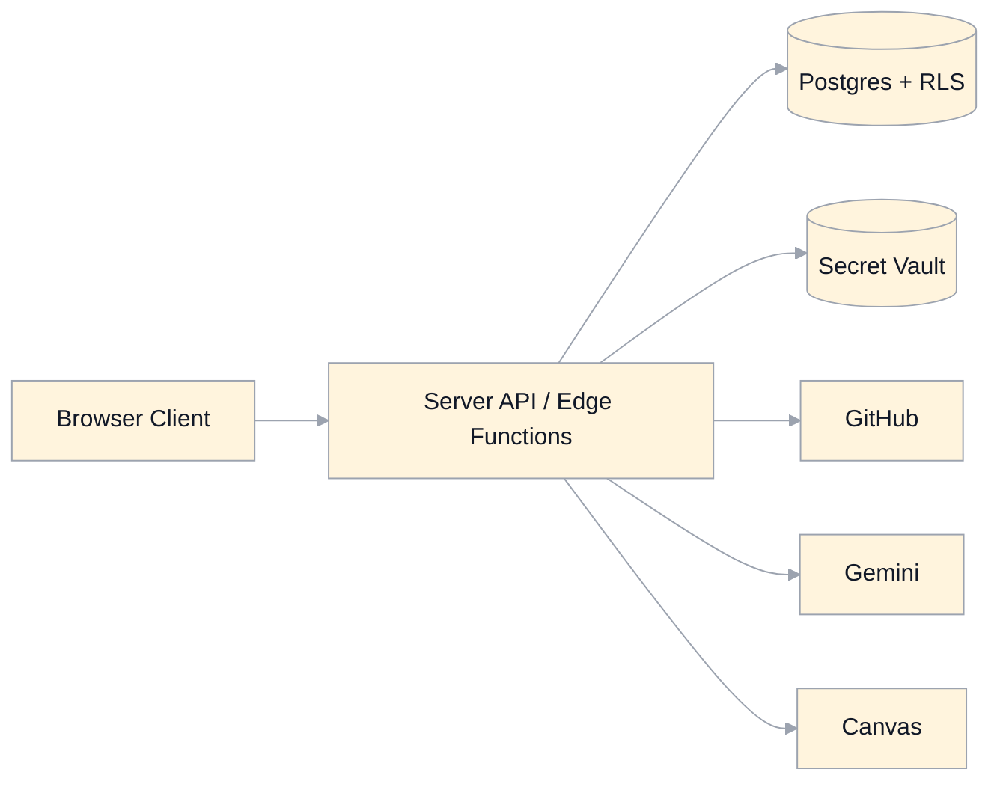

# Security Hardening And Threat Model Specification

## Scope
This document defines the security posture, trust boundaries, threat model, hardening controls, and verification requirements for a regenerated MasteryLS system.

It is aligned to:
- `auth-authorization.md`
- `domain-model.md`
- `integrations.md`
- `api-contracts.md`
- `database-schema-migrations.md`

## Security Objectives
- Prevent unauthorized access and privilege escalation.
- Keep all integration secrets server-custodied.
- Enforce observer-mode read-only behavior at policy and API levels.
- Preserve auditability for privileged actions.
- Limit impact of upstream provider failures or compromise.

## Protected Assets
- User identities and session tokens.
- Role assignments, observer delegations/sessions.
- Course metadata and content commit authority.
- Learner attempts, notes, exam records, activity events.
- Credential references and backing vault keys.
- Canvas and AI operation results.

## Trust Boundaries

Boundary rules:
- client is untrusted for authz decisions and secret custody
- DB trust is mediated through RLS + trusted backend service role usage
- all external provider calls requiring credentials run server-side

## STRIDE Threat Model

| Category | Example threat | Control set |
|---|---|---|
| Spoofing | forged user identity or observer subject | validated JWT, server actor resolution, observer session validation |
| Tampering | client-altered payload to bypass permissions | server-side schema validation + policy checks + deny-by-default |
| Repudiation | privileged action without attribution | immutable `activity_event` audit with actor/subject + request id |
| Information Disclosure | secret/token leakage in client or logs | credential references only, secret redaction, vault custody |
| Denial of Service | OTP abuse, expensive export floods | rate limits, quotas, backoff, async job controls |
| Elevation of Privilege | learner becoming editor/root | strict role grant policies, RLS enforcement, audited role changes |

## Hardening Requirements

## 1) Authentication And Session
- OTP rate limits by IP/email/device fingerprint.
- short-lived access tokens and secure refresh handling.
- session invalidation on suspicious auth events.

## 2) Authorization And Policy
- centralized `can(action, resource, context)` policy engine.
- server enforces authz for every protected endpoint.
- observer mode write hard-deny at API and DB layers.

## 3) Input And Output Validation
- JSON schema validation at API boundary for all mutation requests.
- strict enum checking for role/state transitions.
- markdown sanitization and protocol allowlisting at render/export boundaries.

## 4) Secret Management
- no plaintext provider tokens in DB tables or client payloads.
- all external credentials stored in vault; DB stores `CredentialReference` only.
- rotation policy for provider credentials and revocation support.

## 5) Data Security
- RLS on all protected tables.
- encryption in transit (TLS) and provider-managed encryption at rest.
- principle of least privilege for service-role and function execution contexts.

## 6) Audit And Detection
- mandatory audit events for auth, role changes, observer sessions, content writes, exports, denied privileged actions.
- correlation id (`requestId`) across API logs and activity events.
- alerting on anomalous patterns (excessive denied writes, repeated role mutation failures, OTP abuse).

## 7) Operational Security
- dependency vulnerability scanning in CI.
- pinned runtime versions and environment-specific config isolation.
- production-only secrets injected via secure platform settings.

## Security Test Requirements
- authn tests: OTP success/failure/rate limit behavior.
- authz tests: allow/deny matrix across guest/learner/observer/mentor/editor/root.
- observer tests: read-as-subject + write denial across all mutation endpoints.
- RLS tests for every protected table policy path.
- redaction tests ensuring secrets are absent from logs/events/client payloads.

## Incident Response Requirements
- severity levels and on-call ownership for auth/data/secret incidents.
- rapid credential revocation and rotation runbook.
- audit-driven containment and blast-radius assessment.
- post-incident policy and spec updates required.

## Residual Risk And Explicit Non-Goals
- Third-party provider outages remain an availability risk; mitigated via degraded-mode behavior.
- This document does not define organization-level compliance controls (SOC2/ISO process details).

## Legacy Gaps Addressed
- Removes client-stored secret patterns.
- Makes threat modeling explicit for regeneration quality bar.
- Formalizes observer-mode and privileged action protections as enforceable requirements.
