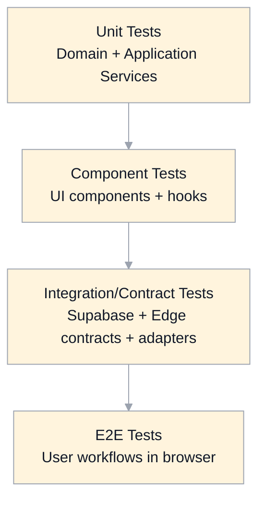

# Test Strategy And Coverage Specification

## Scope
This document defines the target verification strategy for MasteryLS across:
- domain correctness
- authorization/security guarantees
- integration reliability
- end-user workflow behavior

It is aligned to all functional specifications referenced from `app.md`.

## Design Goals
- Catch high-risk regressions early with fast deterministic tests.
- Prove permission boundaries (especially observer-mode read-only behavior).
- Validate integration contracts without relying on unstable external providers.
- Keep CI feedback fast enough for iterative development.

## Quality Model
MasteryLS quality is validated on four axes:
- Correctness: expected outputs/state transitions for valid/invalid inputs.
- Security: deny-by-default access control, no secret leakage, observer write denial.
- Resilience: graceful handling of provider errors, timeouts, and partial failures.
- UX integrity: critical user flows remain functional and understandable.

## Test Pyramid (Target)

### 1) Unit Tests
Focus:
- pure domain rules and state machines
- permission evaluators (`can(action, resource, context)`)
- read-model reducers/aggregators (`ActivityEnvelope` projections)
- markdown interaction parsing/validation

Expectations:
- fast, isolated, no network.
- high branch coverage on security-critical logic.

### 2) Component Tests
Focus:
- rendering and interaction behavior for critical UI units:
  - classroom panes
  - dashboard cards/actions
  - discussion/notes controls
  - authoring commit flows

Expectations:
- deterministic mocks for service adapters.
- explicit empty/loading/error state verification.

### 3) Integration/Contract Tests
Focus:
- adapter contract conformance (`ContentRepositoryGateway`, `AiGateway`, `LmsGateway`, data stores)
- Supabase RLS policy outcomes for role/scope combinations
- edge function request/response normalization and error mapping

Expectations:
- local or ephemeral integration environment.
- no dependence on production credentials.
- schema/contract snapshots for stable API shapes.

### 4) End-To-End Tests
Focus:
- user-visible flows spanning routing + state + integrations.
- realistic browser behavior and navigation.

Critical E2E journeys:
- OTP login/signup + logout
- public route rendering (`/` and `/about`)
- dashboard enroll/withdraw + course entry
- classroom topic navigation and interactions
- discussion/notes flows
- editor commit + history/diff
- course creation and export workflows
- metrics/progress visibility rules

## Role And Security Test Matrix (Required)
Every protected action must have allow/deny coverage for:
- guest
- learner
- observer
- mentor
- editor
- root

Special required scenarios:
- observer mode for delegated observer user
- observer mode assumption by mentor/editor/root
- observer-mode write denial on all mutation endpoints
- cross-user analytics reads with explicit authorization only
- credential secrecy (no token/secret in client payloads/logs/UI)

## Integration Contract Coverage

### Supabase
- Auth flow success/failure/rate-limit behavior.
- RLS read/write policy tests per table and role context.
- canonical timestamp and schema field expectations (`createdAt`).

### GitHub
- latest-content read revalidation behavior.
- commit conflict (`409`) handling with optimistic concurrency.
- commit history/diff retrieval contracts.
- post-commit incremental search indexing trigger behavior.

### Gemini
- discussion and feedback request context shaping.
- timeout/fallback handling.
- malformed upstream response normalization.

### Canvas
- full/incremental/repair workflow contract tests.
- idempotent rerun behavior.
- partial failure reporting shape.

## Deterministic Test Data And Fixtures
- Use canonical fixtures for:
  - course definitions
  - markdown interactions
  - activity events/envelopes
  - role/delegation assignments
- Freeze clocks where needed for timeline/metrics determinism.
- Use stable IDs in fixtures to make diffing and snapshots meaningful.

## Non-Functional Testing
- Performance:
  - dashboard load time budgets
  - topic load/render budgets
  - metrics/progress query latency budgets
- Reliability:
  - retry/backoff behavior under transient failures
  - degraded-mode UX under provider outages
- Accessibility:
  - keyboard navigation and focus for core workflows
  - semantic roles/labels for interactive controls

## CI Quality Gates
- Required on mainline and PR pipelines:
  - build
  - unit/component/integration suites
  - E2E smoke suite
  - coverage reporting artifact

Gate policy:
- no merge on failing critical-security tests.
- no merge on failing contract tests for active integrations.
- flaky test quarantine process must be explicit and time-bounded.

## Coverage Policy
- Use risk-based thresholds, not one global percentage only.
- Mandatory strong coverage for:
  - authorization/policy code paths
  - observer-mode context resolution and write denial
  - enrollment and content mutation workflows
  - integration error normalization

Reporting:
- per-suite trend tracking over time.
- changed-lines coverage checks for high-risk modules.

## Migration Plan From Current State
Current baseline:
- Playwright-heavy E2E coverage with mocked network responses.

Target progression:
1. Add unit tests for extracted application services and permission evaluators.
2. Add contract tests for integration adapters and RLS outcomes.
3. Keep E2E focused on critical user journeys and cross-feature regressions.
4. Reduce over-reliance on large monolithic E2E mocks as service decomposition lands.

## Definition Of Done For A Feature
A feature is test-complete when:
- domain rules are unit-tested.
- UI states (success/loading/error/empty) are component-tested.
- integration contracts are covered for success + key failures.
- E2E journey includes at least one happy path and one authz/error path.
- audit/security expectations are verified where applicable.

## Legacy Gaps Addressed
- Moves from E2E-only confidence to layered, faster, and more diagnosable test coverage.
- Makes authorization and observer-mode behavior first-class test requirements.
- Adds explicit integration contract testing for GitHub/Gemini/Canvas/Supabase boundaries.
- Formalizes CI gates around security-critical behavior and contract stability.
