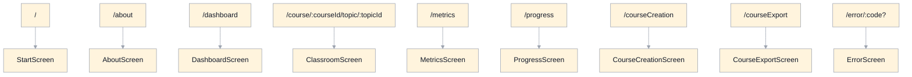
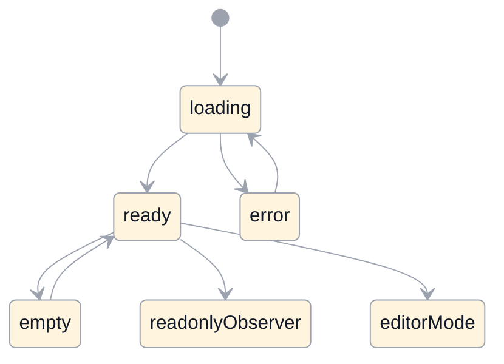
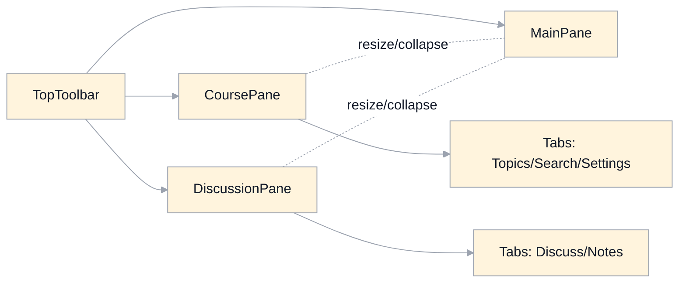
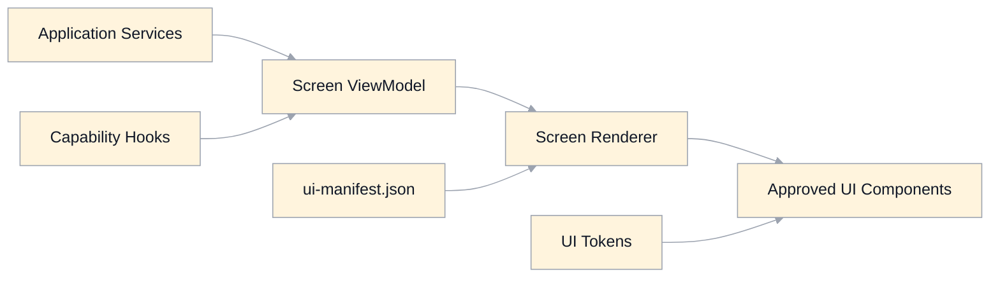

# UI Overview Specification

## Scope
This document provides a top-level map of the application UI:
- route-to-screen structure
- shared screen state model
- classroom pane layout model
- view-model rendering architecture

It is aligned to:
- `ui-goals.md`
- `ui-conformance-baseline.md`
- `ui-principles.md`
- `ui-tokens.md`
- `ui-components.md`
- `../component-contract-schemas.md`
- `ui-screens.md`
- `../view-model-schemas.md`
- `../routing-state.md`
- `../architecture-system.md`

Canonical version source:
- `ui-contract-changelog.md`

## Route To Screen Map

## Shared Screen State Model
All screens should implement explicit state handling. Not all screens use every state.

## Classroom Layout Model

Behavior notes:
- `CoursePane` and `DiscussionPane` share consistent resize/collapse behavior.
- In observer mode, panes remain visible but write controls enter `readonly`.
- On narrow viewports, side panes may switch from split to overlay.

## View-Model Rendering Architecture

Rules:
- Services and hooks produce data/actions; they do not define visual structure.
- Screen renderer composes UI strictly through manifest slots and approved components.
- Components render semantic states (`loading`, `empty`, `error`, `readonlyObserver`, `editorMode`) from view-model fields.

## Relationship To Other UI Specs
- `ui-principles.md`: visual and interaction intent.
- `ui-tokens.md`: canonical token definitions.
- `ui-components.md`: allowed component set and state contracts.
- `../component-contract-schemas.md`: machine-validated component prop/state/slot registry.
- `ui-screens.md`: route-level slot/state matrix + manifest references.
- `../view-model-schemas.md`: machine-validated payload contracts for each screen/state.

## Legacy Gaps Addressed
- Gives one canonical map for how screens relate to routes and states.
- Makes UI derivation from spec clearer for humans and tooling.
- Reduces ambiguity between behavior orchestration and visual composition boundaries.
