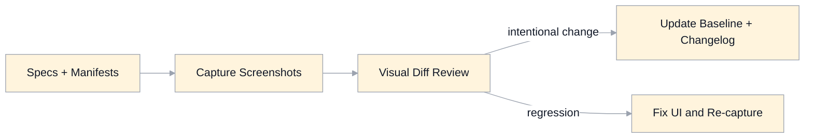

# UI Conformance Baseline Specification

## Scope
This document defines the visual conformance baseline used to verify that the UI:
- matches established MasteryLS look-and-feel
- remains derivable from the UI contract
- stays stable as architecture and features evolve

It is aligned to:
- `ui-goals.md`
- `ui-contract-changelog.md`
- `ui-conformance-governance.md`
- `ui-principles.md`
- `ui-tokens.md`
- `ui-components.md`
- `ui-screens.md`

Canonical baseline manifest:
- `baselines/ui-conformance-baseline.json`
- `baselines/ui-conformance-baseline.schema.json` (validation schema)
- `baselines/ui-conformance-waivers.json` (explicit uncovered state waivers)
- `baselines/ui-conformance-waivers.schema.json` (waiver schema)
- `ui-conformance-gap-matrix.md` (tracked open conformance gaps and closure criteria)
- `ui-conformance-governance.md` (waiver lifecycle and snapshot approval rules)

## Baseline Policy
- Baselines are versioned and tied to `ui-contract` versions.
- Visual changes require:
  - spec/manifests update
  - baseline update
  - changelog entry
- No "silent" baseline refreshes.
- Any manifest state that is not covered by a baseline scenario must be explicitly listed in the waiver manifest with a reason.

## Capture Standard
- Deterministic inputs:
  - fixed fixture data
  - fixed auth/role state per scenario
  - fixed locale/timezone for capture runs
- Deterministic rendering:
  - reduced animation/motion
  - stable viewport sizes
  - stable font loading behavior
- Output:
  - PNG screenshots
  - predictable file naming by scenario ID + viewport

## Coverage Validation
- Validation rule:
  - every `screenId/state` declared in `specification/ui/manifests/*.ui-manifest.json` must be either:
    - covered by at least one baseline scenario, or
    - explicitly listed in `baselines/ui-conformance-waivers.json` with reason.

## Viewport Matrix
- `desktop`: `1366x768`
- `tablet`: `1024x768`
- `mobile`: `390x844`

Not every scenario must run on every viewport. Required viewport coverage is defined in the baseline manifest.

## Required Baseline Scenarios (Initial)
- Public:
  - start/landing ready
  - about ready
- Dashboard:
  - ready with enrolled + discoverable lists
  - empty enrolled state
  - readonly observer state
- Classroom:
  - learner ready (Course pane + Discussion pane visible)
  - editor mode ready
  - readonly observer mode ready
  - no-visible-topics state
- Analytics:
  - metrics ready
  - progress ready
- Admin flows:
  - course creation ready
  - course export ready
- Error handling:
  - `403` and `404` error views

## Review And Approval Workflow
1. Generate/update screenshots from baseline manifest.
2. Compare against prior approved baseline.
3. Review visual diffs for:
  - palette/typography drift
  - spacing/layout shifts
  - component/state regressions
  - accessibility indicator regressions (focus, contrast cues)
4. If intentional:
  - update specs/manifests/changelog
  - approve new baseline version.
5. If unintentional:
  - fix implementation and re-capture.

## CI Conformance Gate
- If an executable conformance harness is present, CI should fail when visual diffs exceed configured thresholds for approved scenarios.
- If an executable conformance harness is present, CI should run accessibility checks on baseline scenarios.
- Failures should link scenario IDs to speed triage.
- CI (or equivalent quality gate) should fail when required manifest screen/states are neither represented in baseline scenarios nor explicitly waived.

## Architecture And Derivation Rules
- Screens are validated against `ui-manifest.json` slot/state/component constraints.
- Baseline scenarios map 1:1 to screen/view-model states where possible.
- Any executable conformance harness should assert screen/state contract markers (slot and state evidence) before image capture.
- Visual conformance is checked at screen level; behavior conformance remains covered by functional tests.

## Success Criteria
- Baseline catches visual regressions before merge.
- Baseline updates are deliberate, reviewed, and versioned.
- UI output remains consistent with UI contract artifacts over time.
