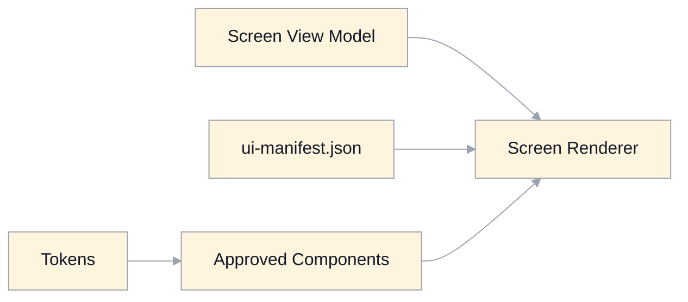

# UI Screens Specification

## Scope
This document defines route-level screen contracts:
- layout slots
- required states
- allowed component set
- view-model interface expectations

It is aligned to:
- `overview.md`
- `ui-principles.md`
- `ui-tokens.md`
- `ui-components.md`
- `../component-contract-schemas.md`
- `../view-model-schemas.md`
- `routing-state.md`
- `architecture-system.md`

## Machine-Derivable Screen Contract
Each screen has a `ui-manifest.json` file under `specification/ui/manifests/`.

Manifest contract:
- `screenId`
- `route`
- `viewModel`
- `viewModelSchema`
- `slots` (slot name + allowed components)
- `states`
- `allowedComponents`

Manifest files:
- `manifests/start.ui-manifest.json`
- `manifests/about.ui-manifest.json`
- `manifests/dashboard.ui-manifest.json`
- `manifests/classroom.ui-manifest.json`
- `manifests/metrics.ui-manifest.json`
- `manifests/progress.ui-manifest.json`
- `manifests/course-creation.ui-manifest.json`
- `manifests/course-export.ui-manifest.json`
- `manifests/error.ui-manifest.json`

View-model schema files:
- `schemas/start.view-model.schema.json`
- `schemas/about.view-model.schema.json`
- `schemas/dashboard.view-model.schema.json`
- `schemas/classroom.view-model.schema.json`
- `schemas/metrics.view-model.schema.json`
- `schemas/progress.view-model.schema.json`
- `schemas/course-creation.view-model.schema.json`
- `schemas/course-export.view-model.schema.json`
- `schemas/error.view-model.schema.json`
- `schemas/screen-view-model.union.schema.json` (validation entry point)

## Architecture Boundary Rules
- Domain/Application services return screen view models.
- UI components are pure renderers of view-model data and manifest slot contracts.
- Capability hooks (for example `useLearningRuntime`, `useAuthoringActions`) orchestrate data/actions and do not own visual structure decisions.
- Avoid ad hoc JSX branching for major states; use explicit state variants from view model + manifest.

## Route Screen Matrix

### `/` (Start)
- Screen: `StartScreen`
- Slots:
  - `hero`, `auth`, `catalogPreview`, `marketingSections`, `footer`
- Required states:
  - `loadingCatalog`, `ready`, `authError`

### `/about`
- Screen: `AboutScreen`
- Slots:
  - `hero`, `overview`, `capabilities`, `integrations`, `versionInfo`, `supportLinks`
- Required states:
  - `loading`, `ready`, `error`

### `/dashboard`
- Screen: `DashboardScreen`
- Slots:
  - `header`, `enrolledSection`, `discoverSection`, `dialogs`
- Required states:
  - `loading`, `ready`, `emptyEnrolled`, `emptyDiscover`, `error`, `readonlyObserver`

### `/course/:courseId/topic/:topicId`
- Screen: `ClassroomScreen`
- Slots:
  - `topToolbar`, `coursePane`, `mainPane`, `discussionPane`, `overlays`
- Required states:
  - `loading`, `ready`, `noVisibleTopics`, `error`, `readonlyObserver`, `editorMode`

### `/metrics`
- Screen: `MetricsScreen`
- Slots:
  - `headerFilters`, `summaryCards`, `charts`, `insights`
- Required states:
  - `loading`, `ready`, `empty`, `error`, `readonlyObserver`

### `/progress`
- Screen: `ProgressScreen`
- Slots:
  - `headerFilters`, `timelineTable`, `pagination`, `dialogs`
- Required states:
  - `loading`, `ready`, `empty`, `error`, `readonlyObserver`

### `/courseCreation`
- Screen: `CourseCreationScreen`
- Slots:
  - `form`, `progressOverlay`, `resultFeedback`
- Required states:
  - `loading`, `ready`, `validating`, `submitting`, `success`, `error`, `readonlyObserver`

### `/courseExport`
- Screen: `CourseExportScreen`
- Slots:
  - `targetSelection`, `modeControls`, `progressLog`, `resultSummary`
- Required states:
  - `loading`, `ready`, `running`, `partialFailure`, `success`, `error`, `readonlyObserver`

### `/error/:code?`
- Screen: `ErrorScreen`
- Slots:
  - `title`, `message`, `recoveryActions`
- Required states:
  - `401`, `403`, `404`, `409`, `422`, `500`

## Required UI Regression Coverage
- Storybook (or equivalent) stories for each screen state variant.
- Playwright visual snapshots for key route states.
- CI gate on significant visual diffs and accessibility regressions.
- Baseline scenario set is defined in `ui-conformance-baseline.md` and `baselines/ui-conformance-baseline.json`.

## Governance
- UI contract versioning is semver (`ui-contract`) and is pinned in `ui-contract-changelog.md`.
- Any token/component/screen-structure change requires:
  - spec update
  - manifest update
  - visual regression baseline update

## Legacy Gaps Addressed
- Replaces ad hoc per-screen JSX branching with explicit screen contracts.
- Makes UI generation and validation machine-derivable from manifests.
- Establishes stable, extensible screen architecture independent of CSS framework choice.
