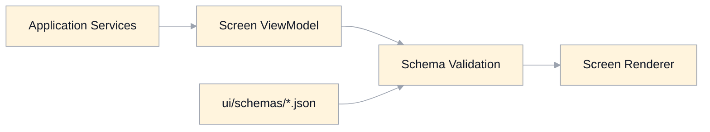

# View-Model Schema Specification

## Scope
This document defines machine-derivable JSON schemas for route-level screen view models.

It is aligned to:
- `ui/ui-screens.md`
- `ui/overview.md`
- `routing-state.md`
- `architecture-system.md`

## Purpose
- Make route/state rendering contracts explicit.
- Prevent ad hoc view-model shape drift as features are added.
- Provide a single validation target for generated UI runtime payloads.

## Schema Layout
Directory:
- `specification/ui/schemas/`

Common base:
- `specification/ui/schemas/view-model.common.schema.json`

Per-screen schemas:
- `specification/ui/schemas/start.view-model.schema.json`
- `specification/ui/schemas/about.view-model.schema.json`
- `specification/ui/schemas/dashboard.view-model.schema.json`
- `specification/ui/schemas/classroom.view-model.schema.json`
- `specification/ui/schemas/metrics.view-model.schema.json`
- `specification/ui/schemas/progress.view-model.schema.json`
- `specification/ui/schemas/course-creation.view-model.schema.json`
- `specification/ui/schemas/course-export.view-model.schema.json`
- `specification/ui/schemas/error.view-model.schema.json`

Union schema:
- `specification/ui/schemas/screen-view-model.union.schema.json`

## Contract Rules
- Every view model must include:
  - `screenId`
  - `route`
  - `state`
  - `readonly`
  - `slots`
  - `actions`
- Screen state enum values must match `specification/ui/manifests/*.ui-manifest.json` state lists.
- Slot keys must match each screen manifest slot contract.
- Each manifest must include `viewModelSchema` pointing to the matching per-screen schema file.
- `readonly` must represent observer/permission lock semantics explicitly.
- Error states must include at least one `errors[]` entry.

## State Variant Coverage
Each per-screen schema uses explicit state variants via `oneOf`.

Required variant coverage:
- Start: `loadingCatalog`, `ready`, `authError`
- About: `loading`, `ready`, `error`
- Dashboard: `loading`, `ready`, `emptyEnrolled`, `emptyDiscover`, `error`, `readonlyObserver`
- Classroom: `loading`, `ready`, `noVisibleTopics`, `error`, `readonlyObserver`, `editorMode`
- Metrics: `loading`, `ready`, `empty`, `error`, `readonlyObserver`
- Progress: `loading`, `ready`, `empty`, `error`, `readonlyObserver`
- Course Creation: `loading`, `ready`, `validating`, `submitting`, `success`, `error`, `readonlyObserver`
- Course Export: `loading`, `ready`, `running`, `partialFailure`, `success`, `error`, `readonlyObserver`
- Error: `401`, `403`, `404`, `409`, `422`, `500`

## Derivation And Validation Flow
1. Select screen schema by route and screen ID.
2. Materialize view model from server/application services.
3. Validate payload against the selected schema (or union schema).
4. Render only when schema-valid; otherwise route to typed error handling.

## Governance
- Any new screen state requires updates to:
  - matching manifest state list
  - matching per-screen JSON schema `state` enum and variant
  - `ui/ui-contract-changelog.md`
- Any slot rename/add/remove requires updates to:
  - manifest slots
  - per-screen schema slot contract
  - affected UI conformance baseline scenarios

## Legacy Gaps Addressed
- Adds strict, machine-validated view-model contracts.
- Captures state-specific payload rules instead of implicit JSX branching.
- Reduces drift between route manifests and runtime view-model shape.
